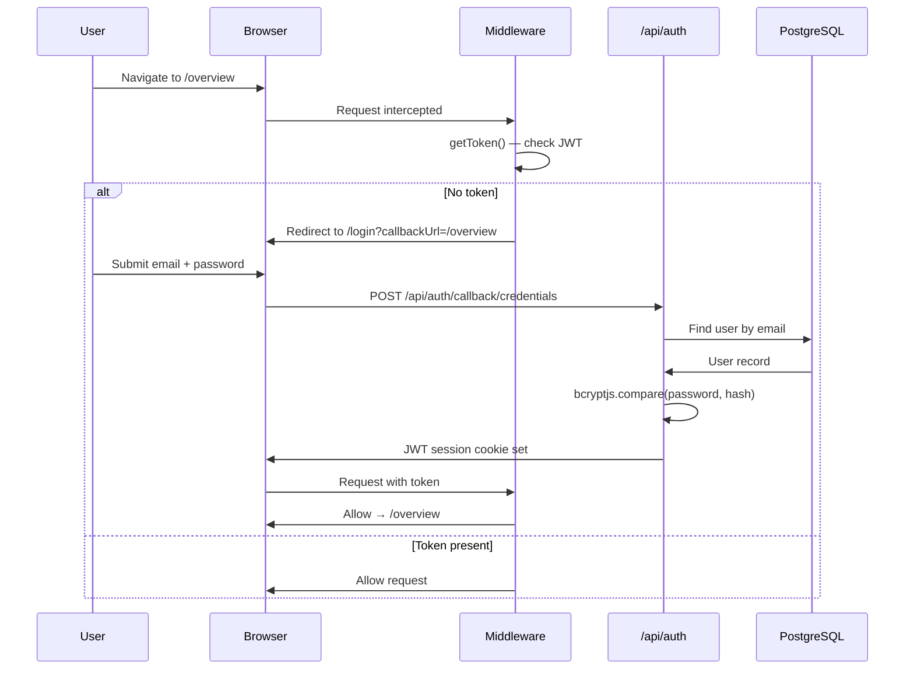
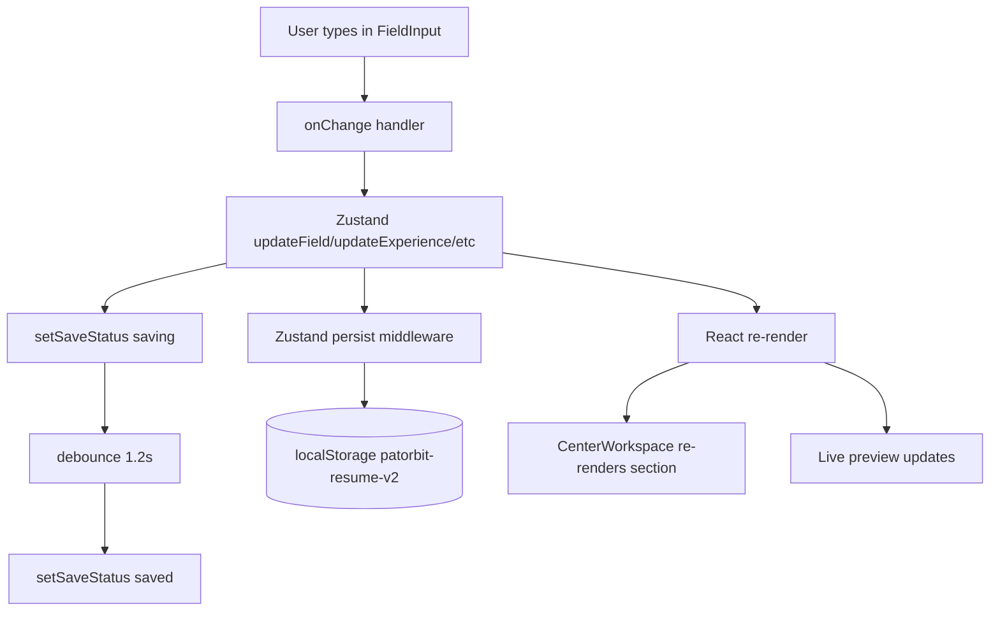

# Patorbit Architecture

**Last Updated:** 2026-08-07  
**Stack:** Next.js 16.2.12 · React 19 · PostgreSQL · Prisma · Zustand · OpenAI

---

## High-Level Overview

```
┌─────────────────────────────────────────────────────────────────┐
│                        BROWSER (Client)                         │
│  ┌─────────────┐  ┌──────────────┐  ┌──────────────────────┐  │
│  │  Marketing  │  │  Auth Pages  │  │    Authenticated App  │  │
│  │  (public)   │  │  /login      │  │  /overview            │  │
│  │  /pricing   │  │  /register   │  │  /resume-builder      │  │
│  │  /platform  │  └──────────────┘  │  /passport            │  │
│  └─────────────┘                    │  /trust /ai /network  │  │
│                                     └──────────────────────┘  │
└───────────────────────────┬─────────────────────────────────────┘
                            │ Next.js API Routes
┌───────────────────────────▼─────────────────────────────────────┐
│                        SERVER (Vercel)                           │
│  ┌──────────────┐  ┌─────────────┐  ┌────────────────────────┐ │
│  │ /api/auth    │  │  /api/ai    │  │  /api/export-docx      │ │
│  │ NextAuth.js  │  │  OpenAI GPT │  │  /api/import           │ │
│  └──────────────┘  └─────────────┘  │  /api/version          │ │
│                                     └────────────────────────┘ │
│  ┌─────────────────────────────────────────────────────────┐   │
│  │                    Prisma ORM                           │   │
│  └─────────────────────────┬───────────────────────────────┘   │
└────────────────────────────┼────────────────────────────────────┘
                             │
┌────────────────────────────▼────────────────────────────────────┐
│                       PostgreSQL (Vercel Postgres)               │
│   User · Account · Session · ProfessionalIdentity               │
└─────────────────────────────────────────────────────────────────┘
```

---

## Folder Structure

```
D:/Patorbit Knowledge System (PKS)/
├── prisma/
│   └── schema.prisma              Database schema
├── src/
│   ├── actions/                   Server actions (auth)
│   │   └── auth/
│   │       ├── login.ts
│   │       └── register.ts
│   ├── app/                       Next.js App Router
│   │   ├── (auth)/                Auth route group (no layout chrome)
│   │   │   ├── login/page.tsx
│   │   │   ├── register/page.tsx
│   │   │   └── forgot-password/page.tsx
│   │   ├── (hub)/                 Authenticated app route group
│   │   │   ├── overview/page.tsx  Dashboard command center
│   │   │   ├── resume/page.tsx    Resume list (hub view)
│   │   │   ├── passport/page.tsx  Professional Passport
│   │   │   ├── trust/page.tsx     Trust Score
│   │   │   ├── ai/page.tsx        AI Copilot standalone
│   │   │   ├── network/page.tsx   Professional network
│   │   │   └── settings/page.tsx
│   │   ├── (marketing)/           Public marketing pages
│   │   │   ├── page.tsx           Homepage (/)
│   │   │   ├── pricing/
│   │   │   ├── platform/
│   │   │   ├── features/
│   │   │   ├── solutions/
│   │   │   ├── about/
│   │   │   ├── contact/
│   │   │   ├── careers/
│   │   │   ├── blog/
│   │   │   ├── changelog/
│   │   │   ├── privacy/
│   │   │   ├── terms/
│   │   │   ├── security/
│   │   │   ├── compliance/
│   │   │   ├── career-passport/
│   │   │   ├── knowledge-graph/
│   │   │   ├── trust-verification/
│   │   │   ├── enterprise/
│   │   │   ├── developers/
│   │   │   ├── api-access/
│   │   │   └── api-reference/
│   │   ├── api/                   API Routes
│   │   │   ├── auth/[...nextauth]/route.ts
│   │   │   ├── ai/route.ts
│   │   │   ├── export-docx/route.ts
│   │   │   ├── import/route.ts
│   │   │   └── version/route.ts
│   │   ├── resume-builder/        Resume Builder feature
│   │   │   ├── page.tsx           Main builder UI
│   │   │   ├── preview/page.tsx   Preview & export
│   │   │   ├── template-components/  22 template renderers
│   │   │   │   ├── shared.tsx         Shared types + primitives
│   │   │   │   ├── modern-clean.tsx
│   │   │   │   ├── executive.tsx
│   │   │   │   └── ... (20 more)
│   │   │   └── templates.ts       Template registry + font/palette config
│   │   ├── dashboard/page.tsx     Legacy dashboard redirect
│   │   ├── coming-soon/page.tsx
│   │   ├── globals.css            Design system + print CSS
│   │   └── layout.tsx             Root layout (SessionProvider, banner)
│   ├── components/
│   │   ├── resume-builder/        Builder-specific components
│   │   │   ├── section-card.tsx   Accordion section wrapper
│   │   │   ├── sections/          Section editors (one per resume section)
│   │   │   │   ├── ExperienceSection.tsx
│   │   │   │   ├── EducationSection.tsx
│   │   │   │   ├── ProjectsSection.tsx
│   │   │   │   ├── CertificationsSection.tsx
│   │   │   │   ├── SkillsSection.tsx
│   │   │   │   ├── PersonalSection.tsx
│   │   │   │   └── OtherSections.tsx  (Achievements, Languages, Portfolio, Review)
│   │   │   ├── fields/            Field primitives
│   │   │   │   ├── FieldInput.tsx
│   │   │   │   ├── SectionContent.tsx
│   │   │   │   └── VerificationBadge.tsx
│   │   │   ├── LeftSidebar.tsx    Section nav + progress
│   │   │   ├── CenterWorkspace.tsx  Section editor host
│   │   │   ├── RightCopilot.tsx   AI panel
│   │   │   ├── ExportModal.tsx    PDF/DOCX export dialog
│   │   │   ├── TemplateGallery.tsx
│   │   │   ├── SaveStatusIndicator.tsx
│   │   │   ├── AIActionButton.tsx
│   │   │   ├── SmartSuggestion.tsx
│   │   │   └── JobMatchPanel.tsx
│   │   ├── resume/
│   │   │   └── ResumePreview.tsx  Template renderer dispatcher
│   │   ├── identity/
│   │   │   └── Passport.tsx
│   │   ├── common/
│   │   │   └── DeploymentUpdateBanner.tsx
│   │   └── hub/
│   │       └── widgets/           Dashboard widget components
│   ├── hooks/
│   │   └── useDeploymentVersion.ts  Deployment polling hook
│   ├── lib/
│   │   ├── ai/
│   │   │   ├── client.ts          Frontend AI client (→ /api/ai)
│   │   │   ├── service.ts         Server-side AI dispatcher
│   │   │   ├── openai.ts          OpenAI SDK instance
│   │   │   ├── provider.ts        AI provider abstraction
│   │   │   ├── prompts.ts         System prompts
│   │   │   ├── scoring.ts         Resume scoring utilities
│   │   │   └── types.ts           AI response types
│   │   ├── auth.ts                NextAuth authOptions
│   │   ├── prisma.ts              Prisma client singleton
│   │   ├── identity-score.ts      Identity scoring utilities
│   │   ├── analytics.ts           Analytics helpers
│   │   ├── validations.ts         Shared Zod schemas
│   │   ├── debounce.ts
│   │   ├── careerjourney/         Career journey state machine
│   │   └── evidence/              Evidence validation + storage
│   ├── repositories/              Data access layer
│   │   ├── user.repository.ts
│   │   ├── claim.repository.ts
│   │   ├── evidence.repository.ts
│   │   └── identity.repository.ts
│   ├── schemas/
│   │   └── auth.schema.ts
│   ├── services/                  Business logic layer
│   │   ├── auth.service.ts
│   │   ├── identity.service.ts
│   │   ├── trust-service.ts
│   │   ├── graph-service.ts
│   │   ├── graph-mapper.ts
│   │   ├── insight-service.ts
│   │   ├── identity-pipeline-coordinator.ts
│   │   ├── identity-pipeline-subscriber.ts
│   │   ├── ai-reasoning-service.ts
│   │   └── __tests__/            Service unit tests
│   ├── store/
│   │   └── resume-builder.ts      Zustand store (resume + evidence + AI state)
│   ├── types/
│   │   ├── resume.ts              Core Resume type definitions
│   │   ├── knowledge-graph.ts     Graph node/edge types
│   │   ├── evidence-kinds.ts      Evidence classification
│   │   ├── careerjourney/
│   │   └── next-auth.d.ts         Session type augmentation
│   ├── utils/
│   │   ├── export.ts              PDF/DOCX export utilities
│   │   ├── resume-parser.ts       Import parsing
│   │   ├── resume-schema.ts       Resume Zod schema
│   │   └── validation.ts
│   ├── validators/
│   │   └── auth.validator.ts
│   └── middleware.ts              Route protection
└── docs/                          Project documentation (this folder)
```

---

## App Router Layout Hierarchy

```
app/layout.tsx              Root — SessionProvider, DeploymentUpdateBanner, body
├── app/(marketing)/        Public marketing group (no auth required)
│   └── layout.tsx          Marketing nav + footer
├── app/(auth)/             Auth group (redirect if already logged in)
│   └── No shared layout
├── app/(hub)/              Authenticated app group
│   └── layout.tsx          App shell (sidebar, header)
├── app/resume-builder/     Resume Builder (separate layout)
│   └── layout.tsx          Builder shell (3-column)
└── app/dashboard/          Legacy redirect → /overview
```

---

## Authentication Flow



**Auth Stack:**
- **Provider:** Credentials (email/password)
- **Password Hashing:** bcryptjs
- **Session Strategy:** JWT
- **Adapter:** `@auth/prisma-adapter` — stores sessions and accounts in PostgreSQL
- **Session Augmentation:** `src/types/next-auth.d.ts` adds `id` to `Session.user`

**Protected Routes (from `src/middleware.ts`):**

| Route Pattern | Auth Required |
|---|---|
| `/overview/*` | ✅ Yes |
| `/resume-builder/*` | ✅ Yes |
| `/passport/*` | ✅ Yes |
| `/trust/*` | ✅ Yes |
| `/ai/*` | ✅ Yes |
| `/network/*` | ✅ Yes |
| `/settings/*` | ✅ Yes |
| `/resume/*` | ✅ Yes |
| `/login`, `/register` | Redirect to `/overview` if authenticated |

---

## Database Schema

**Provider:** PostgreSQL via Prisma ORM

```prisma
// Auth models (NextAuth Prisma Adapter)
model User {
  id             String    @id @default(cuid())
  name           String
  email          String    @unique
  passwordHash   String
  emailVerified  DateTime?
  image          String?
  createdAt      DateTime  @default(now())
  updatedAt      DateTime  @updatedAt
  professionalIdentity ProfessionalIdentity?
  accounts             Account[]
  sessions             Session[]
}

model Account { ... }        // OAuth accounts (future OAuth providers)
model Session { ... }        // JWT sessions
model VerificationToken { ... }  // Email verification (not yet wired)

// Domain model
model ProfessionalIdentity {
  id        String   @id @default(cuid())
  userId    String   @unique
  createdAt DateTime @default(now())
  updatedAt DateTime @updatedAt
  user User @relation(...)
}
```

> **Note:** The database schema is minimal. Resume data is currently stored in browser localStorage via Zustand persist. Future sprints will move resume data to the database for multi-device sync.

---

## State Management

### Zustand Store (`src/store/resume-builder.ts`)

**Persist Key:** `"patorbit-resume-v2"`  
**Partialize:** `{ resume, evidence }` only (AI state is ephemeral)

**State Shape:**

```typescript
interface ResumeBuilderState {
  // Data
  resume: Resume;              // Full resume object
  evidence: Evidence[];        // Evidence attached to claims
  suggestedClaims: SuggestedClaim[];
  trustScore: TrustSnapshot | null;
  trustReport: TrustReport | null;

  // UI State
  activeSection: SectionId;
  saveStatus: "saved" | "saving" | "unsaved" | "offline" | "sync-failed";
  isCopilotOpen: boolean;
  isJobMatchOpen: boolean;
  previewTab: "resume" | "passport" | "knowledge-graph" | "trust-timeline";

  // AI State (ephemeral)
  analysis: ResumeAnalysis | null;
  analysisLoading: boolean;
  jobMatch: JobMatchResult | null;
  jobDescription: string;
  aiActions: Record<string, AIActionState>;

  // Actions
  setResume(resume), updateField(field, value)
  addExperience(), updateExperience(id, field, value), removeExperience(id), moveExperience(id, dir)
  addEducation(), updateEducation(id, field, value), removeEducation(id), moveEducation(id, dir)
  addSkill(), updateSkill(id, field, value), removeSkill(id)
  addProject(), updateProject(id, field, value), removeProject(id), moveProject(id, dir)
  addCertification(), updateCertification(id, field, value), removeCertification(id), moveCertification(id, dir)
  addLanguage(), updateLanguage(id, field, value), removeLanguage(id)
  addAchievement(), updateAchievement(id, field, value), removeAchievement(id)
  addReference(), updateReference(id, field, value), removeReference(id)
  addPortfolio(), updatePortfolio(id, field, value), removePortfolio(id)
  addInterest(), updateInterest(id, field, value), removeInterest(id)
  setSaveStatus(status), setActiveSection(id)
  applyTemplate(templateId)
  setAnalysis(analysis), startAnalysis()
  setJobMatch(result), setJobDescription(desc)
  setAIAction(key, state)
  setSuggestedClaims(claims), acceptClaim(id), rejectClaim(id)
  addEvidence(evidence), updateEvidence(id, field, value), removeEvidence(id)
  setTrustScore(score), setTrustReport(report)
}
```

**Auto-save Architecture:**  
- Zustand `persist` middleware is the **single writer** to localStorage
- A `useEffect` in `page.tsx` debounces `setSaveStatus("saving")` → `setSaveStatus("saved")` after 1.2s of no changes
- No manual `localStorage.setItem` calls outside the persist middleware

---

## AI Layer

### Architecture

```
Browser Component
     │
     ▼
src/lib/ai/client.ts        (ai.generateSummary(), ai.rewrite(), etc.)
     │ POST /api/ai { action, data }
     ▼
src/app/api/ai/route.ts     (action dispatcher)
     │
     ▼
src/lib/ai/service.ts       (server-side handler per action)
     │
     ▼
src/lib/ai/openai.ts        (OpenAI SDK instance)
     │
     ▼
OpenAI API (GPT-4)
```

### API Contract

All AI requests go through a single unified endpoint:

```
POST /api/ai
{ action: string, data: unknown }
→ { success: boolean, data: T, error?: string }
```

**Available Actions:**

| Action | Input | Output |
|---|---|---|
| `generateSummary` | `Resume` | `{ content: string }` |
| `rewrite` | `{ text, tone? }` | `{ content: string }` |
| `improveTone` | `{ text }` | `{ content: string }` |
| `atsOptimization` | `{ content, jobDescription? }` | `{ content: string }` |
| `improveBulletPoints` | `{ bullets: string[] }` | `{ content: string[] }` |
| `generateAchievements` | `Experience` | `{ content: string[] }` |
| `generateProjects` | `Project` | `{ content: string }` |
| `suggestSkills` | `Resume` | `{ content: string[] }` |
| `analyzeResume` | `Resume` | `ResumeAnalysis` |
| `interviewPreparation` | `{ resume, topic? }` | `{ content: string }` |
| `analyzeJobMatch` | `{ resume, jobDescription }` | `JobMatchResult` |
| `optimizeForJob` | `{ resume, jobDescription, targetRole }` | `{ summary, suggestions }` |
| `generateClaims` | `{ identity, existingClaims? }` | `{ claims: SuggestedClaim[] }` |

---

## Resume Builder Data Flow



---

## Export Flow

### PDF Export (client-side)
```
User clicks Export PDF
  → html2canvas captures #pdf-export-target div (off-screen, 210mm width)
  → jsPDF creates A4 document
  → Multi-page: canvas sliced into A4-height segments
  → pdf.save("resume.pdf")
```

### DOCX Export (server-side)
```
User clicks Export DOCX
  → POST /api/export-docx with resume JSON
  → Server builds .docx via `docx` npm package
  → Returns blob
  → file-saver downloads file
```

### Browser Print
```
Ctrl+P / Cmd+P
  → @media print CSS activates (globals.css)
  → App chrome hidden (header, nav, aside)
  → A4 page sizing applied
  → break-inside: avoid on section/article elements
  → White background, black text enforced
```

---

## Deployment Architecture

```
GitHub Repository
      │ push to main
      ▼
Vercel CI/CD
      ├── prisma generate
      ├── next build (Turbopack)
      └── Deploy to Edge Network
            ├── Static pages (SSG): marketing pages
            ├── Dynamic pages (SSR): auth, dashboard
            └── API Routes (Node.js runtime)
                    └── PostgreSQL (Vercel Postgres)
```

**Environment Variables (required):**

| Variable | Purpose |
|---|---|
| `DATABASE_URL` | PostgreSQL connection string |
| `NEXTAUTH_SECRET` | JWT signing secret |
| `NEXTAUTH_URL` | Canonical auth URL |
| `OPENAI_API_KEY` | OpenAI GPT-4 access |
| `NEXT_PUBLIC_VERCEL_GIT_COMMIT_SHA` | Baked-in build SHA (client) |
| `VERCEL_GIT_COMMIT_SHA` | Server-side current build SHA |

---

## Key Design Decisions

| Decision | Choice | Rationale |
|---|---|---|
| State management | Zustand + persist | Lightweight, no boilerplate, works offline |
| Auth | NextAuth.js v4 + Credentials | No OAuth dependency needed for MVP |
| PDF export | html2canvas client-side | Zero server cost; acceptable quality for MVP |
| Evidence storage | IndexedDB (idb-keyval) | Files too large for localStorage; no S3 cost |
| AI routing | Single `/api/ai` endpoint | Simpler than multiple endpoints; action dispatch pattern |
| Resume persistence | localStorage only | Fast, offline-capable; DB sync is a future sprint |
| CSS framework | Tailwind v4 | Utility-first, fast iteration, custom properties |
