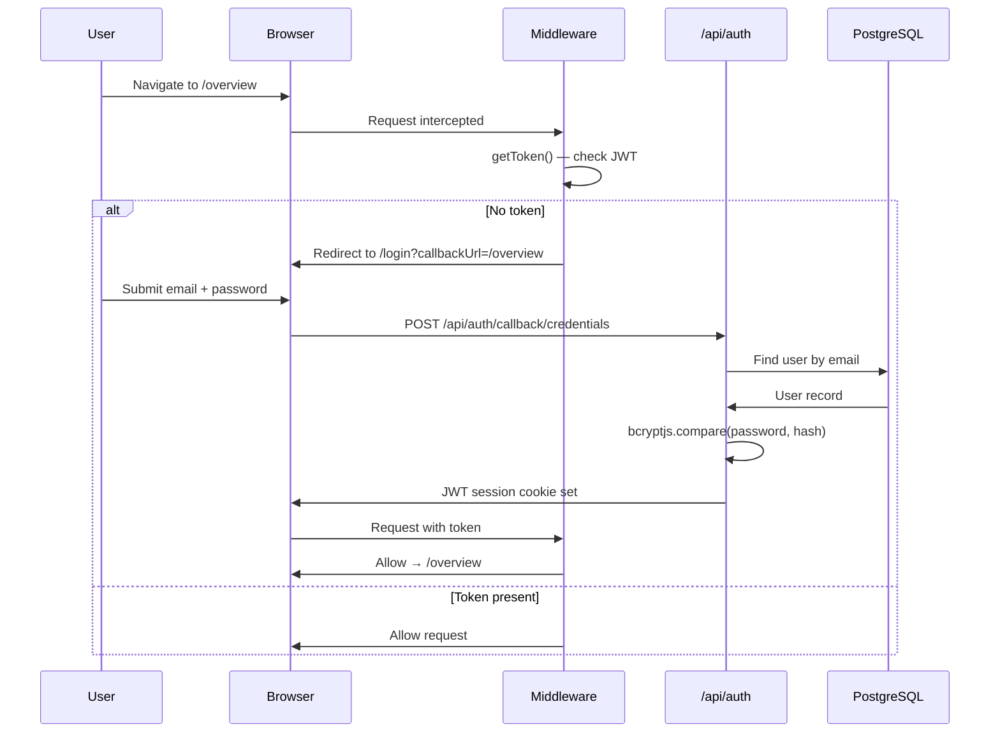
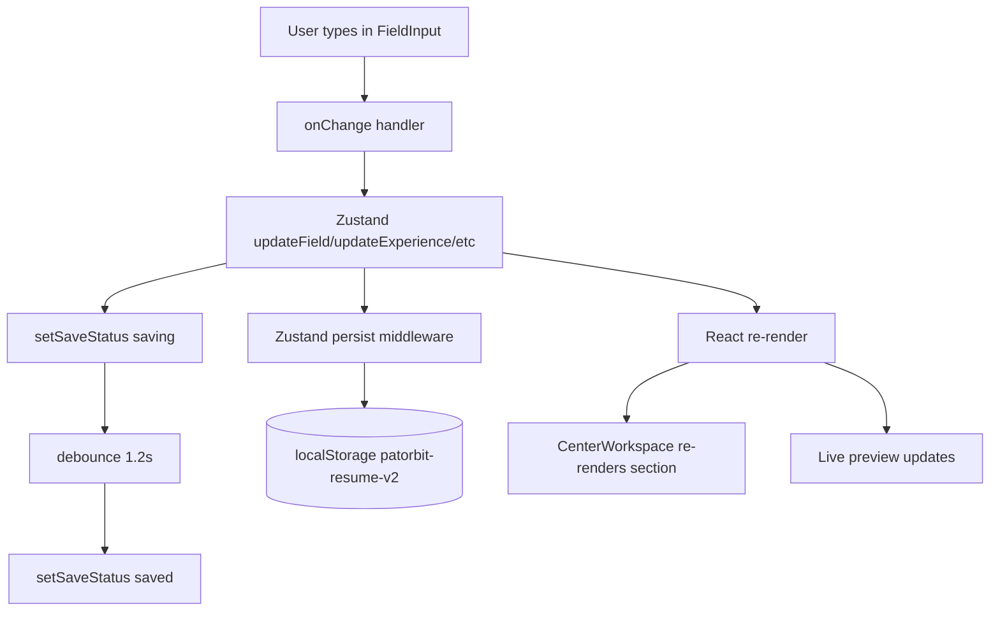

# Patorbit Architecture

**Last Updated:** 2026-09-03  
**Stack:** Next.js 16.3.0 · React 19 · PostgreSQL · Prisma · Zustand · Gemini AI

> **Project direction (current vs. future):** see [MASTER_ARCHITECTURE.md](./MASTER_ARCHITECTURE.md).
> This file documents the implemented system; the master document adds the
> identity/claims/evidence/verification direction and the 6-phase roadmap.

---

## High-Level Overview

```
┌─────────────────────────────────────────────────────────────────┐
│                        BROWSER (Client)                         │
│  ┌─────────────┐  ┌──────────────┐  ┌──────────────────────┐  │
│  │  Marketing  │  │  Auth Pages  │  │    Authenticated App  │  │
│  │  (public)   │  │  /login      │  │  /solutions           │  │
│  │  /pricing   │  │  /register   │  │  /resume-builder      │  │
│  │  /templates │  └──────────────┘  │  /settings            │  │
│  └─────────────┘                    │  /templates           │  │
│                                     └──────────────────────┘  │
└───────────────────────────┬─────────────────────────────────────┘
                            │ Next.js API Routes
┌───────────────────────────▼─────────────────────────────────────┐
│                        SERVER (Vercel)                           │
│  ┌──────────────┐  ┌─────────────┐  ┌────────────────────────┐ │
│  │ /api/auth    │  │  /api/ai    │  │  /api/export-docx      │ │
│  │ NextAuth.js  │  │  Gemini AI  │  │  /api/import           │ │
│  └──────────────┘  └─────────────┘  │  /api/resumes          │ │
│                                     │  /api/applications     │ │
│                                     │  /api/identity         │ │
│                                     └────────────────────────┘ │
│  ┌─────────────────────────────────────────────────────────┐   │
│  │                    Prisma ORM                           │   │
│  └─────────────────────────┬───────────────────────────────┘   │
└────────────────────────────┼────────────────────────────────────┘
                             │
┌────────────────────────────▼────────────────────────────────────┐
│                       PostgreSQL (Vercel Postgres)               │
│   User · Account · Session · ProfessionalIdentity               │
│   Resume · JobApplication · EvidenceRecord · Subscription       │
└─────────────────────────────────────────────────────────────────┘
```

---

## Folder Structure

```
D:/Patorbit Knowledge System (PKS)/
├── prisma/
│   └── schema.prisma              Database schema
├── src/
│   ├── actions/                   Server actions (auth)
│   │   └── auth/
│   │       ├── login.ts
│   │       └── register.ts
│   ├── app/                       Next.js App Router
│   │   ├── (auth)/                Auth route group (no layout chrome)
│   │   │   ├── login/page.tsx
│   │   │   ├── register/page.tsx
│   │   │   └── forgot-password/page.tsx
│   │   ├── (hub)/                 Authenticated app route group
│   │   │   ├── overview/page.tsx  Dashboard command center
│   │   │   ├── resume/page.tsx    Resume list (hub view)
│   │   │   ├── passport/page.tsx  Professional Passport
│   │   │   ├── trust/page.tsx     Trust Score
│   │   │   ├── ai/page.tsx        AI Copilot standalone
│   │   │   ├── network/page.tsx   Professional network
│   │   │   └── settings/page.tsx
│   │   ├── (marketing)/           Public marketing pages
│   │   │   ├── page.tsx           Homepage (/)
│   │   │   ├── pricing/
│   │   │   ├── platform/
│   │   │   ├── features/
│   │   │   ├── solutions/
│   │   │   ├── about/
│   │   │   ├── contact/
│   │   │   ├── careers/
│   │   │   ├── blog/
│   │   │   ├── changelog/
│   │   │   ├── privacy/
│   │   │   ├── terms/
│   │   │   ├── security/
│   │   │   ├── compliance/
│   │   │   ├── career-passport/
│   │   │   ├── knowledge-graph/
│   │   │   ├── trust-verification/
│   │   │   ├── enterprise/
│   │   │   ├── developers/
│   │   │   ├── api-access/
│   │   │   └── api-reference/
│   │   ├── api/                   API Routes
│   │   │   ├── auth/[...nextauth]/route.ts
│   │   │   ├── ai/route.ts
│   │   │   ├── export-docx/route.ts
│   │   │   ├── import/route.ts
│   │   │   └── version/route.ts
│   │   ├── resume-builder/        Resume Builder feature
│   │   │   ├── page.tsx           Main builder UI
│   │   │   ├── preview/page.tsx   Preview & export
│   │   │   ├── template-components/  29 template renderers
│   │   │   │   ├── shared.tsx         Shared types + primitives
│   │   │   │   ├── modern-clean.tsx
│   │   │   │   ├── executive.tsx
│   │   │   │   └── ... (27 more)
│   │   │   └── templates.ts       Template registry + font/palette config
│   │   ├── dashboard/page.tsx     Legacy dashboard redirect
│   │   ├── coming-soon/page.tsx
│   │   ├── globals.css            Design system + print CSS
│   │   └── layout.tsx             Root layout (SessionProvider, banner)
│   ├── components/
│   │   ├── resume-builder/        Builder-specific components
│   │   │   ├── section-card.tsx   Accordion section wrapper
│   │   │   ├── sections/          Section editors (one per resume section)
│   │   │   │   ├── ExperienceSection.tsx
│   │   │   │   ├── EducationSection.tsx
│   │   │   │   ├── ProjectsSection.tsx
│   │   │   │   ├── CertificationsSection.tsx
│   │   │   │   ├── SkillsSection.tsx
│   │   │   │   ├── PersonalSection.tsx
│   │   │   │   └── OtherSections.tsx  (Achievements, Languages, Portfolio, Review)
│   │   │   ├── fields/            Field primitives
│   │   │   │   ├── FieldInput.tsx
│   │   │   │   ├── SectionContent.tsx
│   │   │   │   └── VerificationBadge.tsx
│   │   │   ├── LeftSidebar.tsx    Section nav + progress
│   │   │   ├── CenterWorkspace.tsx  Section editor host
│   │   │   ├── RightCopilot.tsx   AI panel
│   │   │   ├── ExportModal.tsx    PDF/DOCX export dialog
│   │   │   ├── TemplateGallery.tsx
│   │   │   ├── SaveStatusIndicator.tsx
│   │   │   ├── AIActionButton.tsx
│   │   │   ├── SmartSuggestion.tsx
│   │   │   └── JobMatchPanel.tsx
│   │   ├── resume/
│   │   │   ├── ResumePreview.tsx  Template renderer dispatcher
│   │   │   └── PaginatedResumeSheet.tsx  A4 page-frame paginator (gallery/preview/export)
│   │   ├── identity/
│   │   │   └── Passport.tsx
│   │   ├── common/
│   │   │   └── DeploymentUpdateBanner.tsx
│   │   └── hub/
│   │       └── widgets/           Dashboard widget components
│   ├── hooks/
│   │   └── useDeploymentVersion.ts  Deployment polling hook
│   ├── lib/
│   │   ├── resume-design-system/
│   │   │   ├── geometry.ts         A4 geometry (794×1123px / 210×297mm) — single source of truth
│   │   │   ├── page-frame.ts       Canonical A4 page frame (safe top/bottom content areas)
│   │   │   └── style-config.ts     ResumeStyleConfig + template capability rules
│   │   ├── ai/
│   │   │   ├── client.ts          Frontend AI client (→ /api/ai)
│   │   │   ├── service.ts         Server-side AI dispatcher
│   │   │   ├── openai.ts          OpenAI SDK instance
│   │   │   ├── provider.ts        AI provider abstraction
│   │   │   ├── prompts.ts         System prompts
│   │   │   ├── scoring.ts         Resume scoring utilities
│   │   │   └── types.ts           AI response types
│   │   ├── auth.ts                NextAuth authOptions
│   │   ├── prisma.ts              Prisma client singleton
│   │   ├── identity-score.ts      Identity scoring utilities
│   │   ├── analytics.ts           Analytics helpers
│   │   ├── validations.ts         Shared Zod schemas
│   │   ├── debounce.ts
│   │   ├── careerjourney/         Career journey state machine
│   │   └── evidence/              Evidence validation + storage
│   ├── repositories/              Data access layer
│   │   ├── user.repository.ts
│   │   ├── claim.repository.ts
│   │   ├── evidence.repository.ts
│   │   └── identity.repository.ts
│   ├── schemas/
│   │   └── auth.schema.ts
│   ├── services/                  Business logic layer
│   │   ├── auth.service.ts
│   │   ├── identity.service.ts
│   │   ├── trust-service.ts
│   │   ├── graph-service.ts
│   │   ├── graph-mapper.ts
│   │   ├── insight-service.ts
│   │   ├── identity-pipeline-coordinator.ts
│   │   ├── identity-pipeline-subscriber.ts
│   │   ├── ai-reasoning-service.ts
│   │   └── __tests__/            Service unit tests
│   ├── store/
│   │   └── resume-builder.ts      Zustand store (resume + evidence + AI state)
│   ├── types/
│   │   ├── resume.ts              Core Resume type definitions
│   │   ├── knowledge-graph.ts     Graph node/edge types
│   │   ├── evidence-kinds.ts      Evidence classification
│   │   ├── careerjourney/
│   │   └── next-auth.d.ts         Session type augmentation
│   ├── utils/
│   │   ├── export.ts              PDF/DOCX export utilities
│   │   ├── resume-parser.ts       Import parsing
│   │   ├── resume-schema.ts       Resume Zod schema
│   │   └── validation.ts
│   ├── validators/
│   │   └── auth.validator.ts
│   └── middleware.ts              Route protection
└── docs/                          Project documentation (this folder)
```

---

## App Router Layout Hierarchy

```
app/layout.tsx              Root — SessionProvider, DeploymentUpdateBanner, body
├── app/(marketing)/        Public marketing group (no auth required)
│   └── layout.tsx          Marketing nav + footer
├── app/(auth)/             Auth group (redirect if already logged in)
│   └── No shared layout
├── app/(hub)/              Authenticated app group
│   └── layout.tsx          App shell (sidebar, header)
├── app/resume-builder/     Resume Builder (separate layout)
│   └── layout.tsx          Builder shell (3-column)
└── app/dashboard/          Legacy redirect → /overview
```

---

## Authentication Flow



**Auth Stack:**
- **Provider:** Credentials (email/password)
- **Password Hashing:** bcryptjs
- **Session Strategy:** JWT
- **Adapter:** `@auth/prisma-adapter` — stores sessions and accounts in PostgreSQL
- **Session Augmentation:** `src/types/next-auth.d.ts` adds `id` to `Session.user`

**Protected Routes (from `src/proxy.ts`):**

| Route Pattern | Auth Required |
|---|---|
| `/solutions/*` | ✅ Yes |
| `/resume-builder/*` | ✅ Yes |
| `/settings/*` | ✅ Yes |
| `/resume/*` | ✅ Yes |
| `/login`, `/register` | Redirect to `/solutions` if authenticated |
| `/` (landing) | No |
| `/templates` | No |
| `/pricing` | No |

---

## Database Schema

**Provider:** PostgreSQL via Prisma ORM

```prisma
// Auth models (NextAuth Prisma Adapter)
model User {
  id             String    @id @default(cuid())
  name           String
  email          String    @unique
  passwordHash   String
  emailVerified  DateTime?
  image          String?
  createdAt      DateTime  @default(now())
  updatedAt      DateTime  @updatedAt
  professionalIdentity ProfessionalIdentity?
  accounts             Account[]
  sessions             Session[]
  evidenceRecords      EvidenceRecord[]
  usageRecords         UsageRecord[]
}

model Account { ... }        // OAuth accounts
model Session { ... }        // JWT sessions
model VerificationToken { ... }

// Domain model
model ProfessionalIdentity {
  id                   String   @id @default(cuid())
  userId               String   @unique
  profileData          Json?    // Full professional profile (Basics, Experience, Education, Skills)
  onboardingCompleted  Boolean  @default(false)
  createdAt            DateTime @default(now())
  updatedAt            DateTime @updatedAt
  user                 User     @relation(...)
  resumes              Resume[]
  jobApplications      JobApplication[]
}

model Resume {
  id                     String   @id @default(cuid())
  resumeId               String   @unique  // Stable public/domain ID
  professionalIdentityId String
  resumeName             String
  templateId             String
  careerStage            String   @default("working-professional")
  payload                Json     // Full resume document (JSONB)
  version                Int      @default(1)
  shareEnabled           Boolean  @default(false)
  shareToken             String?  @unique
  createdAt              DateTime @default(now())
  updatedAt              DateTime @updatedAt
  @@unique([professionalIdentityId, resumeId])
}

model JobApplication {
  id                     String   @id @default(cuid())
  applicationId          String   @unique
  professionalIdentityId String
  title                  String   // Job title
  companyName            String   // Company name
  jobDescription         String   @db.Text
  status                 String   @default("saved")
  resumeId               String?  // Optional reference to Resume
  matchScore             Int?     // 0-100 match score
  matchData              Json?    // Match analysis (matched/partial/missing skills)
  createdAt              DateTime @default(now())
  updatedAt              DateTime @updatedAt
  @@index([professionalIdentityId])
  @@index([professionalIdentityId, status])
}
```

> **Note:** Resume data is stored both in PostgreSQL (server-authoritative) and localStorage (client cache via Zustand persist). The server is the canonical source of truth for resume data (ADR-001).

---

## State Management

### Zustand Store (`src/store/resume-builder.ts`)

**Persist Key:** `"patorbit-resume-v2"`  
**Partialize:** `{ resume, evidence }` only (AI state is ephemeral)

**State Shape:**

```typescript
interface ResumeBuilderState {
  // Data
  resume: Resume;              // Full resume object
  evidence: Evidence[];        // Evidence attached to claims
  suggestedClaims: SuggestedClaim[];
  trustScore: TrustSnapshot | null;
  trustReport: TrustReport | null;

  // UI State
  activeSection: SectionId;
  saveStatus: "saved" | "saving" | "unsaved" | "offline" | "sync-failed";
  isCopilotOpen: boolean;
  isJobMatchOpen: boolean;
  previewTab: "resume" | "passport" | "knowledge-graph" | "trust-timeline";

  // AI State (ephemeral)
  analysis: ResumeAnalysis | null;
  analysisLoading: boolean;
  jobMatch: JobMatchResult | null;
  jobDescription: string;
  aiActions: Record<string, AIActionState>;

  // Actions
  setResume(resume), updateField(field, value)
  addExperience(), updateExperience(id, field, value), removeExperience(id), moveExperience(id, dir)
  addEducation(), updateEducation(id, field, value), removeEducation(id), moveEducation(id, dir)
  addSkill(), updateSkill(id, field, value), removeSkill(id)
  addProject(), updateProject(id, field, value), removeProject(id), moveProject(id, dir)
  addCertification(), updateCertification(id, field, value), removeCertification(id), moveCertification(id, dir)
  addLanguage(), updateLanguage(id, field, value), removeLanguage(id)
  addAchievement(), updateAchievement(id, field, value), removeAchievement(id)
  addReference(), updateReference(id, field, value), removeReference(id)
  addPortfolio(), updatePortfolio(id, field, value), removePortfolio(id)
  addInterest(), updateInterest(id, field, value), removeInterest(id)
  setSaveStatus(status), setActiveSection(id)
  applyTemplate(templateId)
  setAnalysis(analysis), startAnalysis()
  setJobMatch(result), setJobDescription(desc)
  setAIAction(key, state)
  setSuggestedClaims(claims), acceptClaim(id), rejectClaim(id)
  addEvidence(evidence), updateEvidence(id, field, value), removeEvidence(id)
  setTrustScore(score), setTrustReport(report)
}
```

**Auto-save Architecture:**  
- Zustand `persist` middleware is the **single writer** to localStorage
- A `useEffect` in `page.tsx` debounces `setSaveStatus("saving")` → `setSaveStatus("saved")` after 1.2s of no changes
- No manual `localStorage.setItem` calls outside the persist middleware

---

## AI Layer

### Architecture

```
Browser Component
     │
     ▼
src/lib/ai/client.ts        (ai.generateSummary(), ai.rewrite(), etc.)
     │ POST /api/ai { action, data }  OR  POST /api/ai/tailor { resumeId, jobDescription }
     ▼
src/app/api/ai/route.ts     (action dispatcher for general AI actions)
src/app/api/ai/tailor/route.ts (server-authoritative tailoring endpoint)
     │
     ▼
src/lib/ai/service.ts       (server-side handler per action)
     │
     ▼
src/lib/ai/gemini.ts        (Google Gemini SDK instance)
     │
     ▼
Google Gemini API
```

**C33.3: Gemini is the primary AI provider.** OpenAI is no longer used.

### API Contract

All AI requests go through a single unified endpoint:

```
POST /api/ai
{ action: string, data: unknown }
→ { success: boolean, data: T, error?: string }
```

**Available Actions:**

| Action | Input | Output |
|---|---|---|
| `generateSummary` | `Resume` | `{ content: string }` |
| `rewrite` | `{ text, tone? }` | `{ content: string }` |
| `improveTone` | `{ text }` | `{ content: string }` |
| `atsOptimization` | `{ content, jobDescription? }` | `{ content: string }` |
| `improveBulletPoints` | `{ bullets: string[] }` | `{ content: string[] }` |
| `generateAchievements` | `Experience` | `{ content: string[] }` |
| `generateProjects` | `Project` | `{ content: string }` |
| `suggestSkills` | `Resume` | `{ content: string[] }` |
| `analyzeResume` | `Resume` | `ResumeAnalysis` |
| `interviewPreparation` | `{ resume, topic? }` | `{ content: string }` |
| `analyzeJobMatch` | `{ resume, jobDescription }` | `JobMatchResult` |
| `optimizeForJob` | `{ resume, jobDescription, targetRole }` | `{ summary, suggestions }` |
| `generateClaims` | `{ identity, existingClaims? }` | `{ claims: SuggestedClaim[] }` |

---

## Resume Builder Data Flow



---

## Export Flow

### PDF Export (browser print)
```
User clicks Export PDF
  → ExportModal mounts #pdf-export-target only while printing (conditional mount)
  → ResumePreview + StyleScope render with the active templateId and ResumeStyleConfig
  → Print target carries exact A4 geometry (210mm × 297mm, box-sizing: border-box, margin 0)
  → window.print() opens the browser dialog; @media print hides app chrome
  → @page { size: A4; margin: 0 } + print-color-adjust: exact → Save as PDF matches the preview
```
Page-break math shares the A4 constants module (`src/lib/resume-design-system/geometry.ts`) with the preview and gallery.

## A4 Page-Frame / Pagination Architecture

The Gallery, the Professional Preview, and the PDF export all render through the
**same** paginated DOM — one page model, no competing layouts.

```
A4 Geometry (src/lib/resume-design-system/geometry.ts)
  │  794×1123px screen / 210×297mm print — single source of truth
  ▼
Canonical Page Frame (src/lib/resume-design-system/page-frame.ts)
  │  physical A4 boundary + safe top/bottom content area
  ▼
Template content (29 templates — untouched)
  ▼
PaginatedResumeSheet (src/components/resume/PaginatedResumeSheet.tsx)
  │  real DOM pagination, semantic block splitting,
  │  consistent per-page safe space, no content clipping
  ├── Template Gallery (FullTemplatePreview)
  ├── Professional Resume Preview
  └── PDF / print export (#pdf-export-target)
```

- One A4 size definition is shared everywhere — no duplicate geometry.
- `PaginatedResumeSheet` distributes content across real A4 pages; page
  navigation shows the actual rendered page count; continuation pages get the
  same safe top/bottom space as page 1.
- `break-inside-avoid` is respected for small semantic blocks (experience
  article, education entry, project, certification) — never for a whole
  template root container.
- Templates are not modified for pagination; no template-specific hacks.

## Resume Import Pipeline

```
File (PDF/DOCX/JSON)
  → POST /api/import
  → regex extractor (src/utils/resume-parser.ts) and/or AI extraction
  → parsed Resume (src/utils/resume-schema.ts validates with safe defaults)
  → ImportReviewScreen (review/edit before apply)
  → one Apply action
  → mergeImportedResume(current, imported) (src/utils/normalize-import.ts)
  → setResume → Zustand persist (patorbit-resume-v2)
  → Resume Builder renders imported data
```

- The import pipeline populates every section in one step; no per-section
  manual import.
- The Apply step preserves the user's current resume content and `templateId`
  (an import only carries a template when the file explicitly specifies one);
  gallery sample data is never written into the real resume.
- Imported data is not automatically "verified" — import and verification are
  related but distinct pipelines (see MASTER_ARCHITECTURE.md).

### DOCX Export (server-side)
```
User clicks Export DOCX
  → POST /api/export-docx with resume JSON
  → Server builds .docx via `docx` npm package
  → Returns blob
  → file-saver downloads file
```

### Browser Print
```
Ctrl+P / Cmd+P
  → @media print CSS activates (globals.css)
  → App chrome hidden (header, nav, aside)
  → A4 page sizing applied
  → break-inside: avoid on section/article elements
  → White background, black text enforced
```

---

## Deployment Architecture

```
GitHub Repository
      │ push to main
      ▼
Vercel CI/CD
      ├── prisma generate
      ├── next build (Turbopack)
      └── Deploy to Edge Network
            ├── Static pages (SSG): marketing pages
            ├── Dynamic pages (SSR): auth, dashboard
            └── API Routes (Node.js runtime)
                    └── PostgreSQL (Vercel Postgres)
```

**Environment Variables (required):**

| Variable | Purpose |
|---|---|
| `DATABASE_URL` | PostgreSQL connection string |
| `AUTH_SECRET` | JWT signing secret |
| `NEXTAUTH_URL` | Canonical auth URL |
| `GEMINI_API_KEY` | Google Gemini AI access (primary AI provider) |
| `NEXT_PUBLIC_VERCEL_GIT_COMMIT_SHA` | Baked-in build SHA (client) |
| `VERCEL_GIT_COMMIT_SHA` | Server-side current build SHA |

---

## Key Design Decisions

| Decision | Choice | Rationale |
|---|---|---|
| State management | Zustand + persist (client) + PostgreSQL (server) | Client cache for offline; server as canonical source (ADR-001) |
| Auth | NextAuth.js v4 + Credentials | No OAuth dependency needed for MVP |
| AI Provider | Google Gemini (C33.3) | Primary AI provider; OpenAI removed |
| PDF export | Browser print → Save as PDF (A4) | Matches the on-screen resume; zero server cost; browser-consistent |
| Evidence storage | IndexedDB (idb-keyval) | Files too large for localStorage; no S3 cost |
| Resume persistence | PostgreSQL (server-authoritative) + localStorage (client cache) | Server is source of truth; client is cache (ADR-001) |
| Professional Identity | Server-side canonical source | PI seeds new resumes; existing resumes unchanged when PI updates |
| Job Applications | PostgreSQL with PI ownership | Applications reference resumes but don't own them |
| CSS framework | Tailwind v4 | Utility-first, fast iteration, custom properties |
| Post-login destination | `/solutions` (C54) | Main product home; builder entered intentionally |
