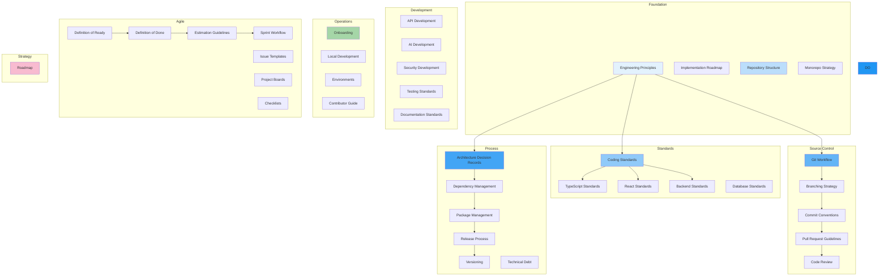

# Engineering Handbook

## Overview

This handbook is the official guide for all engineering work on the **Patorbit platform** — an AI-powered Career Intelligence Platform. It defines how engineers design, implement, review, release, and maintain the platform.

This handbook translates the architecture documentation into executable engineering practices. It enables any engineer to contribute confidently with minimal ambiguity.

## Navigation Guide

### For New Engineers

Start with **Engineering Principles**, **Repository Structure**, **Local Development**, and **Onboarding**.

### For All Engineers

Review **Coding Standards**, **TypeScript Standards**, **React Standards**, **Backend Standards**, and **Testing Standards**.

### For Team Leads

Focus on **Code Review**, **Pull Request Guidelines**, **Definition of Done**, **Technical Debt**, and **Estimation Guidelines**.

### For Architects

Review **Architecture Decision Records**, **Implementation Roadmap**, and **Dependency Management**.

## Document Map

## Document List

| #   | Document                                                          | Description                    |
| --- | ----------------------------------------------------------------- | ------------------------------ |
| 1   | [Engineering Principles](engineering-principles.md)               | Core engineering principles    |
| 2   | [Implementation Roadmap](implementation-roadmap.md)               | Phased build plan              |
| 3   | [Repository Structure](repository-structure.md)                   | Monorepo organization          |
| 4   | [Monorepo Strategy](monorepo-strategy.md)                         | Monorepo decisions             |
| 5   | [Coding Standards](coding-standards.md)                           | Code style and conventions     |
| 6   | [TypeScript Standards](typescript-standards.md)                   | TypeScript best practices      |
| 7   | [React Standards](react-standards.md)                             | React and frontend conventions |
| 8   | [Backend Standards](backend-standards.md)                         | Backend conventions            |
| 9   | [Database Standards](database-standards.md)                       | Database change process        |
| 10  | [API Development](api-development.md)                             | API implementation workflow    |
| 11  | [AI Development](ai-development.md)                               | AI feature development         |
| 12  | [Security Development](security-development.md)                   | Security requirements          |
| 13  | [Testing Standards](testing-standards.md)                         | Testing requirements           |
| 14  | [Documentation Standards](documentation-standards.md)             | Documentation expectations     |
| 15  | [Git Workflow](git-workflow.md)                                   | Git practices                  |
| 16  | [Branching Strategy](branching-strategy.md)                       | Branch naming and rules        |
| 17  | [Commit Conventions](commit-conventions.md)                       | Commit message format          |
| 18  | [Pull Request Guidelines](pull-request-guidelines.md)             | PR process                     |
| 19  | [Code Review](code-review.md)                                     | Review checklist               |
| 20  | [Architecture Decision Records](architecture-decision-records.md) | ADR workflow                   |
| 21  | [Dependency Management](dependency-management.md)                 | Update policy                  |
| 22  | [Package Management](package-management.md)                       | Package rules                  |
| 23  | [Release Process](release-process.md)                             | Release lifecycle              |
| 24  | [Versioning](versioning.md)                                       | Versioning scheme              |
| 25  | [Technical Debt](technical-debt.md)                               | Debt management                |
| 26  | [Onboarding](onboarding.md)                                       | New engineer setup             |
| 27  | [Local Development](local-development.md)                         | Dev environment                |
| 28  | [Environments](environments.md)                                   | Environment configuration      |
| 29  | [Contributor Guide](contributor-guide.md)                         | Contribution workflow          |
| 30  | [Definition of Ready](definition-of-ready.md)                     | Ready criteria                 |
| 31  | [Definition of Done](definition-of-done.md)                       | Done criteria                  |
| 32  | [Estimation Guidelines](estimation-guidelines.md)                 | Story estimation               |
| 33  | [Sprint Workflow](sprint-workflow.md)                             | Sprint execution               |
| 34  | [Issue Templates](issue-templates.md)                             | Issue management               |
| 35  | [Project Boards](project-boards.md)                               | Board conventions              |
| 36  | [Checklists](checklists.md)                                       | Engineering checklists         |
| 37  | [Roadmap](roadmap.md)                                             | Engineering maturity           |

## References

- [System Architecture](../specifications/architecture/README.md): System design.
- [API Architecture](../specifications/api/README.md): API contracts.
- [Frontend Architecture](../specifications/frontend/README.md): UI architecture.
- [AI Architecture](../specifications/ai/README.md): AI integration.
- [Quality Architecture](../specifications/quality/README.md): Testing strategy.
