# AI Platform Architecture

## Overview

This document set defines the complete AI platform architecture for the **Patorbit platform** — an AI-powered Career Intelligence Platform. AI is not a feature; it is a core capability embedded into every aspect of the platform.

This is the canonical reference for all AI engineering decisions, covering model abstraction, prompt orchestration, retrieval-augmented generation, agents, evaluation, safety, and cost management.

## Navigation Guide

### For AI Engineers

Start with **AI Principles**, **AI Platform Overview**, then **Model Abstraction**, **Prompt Architecture**, and **RAG Architecture**. Deep-dive into **Agent Architecture**, **Tool Calling**, and **Orchestration**.

### For Product / Prompt Engineers

Focus on **Prompt Library**, **Prompt Versioning**, **Evaluation**, and **Experimentation**. Study **Human-in-the-Loop** for review workflows.

### For SRE / ML Ops

Start with **Observability**, **Cost Management**, **Guardrails**, and **Safety**. Then study **Model Abstraction** and **Provider Management**.

## Document Map

```mermaid
graph TB
    subgraph "Foundation"
        PR[AI Principles]
        OV[AI Platform Overview]
    end

    subgraph "Models"
        MA[Model Abstraction]
        PM[Provider Management]
    end

    subgraph "Prompts"
        PA[Prompt Architecture]
        PL[Prompt Library]
        PV[Prompt Versioning]
    end

    subgraph "Retrieval"
        RA[RAG Architecture]
        EM[Embeddings]
        VS[Vector Search]
        KG[Knowledge Graph Integration]
    end

    subgraph "Agents"
        AA[Agent Architecture]
        TC[Tool Calling]
        OR[Orchestration]
    end

    subgraph "Capabilities"
        RG[Resume Generation]
        CR[Career Recommendations]
        DI[Document Intelligence]
        CA[Claim Analysis]
        EA[Evidence Analysis]
        TCI[Trust-Confidence AI]
    end

    subgraph "Quality"
        EV[Evaluation]
        HM[Hallucination Mitigation]
        GR[Guardrails]
        SF[Safety]
        PRIV[Privacy]
    end

    subgraph "Operations"
        OB[Observability]
        CM[Cost Management]
        EX[Experimentation]
        HIL[Human-in-the-Loop]
        TEST[AI Testing]
        GOV[Governance]
    end

    subgraph "Strategy"
        RM[Roadmap]
        ADR[Architecture Decision Records]
    end

    PR --> MA
    OV --> PA
    MA --> PM
    PA --> PL
    PL --> PV
    RA --> EM
    EM --> VS
    VS --> KG
    AA --> TC
    TC --> OR
    OR --> RG
    OR --> CR
    OR --> DI
    EV --> HM
    HM --> GR
    GR --> SF
    SF --> PRIV
    OB --> CM
    EX --> HIL
    HIL --> TEST
    TEST --> GOV

    style PR fill:#e3f2fd
    style OV fill:#bbdefb
    style MA fill:#90caf9
    style PA fill:#64b5f6
    style AA fill:#42a5f5
    style EV fill:#ef5350
    style OB fill:#ffb74d
    style RM fill:#ce93d8
    style ADR fill:#f8bbd0
```

## Document List

| #   | Document                                                          | Description                      |
| --- | ----------------------------------------------------------------- | -------------------------------- |
| 1   | [AI Principles](ai-principles.md)                                 | Core AI engineering principles   |
| 2   | [AI Platform Overview](ai-platform-overview.md)                   | End-to-end AI architecture       |
| 3   | [Model Abstraction](model-abstraction.md)                         | Provider-agnostic model layer    |
| 4   | [Provider Management](provider-management.md)                     | Model provider lifecycle         |
| 5   | [Prompt Architecture](prompt-architecture.md)                     | Prompt composition and design    |
| 6   | [Prompt Library](prompt-library.md)                               | Organized prompt catalog         |
| 7   | [Prompt Versioning](prompt-versioning.md)                         | Prompt lifecycle management      |
| 8   | [RAG Architecture](rag-architecture.md)                           | Retrieval-Augmented Generation   |
| 9   | [Embeddings](embeddings.md)                                       | Embedding generation and storage |
| 10  | [Vector Search](vector-search.md)                                 | Vector search design             |
| 11  | [Knowledge Graph Integration](knowledge-graph-integration.md)     | AI + Knowledge Graph             |
| 12  | [Agent Architecture](agent-architecture.md)                       | AI agent design                  |
| 13  | [Tool Calling](tool-calling.md)                                   | Tool invocation framework        |
| 14  | [Orchestration](orchestration.md)                                 | Workflow orchestration           |
| 15  | [Resume Generation](resume-generation.md)                         | AI resume capabilities           |
| 16  | [Career Recommendations](career-recommendations.md)               | Career path insights             |
| 17  | [Document Intelligence](document-intelligence.md)                 | Document analysis                |
| 18  | [Claim Analysis](claim-analysis.md)                               | Claim validation assistance      |
| 19  | [Evidence Analysis](evidence-analysis.md)                         | Evidence processing              |
| 20  | [Trust-Confidence AI](trust-confidence-ai.md)                     | Trust and confidence             | AI  |
| 21  | [Evaluation](evaluation.md)                                       | Quality evaluation pipelines     |
| 22  | [Hallucination Mitigation](hallucination-mitigation.md)           | Hallucination prevention         |
| 23  | [Guardrails](guardrails.md)                                       | AI guardrails and policy         |
| 24  | [Safety](safety.md)                                               | AI safety and bias               |
| 25  | [Privacy](privacy.md)                                             | AI privacy controls              |
| 26  | [Observability](observability.md)                                 | Monitoring and metrics           |
| 27  | [Cost Management](cost-management.md)                             | Cost optimization                |
| 28  | [Experimentation](experimentation.md)                             | A/B testing and canaries         |
| 29  | [Human-in-the-Loop](human-in-the-loop.md)                         | Human review workflows           |
| 30  | [AI Testing](ai-testing.md)                                       | Testing strategy                 |
| 31  | [Governance](governance.md)                                       | AI governance                    |
| 32  | [Roadmap](roadmap.md)                                             | Long-term AI roadmap             |
| 33  | [Architecture Decision Records](architecture-decision-records.md) | Major AI decisions               |

## References

- [Domain Architecture](../domain/README.md): Domain model this AI implements.
- [System Architecture](../architecture/README.md): System-level AI integration.
- [Data Architecture](../data/README.md): Data foundations for AI.
