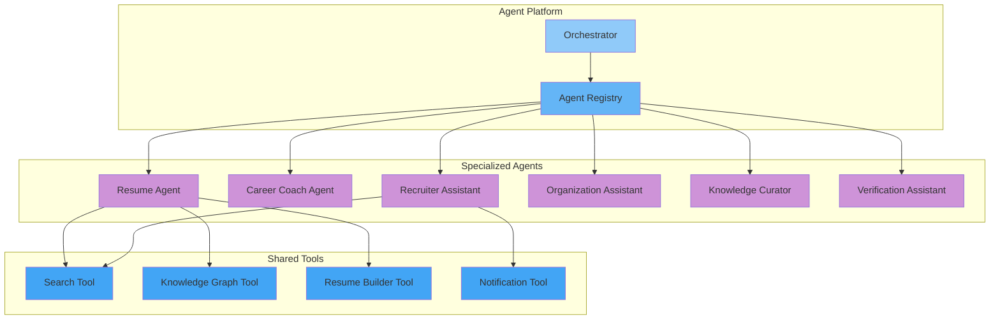

# Agent Architecture

## Purpose

This document defines the AI agent architecture for the Patorbit platform, enabling specialized agents for different tasks.

## Scope

This document covers agent definitions, responsibilities, and the agent lifecycle.

---

## Agent Architecture

---

## Agent Definitions

### Resume Agent

**Purpose**: Assist users in creating, optimizing, and customizing resumes.

**Capabilities**:

- Generate professional summaries.
- Optimize experience descriptions.
- Extract and format skills.
- Tailor content for target roles.
- ATS compatibility analysis.

### Career Coach Agent

**Purpose**: Provide personalized career advice and recommendations.

**Capabilities**:

- Career path recommendations.
- Skill gap analysis.
- Industry trend insights.
- Learning resource suggestions.
- Interview preparation.

### Recruiter Assistant

**Purpose**: Help recruiters find and evaluate candidates.

**Capabilities**:

- Natural language candidate search.
- Candidate profile summaries.
- Match scoring with explanations.
- Search query optimization.
- Outreach message generation.

### Organization Assistant

**Purpose**: Help organizations manage their talent data.

**Capabilities**:

- Workforce analytics.
- Skill gap analysis.
- Verification queue assistance.
- Credential issuance support.
- Talent pool analysis.

### Knowledge Curator

**Purpose**: Maintain and enrich the Knowledge Graph.

**Capabilities**:

- Entity linking.
- Relationship discovery.
- Duplicate detection.
- Taxonomy management.
- Data quality improvement.

### Verification Assistant

**Purpose**: Assist the verification process.

**Capabilities**:

- Evidence document analysis.
- Consistency checking.
- Flag potential fraud.
- Verification confidence scoring.

## Agent Lifecycle

1. **Instantiated**: A new agent is created for a session.
2. **Configured**: The agent receives a system prompt and available tools.
3. **Active**: The agent processes requests.
4. **Terminated**: The session ends, and the agent is released.

## References

- [Tool Calling](tool-calling.md): Tools available to agents.
- [Orchestration](orchestration.md): Orchestrating agent workflows.
- [AI Platform Overview](ai-platform-overview.md): Overall architecture.
