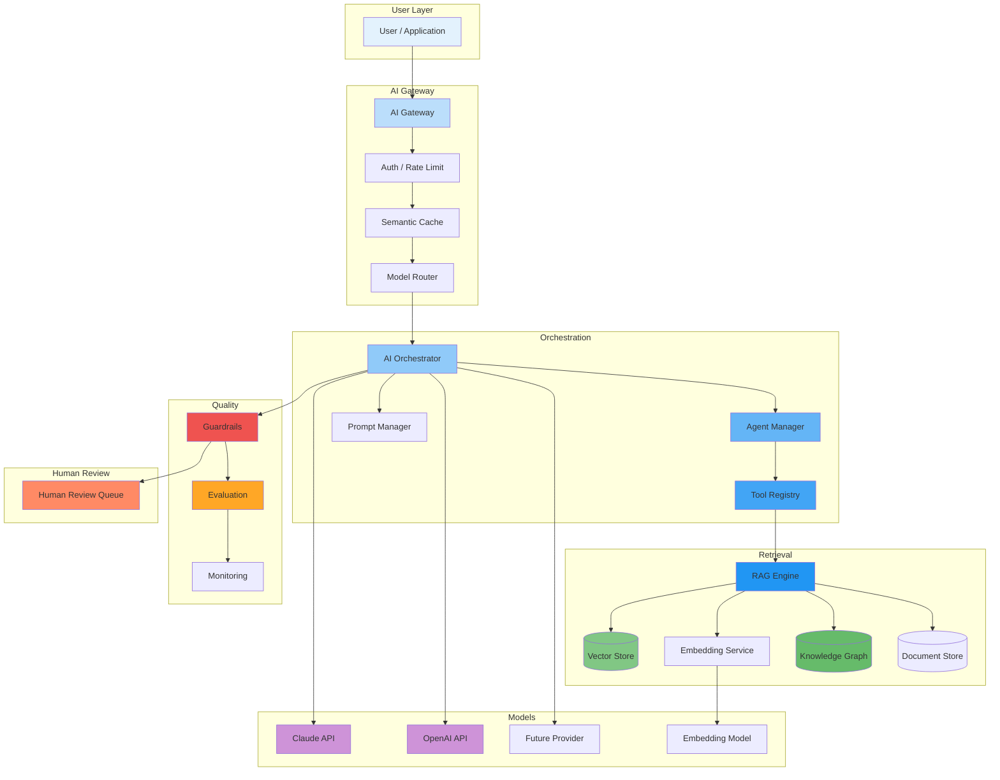
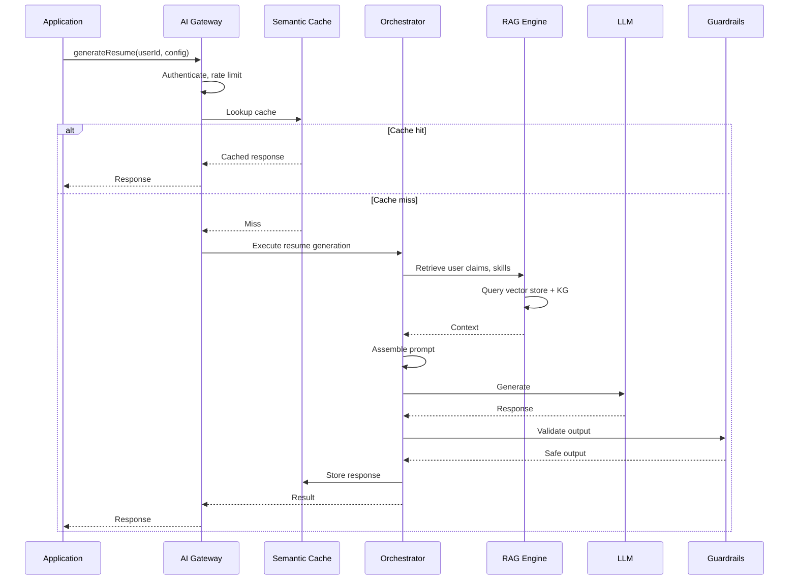

# AI Platform Overview

## Purpose

This document describes the end-to-end AI architecture for the Patorbit platform, showing how user requests are processed through the AI pipeline.

## Scope

This document covers all major AI components, their interactions, and the data flow from request to response.

---

## AI Architecture (C4 Level 1)

---

## Core Components

### AI Gateway

The entry point for all AI requests. Responsibilities:

- **Authentication**: Validate API tokens, enforce rate limits.
- **Semantic Cache**: Cache semantically similar requests to reduce cost and latency.
- **Model Router**: Route to the appropriate model based on capability, cost, and availability.

### AI Orchestrator

The brain of the AI platform. Responsibilities:

- **Agent Management**: Create and manage AI agent instances.
- **Prompt Assembly**: Compile prompt templates with context and instructions.
- **Tool Invocation**: Execute tools (search, Knowledge Graph, resume builder) during generation.
- **Multi-Step Reasoning**: Chain multiple AI operations for complex tasks.
- **Fallback Handling**: Retry with alternative models on failure.

### RAG Engine

Retrieves relevant context to ground AI responses. Responsibilities:

- **Query Construction**: Build search queries from user intent.
- **Multi-Source Retrieval**: Search across vector store, Knowledge Graph, and document store.
- **Chunking and Embedding**: Process documents into searchable chunks.
- **Re-ranking**: Order retrieved results by relevance.
- **Context Assembly**: Compose retrieved information into the prompt context window.

### Guardrails

Enforces safety and policy on all AI interactions. Responsibilities:

- **Input Guard**: Detect prompt injection, PII, and inappropriate content in user input.
- **Output Guard**: Filter harmful, biased, or ungrounded content from AI output.
- **Policy Enforcement**: Apply workspace and organization AI usage policies.

---

## Request Flow

## References

- [Model Abstraction](model-abstraction.md): Provider-agnostic layer.
- [RAG Architecture](rag-architecture.md): Retrieval details.
- [Agent Architecture](agent-architecture.md): Agent design.
- [Orchestration](orchestration.md): Orchestration engine.
