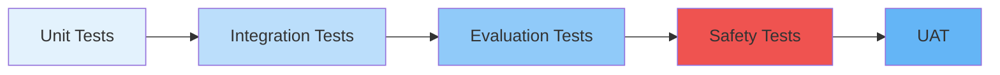

# AI Testing

## Purpose

Testing strategy for AI features.

## Test Types

| Type             | Description                                    | Tool                 |
| ---------------- | ---------------------------------------------- | -------------------- |
| Prompt Tests     | Verify prompt output against expected schema   | Golden dataset       |
| Regression Tests | Compare new outputs against previous baselines | Evaluation pipeline  |
| Load Tests       | Measure latency and throughput under load      | k6 / Artillery       |
| Safety Tests     | Verify guardrails catch unsafe inputs          | Dedicated test suite |
| User Acceptance  | Validate with real users                       | A/B testing          |

## Testing Pipeline

## References

- [Evaluation](evaluation.md): Evaluation pipeline.
- [Experimentation](experimentation.md): A/B testing.
