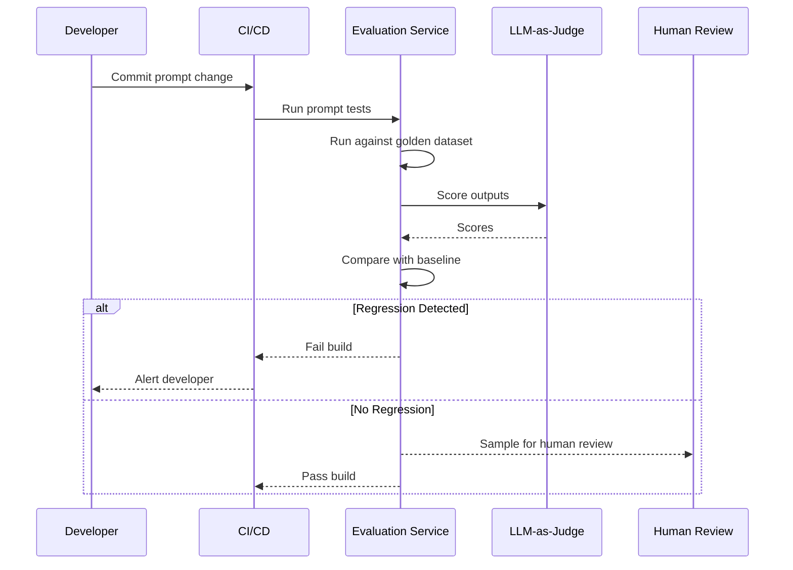

# Evaluation

## Purpose

Defines the AI evaluation pipeline to ensure quality and prevent regressions.

## Evaluation Pipeline

## Metrics

| Metric                 | Description                                   |
| ---------------------- | --------------------------------------------- |
| **Accuracy**           | Correctness of extracted information          |
| **Completeness**       | How much relevant information was captured    |
| **Relevance**          | How relevant the output is to the task        |
| **Coherence**          | Readability and fluency                       |
| **Safety**             | Absence of harmful content                    |
| **Hallucination Rate** | Percentage of outputs with unsupported claims |

## References

- [AI Testing](ai-testing.md): Testing strategy.
- [Human-in-the-Loop](human-in-the-loop.md): Human review.
