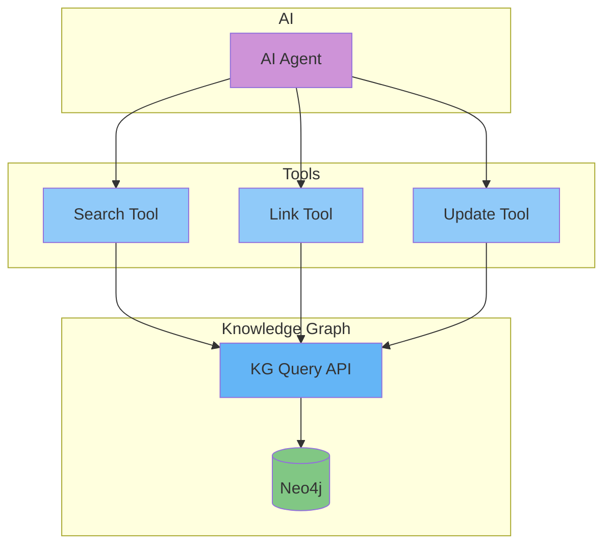

# Knowledge Graph Integration

## Purpose

This document explains how AI interacts with the Knowledge Graph to enrich data, discover relationships, and ground responses.

## Scope

Entity linking, relationship discovery, graph enrichment, and reasoning support.

---

## AI + Knowledge Graph Architecture

---

## Entity Linking

- **Purpose**: Link unstructured text (from resumes, documents) to structured nodes in the Knowledge Graph.
- **Flow**:
  1. AI extracts entities (companies, universities, skills) from text.
  2. Search the Knowledge Graph for matching nodes.
  3. If a match is found, create an edge.
  4. If no match, create a new node.

## Relationship Discovery

- **Purpose**: Discover relationships between nodes based on context.
- **Flow**:
  1. AI analyzes a claim (e.g., "Software Engineer at Acme Corp").
  2. Extracts entities: `Acme Corp` (organization), `Software Engineer` (role).
  3. Proposes an `employed_at` edge between the user and organization.

## Graph Enrichment

- **Purpose**: Use AI to infer new knowledge and enrich the graph.
- **Examples**:
  - Infer skill proficiency from experience descriptions.
  - Suggest related skills.
  - Cluster similar job roles.
  - Predict career paths based on historical data.

## Reasoning Support

- **Purpose**: Use the graph to answer complex questions that require multi-hop reasoning.
- **Example**: "Which employees at my company have used Python and have a verified degree from an Ivy League school?"
- **Flow**: AI agent translates the question into a Cypher query, executes it, and synthesizes the results.

## References

- [Agent Architecture](agent-architecture.md): AI agents that use the graph.
- [Tool Calling](tool-calling.md): Tools for graph interaction.
- [Knowledge Graph Schema](../data/knowledge-graph-schema.md): Graph data model.
