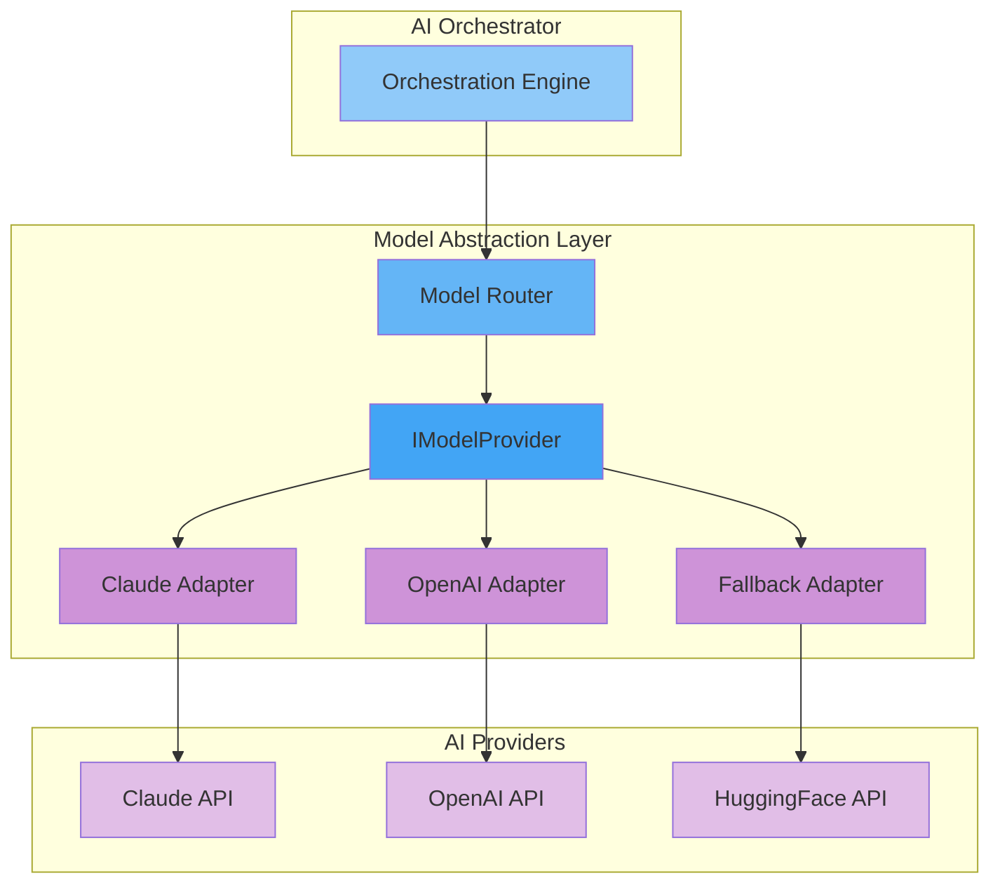
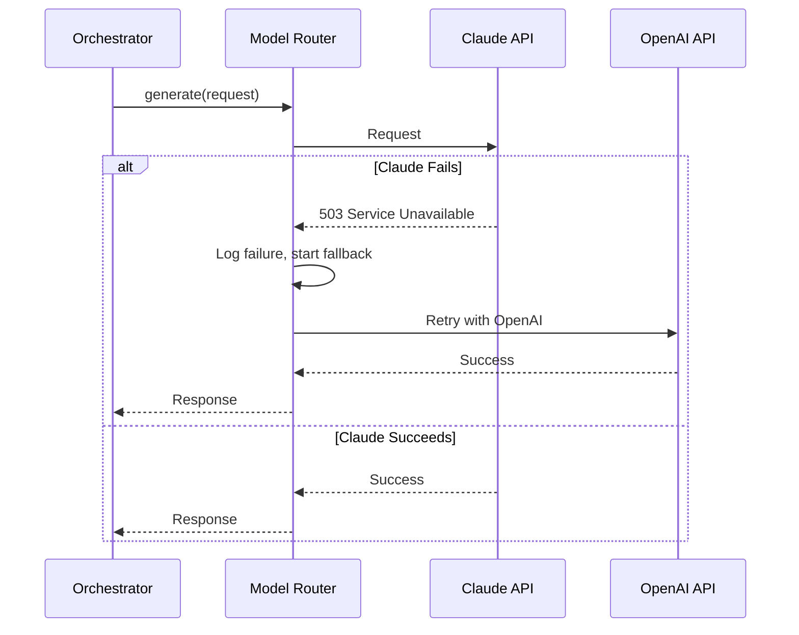

# Model Abstraction

## Purpose

This document defines the model abstraction layer for the Patorbit AI platform, ensuring that business logic is decoupled from specific AI providers.

## Scope

This document covers model routing, provider interfaces, fallbacks, and failover.

---

## Model Abstraction Architecture



---

## Provider Interface

All providers must implement a standard interface:

```typescript
interface IModelProvider {
  generate(request: GenerateRequest): Promise<GenerateResponse>;
  embed(request: EmbedRequest): Promise<EmbedResponse>;
  classify(request: ClassifyRequest): Promise<ClassifyResponse>;
  getCapabilities(): CapabilityMatrix;
}
```

## Model Router

The Model Router is responsible for selecting the best model for a given task.

### Routing Logic

1. **Explicit Request**: If the request specifies a model, route to that model.
2. **Capability-Based**: If the request specifies a capability (e.g., "summarize-long"), route to the best model for that capability.
3. **Cost-Based**: Route to the cheapest model that meets the capability requirements.
4. **Latency-Based**: Route to the fastest model for interactive tasks.
5. **Default**: Route to the default provider (Claude).

### Provider Capability Matrix

| Capability          | Claude 3.5 Sonnet | GPT-4o | Llama 3 70B |
| ------------------- | ----------------- | ------ | ----------- |
| Max Context         | 200K              | 128K   | 8K          |
| Tool Calling        | Yes               | Yes    | Yes         |
| Image Understanding | Yes               | Yes    | No          |
| Structured Output   | Yes               | Yes    | Yes         |
| Cost per 1M tokens  | $15               | $10    | $1          |

## Fallback and Failover

- **Fallback**: If the primary model fails, the router automatically retries with a fallback model.
- **Failover**: If a provider is down (status check fails), the router automatically routes to the next best provider.

### Failover Strategy



## Model Version Management

- Models are referenced by their abstract name (e.g., `patorbit/generation/large`) in business logic.
- The Model Router maps abstract names to specific provider models (e.g., `claude-3-5-sonnet-20240620`).
- This allows model versions to be updated without changing application code.

## References

- [Provider Management](provider-management.md): Provider lifecycle.
- [Prompt Architecture](prompt-architecture.md): Prompt compatibility.
- [AI Platform Overview](ai-platform-overview.md): Overall architecture.
