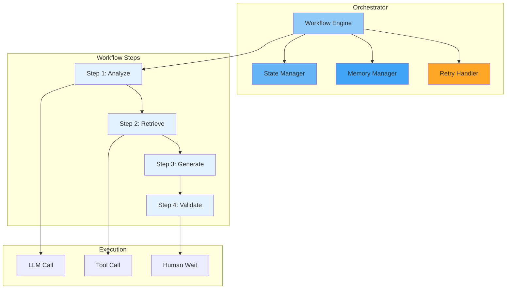

# Orchestration

## Purpose

This document defines the AI orchestration engine for the Patorbit platform, enabling complex multi-step AI workflows.

## Scope

Workflow execution, multi-step reasoning, retries, timeouts, and state handling.

---

## Orchestration Architecture



---

## Workflow Definition

Workflows are defined as a sequence of steps:

```yaml
workflow: generate_resume
steps:
  - id: analyze_passport
    type: llm
    prompt: resume/generate/summary
  - id: retrieve_skills
    type: tool
    tool: get_claims
    depends_on: analyze_passport
  - id: generate_section
    type: llm
    prompt: resume/generate/experience
    depends_on: [analyze_passport, retrieve_skills]
  - id: validate_output
    type: tool
    tool: validate_resume
    depends_on: generate_section
```

## State Handling

- Workflow state is persisted between steps.
- If a step fails, the workflow can be retried from the failed step (not from the beginning).
- State is scoped to the session.

## Retry Strategy

| Failure Type      | Retries | Strategy                  |
| ----------------- | ------- | ------------------------- |
| LLM Timeout       | 3       | Exponential backoff       |
| Tool Failure      | 2       | Immediate retry           |
| Validation Failed | 1       | Re-generate with feedback |
| Human Timeout     | —       | Keep waiting              |

## References

- [Agent Architecture](agent-architecture.md): Agents orchestrated by this engine.
- [Tool Calling](tool-calling.md): Tools executed during workflows.
- [AI Platform Overview](ai-platform-overview.md): System integration.
