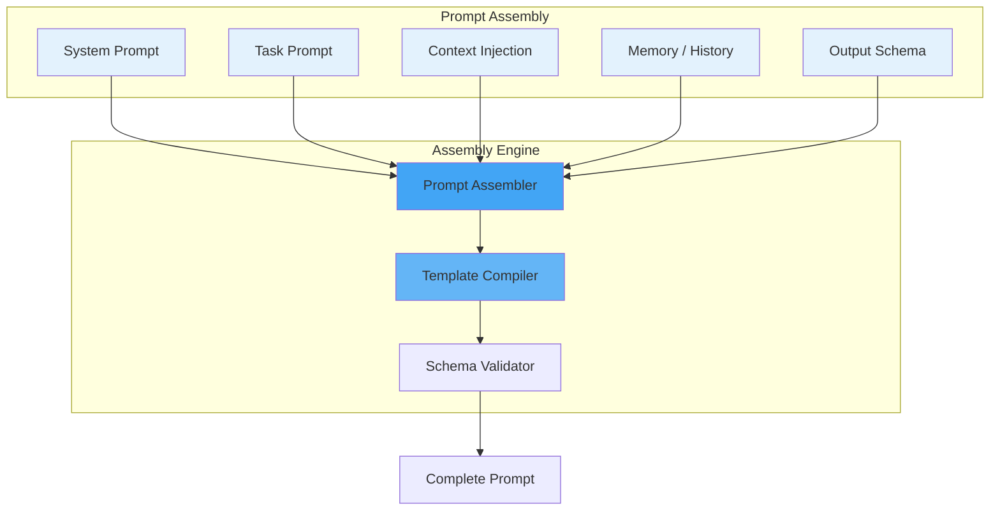

# Prompt Architecture

## Purpose

This document defines the prompt composition architecture for the Patorbit AI platform.

## Scope

This document covers system prompts, task prompts, context assembly, memory injection, and output schema definition.

---

## Prompt Composition



---

## Prompt Template Format

Templates use a simple variable interpolation syntax:

```
## System Instructions
You are an AI career assistant.

## Context
User has the following claims:
{{#each claims}}
- {{title}} ({{type}}) - {{status}}
{{/each}}

## Task
Based on the claims above, generate a resume summary.

## Output Format
{{outputSchema}}
```

## System Prompt

The system prompt defines the AI's role, behavior, and constraints. It is consistent across all prompts for the same agent.

```yaml
System Prompt (Resume Agent):
  Role: 'You are an expert resume writer and career coach.'
  Behavior: 'Always be factual and evidence-based.'
  Constraints: 'Do not invent experience or skills.'
  Formatting: 'Generate structured JSON output.'
```

## Task Prompt

The task prompt defines the specific task to be performed. It varies per request.

```yaml
Task Prompt (Generate Summary):
  Task: 'Generate a professional summary.'
  Input: "User's current claims and target role."
  Output: 'A 2-3 sentence summary in JSON format.'
```

## Context Assembly

Context is retrieved from the Knowledge Graph, vector store, and document store. It is injected into the prompt as structured data.

### Context Sources

| Source       | Type         | Description             |
| ------------ | ------------ | ----------------------- |
| Claims       | Structured   | User's career claims    |
| Evidence     | Structured   | Evidence metadata       |
| Skills       | Structured   | Extracted skills        |
| Organization | Structured   | Organization data       |
| Resume       | Structured   | Existing resume content |
| Document     | Unstructured | Uploaded documents      |

## Output Schema

All structured outputs use JSON Schema for validation:

```json
{
  "type": "object",
  "properties": {
    "summary": { "type": "string" },
    "highlights": { "type": "array", "items": { "type": "string" } },
    "tone": { "type": "string", "enum": ["professional", "technical"] }
  },
  "required": ["summary"]
}
```

## References

- [Prompt Library](prompt-library.md): Prompt templates.
- [Prompt Versioning](prompt-versioning.md): Version management.
- [RAG Architecture](rag-architecture.md): Context retrieval.
