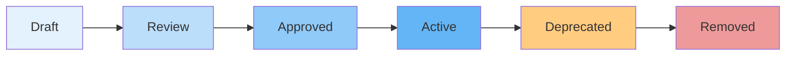
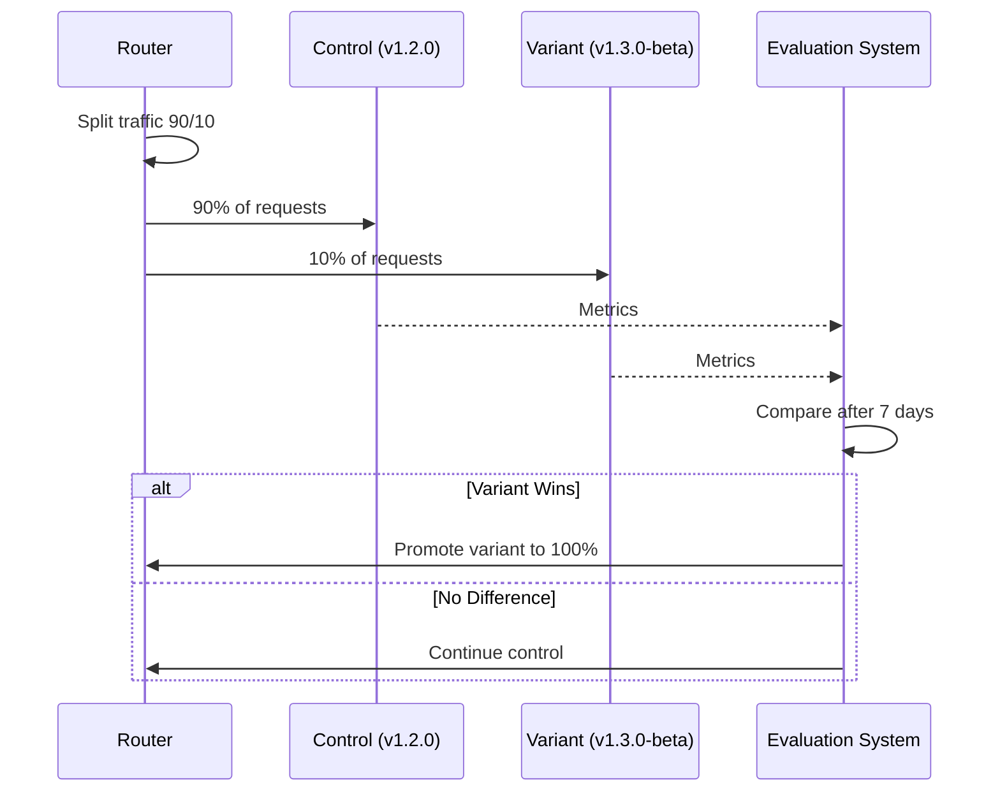

# Prompt Versioning

## Purpose

This document defines the prompt versioning and lifecycle management strategy.

## Scope

Versioning, rollback, A/B testing, and approval workflow.

---

## Prompt Lifecycle

## Versioning Strategy

- **Semantic Versioning**: Major.Minor.Patch for prompt templates.
- **Major**: Breaking changes to output format or behavior.
- **Minor**: Additive changes (new fields, additional context).
- **Patch**: Bug fixes, wording improvements.

## Rollback

- Rollback to any previous version within 24 hours (automated).
- Rollback to any version within 30 days (manual).
- Rollback triggers re-evaluation of the previous version.

## A/B Testing

- System supports routing a percentage of traffic to a variant.
- Metrics: quality score, user satisfaction, task completion rate.
- Automated promotion when variant outperforms control.

## Approval Workflow

| Step       | Approver        | Criteria                    |
| ---------- | --------------- | --------------------------- |
| Draft      | Author          | Initial version             |
| Review     | AI Team Lead    | Quality, safety, compliance |
| Approved   | Product Manager | Business alignment          |
| Active     | —               | —                           |
| Deprecated | AI Team Lead    | After 30 days of inactivity |

## References

- [Prompt Architecture](prompt-architecture.md): Prompt structure.
- [Prompt Library](prompt-library.md): Prompt catalog.
- [Experimentation](experimentation.md): A/B testing.
