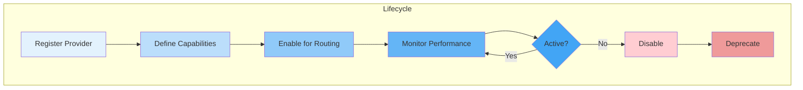

# Provider Management

## Purpose

This document defines how AI providers are registered, selected, monitored, and replaced without changing business logic.

## Scope

This document covers provider registration, capability matrix, selection, monitoring, and replacement.

---

## Provider Lifecycle



---

## Provider Registration

Providers are registered in a configuration file:

```yaml
providers:
  - name: 'claude'
    adapter: 'ClaudeAdapter'
    apiKeySecret: 'CLAUDE_API_KEY'
    baseUrl: 'https://api.anthropic.com'
  - name: 'openai'
    adapter: 'OpenAIAdapter'
    apiKeySecret: 'OPENAI_API_KEY'
    baseUrl: 'https://api.openai.com'
```

## Provider Capability Matrix

Each provider has a capability matrix that defines its strengths and weaknesses:

| Provider | Model      | Max Context | Tool Calling | Cost per 1M |
| -------- | ---------- | ----------- | ------------ | ----------- |
| Claude   | Sonnet 3.5 | 200K        | Yes          | $15         |
| OpenAI   | GPT-4o     | 128K        | Yes          | $10         |
| Llama 3  | 70B        | 8K          | Yes          | $1          |

## Provider Selection

The Model Router uses the capability matrix to select the best provider for each request.

```typescript
function selectProvider(task: Task): IModelProvider {
  if (task.requiresLongContext) {
    return getProvider('claude');
  }
  if (task.isCostSensitive) {
    return getProvider('llama3');
  }
  return getDefaultProvider();
}
```

## Provider Monitoring

Each provider is monitored for:

- **Availability**: Uptime and health checks.
- **Latency**: P50, P95, P99 response times.
- **Error Rate**: API error rate.
- **Cost**: Real-time cost per request.

## Provider Replacement

To replace a provider:

1. Register the new provider.
2. Implement a new adapter.
3. Update the capability matrix.
4. Route a small percentage of traffic to the new provider.
5. Monitor performance and quality.
6. Gradually increase traffic to the new provider.
7. Deprecate and remove the old provider.

## References

- [Model Abstraction](model-abstraction.md): Abstraction layer.
- [Observability](observability.md): Provider monitoring.
- [Cost Management](cost-management.md): Cost tracking.
