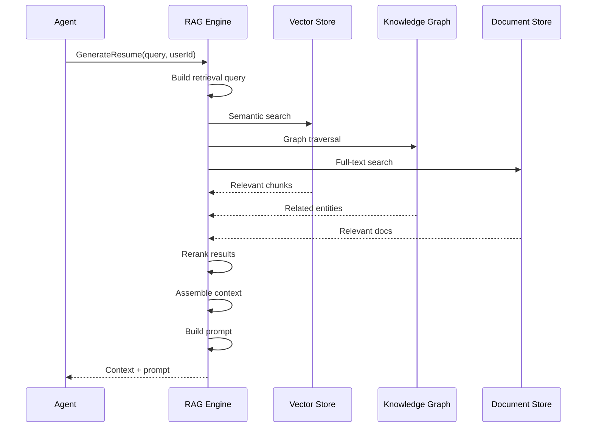

# RAG Architecture

## Purpose

This document defines the Retrieval-Augmented Generation (RAG) architecture for the Patorbit AI platform, grounding AI outputs in verified user data.

## Scope

Knowledge sources, retrieval flow, chunking, ranking, context assembly, and citation strategy.

---

## RAG Flow

## Knowledge Sources

| Source              | Type         | Retrieval Strategy |
| ------------------- | ------------ | ------------------ |
| User Claims         | Structured   | Graph traversal    |
| Evidence Metadata   | Structured   | Graph traversal    |
| Skills              | Structured   | Vector search      |
| Resume Content      | Unstructured | Vector + full-text |
| Organization Data   | Structured   | Graph traversal    |
| Uploaded Documents  | Unstructured | Vector search      |
| Industry Taxonomies | Structured   | Exact match        |

## Chunking Strategy

- **Documents**: Split by section (500-1000 tokens), overlap 50 tokens.
- **Resumes**: Split by section (Experience, Education, Skills).
- **Evidence**: Store as single chunk with metadata.

## Ranking

- **First Pass**: Embedding similarity (cosine distance).
- **Second Pass**: Cross-encoder reranking for top 20 results.
- **Final**: Top 10 chunks included in context.

## Context Assembly

- Inject the most relevant chunks into the prompt in order of relevance.
- Include source metadata for each chunk (citation tracking).
- Truncate context to fit model's context window.

## Citation Strategy

- Each claim in the AI output is attributed to a specific source chunk.
- Sources are returned as metadata alongside the generated content.
- Users can click citations to view the original source.

## References

- [Embeddings](embeddings.md): Embedding generation.
- [Vector Search](vector-search.md): Search implementation.
- [Knowledge Graph Integration](knowledge-graph-integration.md): KG retrieval.
