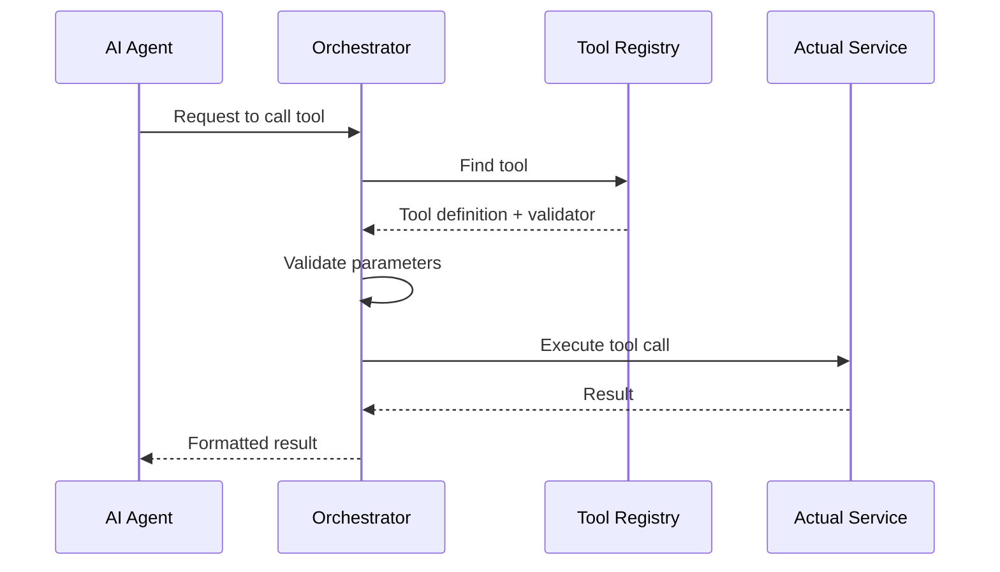

# Tool Calling

## Purpose

This document defines the tool invocation framework for AI agents, enabling them to interact with platform capabilities.

## Scope

Tool registry, tool execution, and tool lifecycle.

---

## Tool Registry

| Tool                    | Description                | Parameters                   |
| ----------------------- | -------------------------- | ---------------------------- |
| `search_candidates`     | Search for candidates      | query, filters               |
| `search_jobs`           | Search job descriptions    | query                        |
| `get_passport`          | Retrieve a passport        | passportId                   |
| `get_claims`            | Retrieve claims            | identityId, filters          |
| `get_evidence`          | Retrieve evidence metadata | claimId                      |
| `create_claim`          | Create a new claim         | type, title, dates           |
| `update_resume`         | Update a resume            | resumeId, section, content   |
| `query_knowledge_graph` | Query the KG               | cypherQuery                  |
| `link_entity`           | Link entities              | sourceId, targetId, edgeType |
| `list_tools`            | List available tools       | —                            |

## Tool Execution Flow



## Tool Definition

Each tool is defined by its schema:

```json
{
  "name": "search_candidates",
  "description": "Search for candidates matching criteria",
  "parameters": {
    "type": "object",
    "properties": {
      "query": { "type": "string" },
      "skills": { "type": "array", "items": { "type": "string" } }
    },
    "required": ["query"]
  }
}
```

## Security

- Tools validate input parameters before execution.
- Access control is enforced for each tool based on user roles.
- Sensitive tools (write operations) require confirmation.

## References

- [Agent Architecture](agent-architecture.md): Agents using tools.
- [Orchestration](orchestration.md): Orchestrating tool calls.
