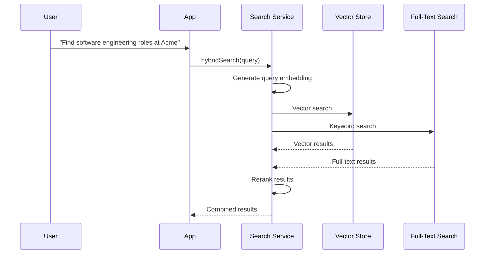

# Vector Search

## Purpose

This document defines the vector search architecture for semantic search and retrieval.

## Scope

Indexes, metadata filters, hybrid search, ranking, and performance.

---

## Vector Search Flow



## Indexes

| Index Name | Source Content              | Dimensions |
| ---------- | --------------------------- | ---------- |
| `claims`   | Claim title and description | 768        |
| `skills`   | Skill name and description  | 768        |
| `resumes`  | Resume sections             | 1536       |
| `evidence` | Evidence metadata           | 768        |
| `jobs`     | Job descriptions            | 1536       |

## Metadata Filtering

Vector search is combined with metadata filters:

```
vectorSearch(embedding, {
  filters: {
    status: 'verified',
    industry: 'tech',
    startDate: { gte: '2023-01-01' }
  }
})
```

## Hybrid Search

Combine vector search with keyword search:

1. Fetch top 100 results from vector search.
2. Fetch top 100 results from full-text search.
3. Rerank the combined results using a cross-encoder.

## Ranking

- **Reciprocal Rank Fusion**: Combine ranks from vector and full-text search.
- **Cross-Encoder Reranking**: Use a dedicated cross-encoder model to rerank the top results.

## Performance

- **Index**: HNSW (Hierarchical Navigable Small Worlds) for fast approximate nearest neighbor search.
- **Latency**: Aim for p99 < 200ms for vector search.
- **Partitioning**: Partition indexes by organization ID for multi-tenant isolation.

## References

- [Embeddings](embeddings.md): Embedding generation.
- [RAG Architecture](rag-architecture.md): Retrieval flow.
- [Data Architecture](../architecture/data-architecture.md): Database technology.
