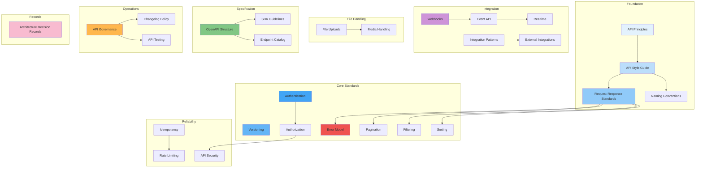

# API Architecture

## Overview

This document set defines the complete API architecture for the **Patorbit platform**, an AI-powered Career Intelligence Platform. The API architecture follows API First, REST best practices, OpenAPI 3.1 standards, and enterprise integration patterns to support web, mobile, AI agents, and third-party integrations.

This is the canonical reference for all API design, governance, and integration decisions.

## Navigation Guide

### For Frontend Engineers

Start with **API Style Guide**, **Request-Response Standards**, and **Pagination/Filtering/Sorting**. Then study **Authentication** and **Authorization** for integration patterns.

### For Backend Engineers

Study the full set: **API Principles**, **Versioning**, **Error Model**, **Idempotency**, then **Endpoints Catalog** and **OpenAPI Structure**.

### For Integration / Partner Engineers

Start with **Webhooks**, **Event API**, **Integration Patterns**, and **External Integrations**. Then study **Authentication** and **API Security**.

### For Platform / API Architects

Focus on **API Governance**, **API Security**, **Changelog Policy**, **SDK Guidelines**, and **Architecture Decision Records**.

## Document Map

## Document List

| #   | Document                                                          | Description                                 |
| --- | ----------------------------------------------------------------- | ------------------------------------------- |
| 1   | [API Principles](api-principles.md)                               | Foundational API design principles          |
| 2   | [API Style Guide](api-style-guide.md)                             | Resource naming, URI design, HTTP methods   |
| 3   | [Versioning](versioning.md)                                       | API versioning strategy                     |
| 4   | [Authentication](authentication.md)                               | OAuth 2.1, JWT, API Keys                    |
| 5   | [Authorization](authorization.md)                                 | RBAC, ABAC, OAuth scopes                    |
| 6   | [Error Model](error-model.md)                                     | Standard error format and codes             |
| 7   | [Pagination](pagination.md)                                       | Cursor and offset pagination                |
| 8   | [Filtering](filtering.md)                                         | Filtering syntax and conventions            |
| 9   | [Sorting](sorting.md)                                             | Sorting syntax and conventions              |
| 10  | [Idempotency](idempotency.md)                                     | Idempotency keys and retry handling         |
| 11  | [Rate Limiting](rate-limiting.md)                                 | Throttling and burst handling               |
| 12  | [Webhooks](webhooks.md)                                           | Webhook architecture and delivery           |
| 13  | [Event API](event-api.md)                                         | Event contracts for async integration       |
| 14  | [Realtime](realtime.md)                                           | WebSockets and SSE                          |
| 15  | [File Uploads](file-uploads.md)                                   | Upload strategy and signed URLs             |
| 16  | [Media Handling](media-handling.md)                               | PDFs, images, resume files                  |
| 17  | [OpenAPI Structure](openapi-structure.md)                         | OpenAPI specification organization          |
| 18  | [SDK Guidelines](sdk-guidelines.md)                               | SDK generation standards                    |
| 19  | [Integration Patterns](integration-patterns.md)                   | Sync, async, webhook, batch                 |
| 20  | [External Integrations](external-integrations.md)                 | Email, SMS, AI, payment, auth providers     |
| 21  | [API Security](api-security.md)                                   | Encryption, validation, CORS, CSRF          |
| 22  | [API Testing](api-testing.md)                                     | Contract, integration, load, security tests |
| 23  | [API Governance](api-governance.md)                               | Review process, breaking changes, lifecycle |
| 24  | [Endpoint Catalog](endpoint-catalog.md)                           | Resource organization and endpoint groups   |
| 25  | [Request-Response Standards](request-response-standards.md)       | Canonical envelopes and metadata            |
| 26  | [Naming Conventions](naming-conventions.md)                       | Unified naming across all API artifacts     |
| 27  | [Changelog Policy](changelog-policy.md)                           | Change documentation and deprecation        |
| 28  | [Architecture Decision Records](architecture-decision-records.md) | Major API architecture decisions            |

## References

- [Domain Architecture](../domain/README.md): Business domain this API implements.
- [System Architecture](../architecture/README.md): System-level API integration.
- [Data Architecture](../data/README.md): Data models this API exposes.
