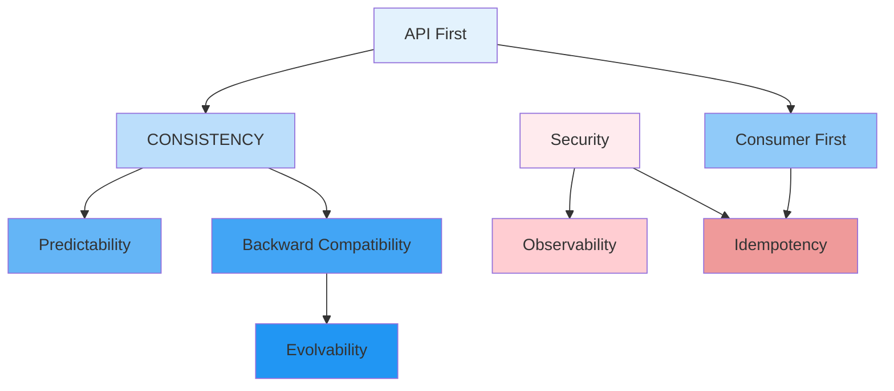

# API Principles

## Purpose

This document defines the core principles that guide all API design decisions for the Patorbit platform. These principles ensure consistency, quality, and maintainability across the entire API surface.

## Scope

This document covers the engineering principles applicable to all public, private, and internal APIs.

---

## Principles

### 1. API First

**Principle**: Design and document APIs before implementing any feature. The API contract is the source of truth.

**Rationale**: API-first development enables parallel frontend and backend work, ensures well-defined boundaries, and produces a consistent developer experience. It prevents implementation details from leaking into the API surface.

**Application**:

- Every feature begins with an OpenAPI specification.
- API reviews are required before implementation begins.
- Mock servers are generated from specifications for parallel development.

### 2. Consumer First

**Principle**: APIs are designed from the perspective of the consumer, not the implementer.

**Rationale**: The API is a product for developers. Its usability directly impacts integration velocity, partner satisfaction, and internal productivity.

**Application**:

- Resource names reflect business concepts, not database tables.
- Error messages are human-readable and actionable.
- Documentation includes code examples in multiple languages.
- Breaking changes are minimized and well-communicated.

### 3. Consistency

**Principle**: All APIs follow uniform conventions for naming, structure, error handling, pagination, and authentication.

**Rationale**: Consistency reduces cognitive load for developers integrating with multiple Patorbit APIs. When a developer learns one API, they have learned them all.

**Application**:

- All resources follow the same naming conventions.
- All responses follow the same envelope structure.
- All errors follow the same format.
- All endpoints support the same pagination, filtering, and sorting patterns.

### 4. Predictability

**Principle**: API behavior should be predictable based on HTTP methods and status codes.

**Rationale**: HTTP has well-defined semantics for CRUD operations. Adhering to these standards means developers can predict behavior without reading detailed documentation.

**Application**:

- `GET` requests never modify state.
- `POST` creates resources, `PUT` replaces, `PATCH` partially updates.
- `DELETE` is idempotent (repeated calls return the same result).
- HTTP status codes are used according to their standard definitions.

### 5. Backward Compatibility

**Principle**: Existing API consumers must not break when new features are added.

**Rationale**: The platform has long-lived integrations. Breaking changes are costly for consumers and erode trust in the platform.

**Application**:

- Additive changes (new fields, new endpoints) are always backward compatible.
- Breaking changes require a new major version.
- Fields are never removed; they are deprecated with a sunset notice.
- Deprecated fields remain functional for at least 6 months.

### 6. Security

**Principle**: Security is built into every API by default.

**Rationale**: Career data is highly sensitive. Every API endpoint must enforce authentication, authorization, input validation, and output encoding.

**Application**:

- All endpoints require authentication unless explicitly marked public.
- HTTPS is required for all API communication.
- Input is validated on every request.
- Output is encoded to prevent injection attacks.
- Rate limiting protects against abuse.

### 7. Observability

**Principle**: Every API request is observable through logs, metrics, and traces.

**Rationale**: At millions of requests per day, debugging requires distributed tracing, structured logging, and aggregated metrics.

**Application**:

- Every request carries a correlation ID.
- All API requests and responses are logged (with PII redacted).
- Request latency, error rate, and throughput are monitored.
- Distributed tracing spans every cross-service call.

### 8. Idempotency

**Principle**: State-changing operations should be safe to retry without unintended side effects.

**Rationale**: Network failures are inevitable. Idempotent APIs allow clients to safely retry failed requests.

**Application**:

- `POST`, `PUT`, `PATCH`, and `DELETE` support idempotency keys.
- The server deduplicates requests with the same idempotency key.
- Idempotency guarantees are documented per endpoint.

### 9. Evolvability

**Principle**: APIs are designed to evolve without breaking existing consumers.

**Rationale**: The platform will grow and change over time. The API must accommodate new features, new data, and new requirements.

**Application**:

- Responses include extra fields by default (consumers ignore unknown fields).
- Query parameters allow optional behavior changes.
- New endpoints are added before old ones are deprecated.
- Extensibility points are designed into the API from the start.

## Principle Hierarchy

## References

- [API Style Guide](api-style-guide.md): Application of these principles.
- [Architecture Principles](../architecture/architecture-principles.md): System-level principles.
- [API Governance](api-governance.md): Enforcement of these principles.
