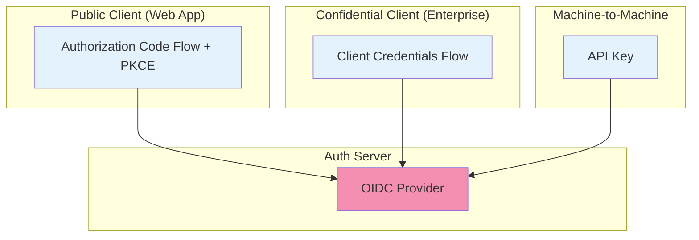

# Authentication

## Purpose

This document defines the API authentication strategy for the Patorbit platform, detailing how consumers are identified and authenticated.

## Scope

This document covers OAuth 2.1, JWT, API keys, service accounts, and session management.

---

## Authentication Flows

---

## 1. OAuth 2.1 (Primary)

**Flow**: Authorization Code with PKCE (Proof Key for Code Exchange)

**Rationale**: The recommended flow for web and mobile applications. It is secure against authorization code interception attacks.

**Steps**:

1. **Authorization Request**: Client redirects user to the `/authorize` endpoint with `response_type=code`, `client_id`, `redirect_uri`, `scope`, `state`, and `code_challenge`.
2. **User Consent**: User authenticates and grants consent.
3. **Authorization Code**: Auth server redirects to client with an authorization code.
4. **Token Request**: Client sends the authorization code + `code_verifier` to the `/token` endpoint.
5. **Token Response**: Auth server returns `access_token` and `refresh_token`.

## 2. JWT (Access Tokens)

**Type**: JSON Web Token (JWT)
**Algorithm**: RS256
**Lifetime**: 15 minutes

**Claims**:

| Claim   | Description                            |
| ------- | -------------------------------------- |
| `sub`   | Subject (User ID)                      |
| `iss`   | Issuer (Patorbit Auth)                 |
| `aud`   | Audience (Patorbit API)                |
| `exp`   | Expiration time                        |
| `iat`   | Issued at time                         |
| `jti`   | JWT ID                                 |
| `scope` | Space-separated list of granted scopes |
| `roles` | Array of user roles                    |

## 3. Refresh Tokens

- **Type**: Opaque string.
- **Lifetime**: 30 days, rolling.
- **Rotation**: A new refresh token is issued with each refresh.
- **Storage**: Stored in a secure, HttpOnly cookie on the client.

## 4. API Keys (Machine-to-Machine)

**Use Case**: Enterprise integrations, CI/CD, internal service accounts.

**Format**: `patorbit_sk_{random_string}`

**Authentication**:

- Sent in the `Authorization` header: `Authorization: Bearer {api_key}`.
- Keys are hashed in the database.

## 5. Service Accounts

**Use Case**: Internal machine-to-machine communication.

**Authentication**:

- Use the Client Credentials Flow to obtain a short-lived access token.
- Scopes are restricted to the service's required permissions.

## 6. Device Authentication

**Use Case**: Securing mobile and IoT devices.

**Strategy**:

- **Device ID**: Each device registers and receives a unique device ID.
- **Attestation**: Use platform-specific attestation (SafetyNet, DeviceCheck) to verify device integrity.
- **Biometric Factors**: Use biometric data for step-up authentication.

## 7. MFA Integration

- **Trigger**: When an API endpoint is configured with a higher level of assurance (ACR - Authentication Context Class Reference).
- **Flow**: API returns a `401 Unauthorized` with a challenge. Client completes the MFA flow and retries the request with the updated token.

## References

- [Authorization](authorization.md): Authorization after authentication.
- [API Security](api-security.md): Overall security posture.
- [System Architecture/authentication.md](../architecture/authentication.md): System-level authentication.
