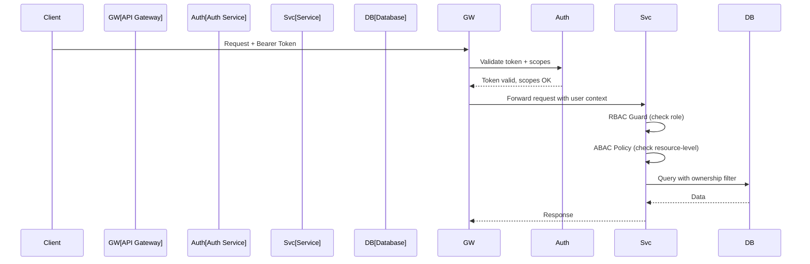

# Authorization

## Purpose

This document defines the API authorization model for the Patorbit platform, detailing how requests are checked for permissions.

## Scope

This document covers RBAC, ABAC, resource ownership, and fine-grained OAuth scopes.

---

## Authorization Model: RBAC + ABAC

The platform uses a hybrid RBAC (Role-Based Access Control) and ABAC (Attribute-Based Access Control) model.

### Example

- **RBAC**: A `Recruiter` role can search candidates.
- **ABAC**: A `Recruiter` can view a candidate's profile only if the candidate's `visibility` is `public` or `recruiters_only`.

---

## OAuth Scopes

Scopes follow the resource:action pattern.

| Scope                | Description                 |
| -------------------- | --------------------------- |
| `passport:read`      | Read passport data          |
| `passport:write`     | Create and update passport  |
| `claim:read`         | Read claims                 |
| `claim:write`        | Create and update claims    |
| `evidence:read`      | Read evidence metadata      |
| `evidence:write`     | Submit evidence             |
| `organization:read`  | Read organization data      |
| `organization:write` | Manage organization         |
| `resume:read`        | Read resumes                |
| `resume:write`       | Create and generate resumes |
| `candidate:search`   | Search candidates           |
| `webhook:manage`     | Manage webhooks             |

---

## Authorization Flow

## Resource Ownership

| Resource     | Owner                |
| ------------ | -------------------- |
| Passport     | Identity             |
| Claim        | Identity             |
| Evidence     | Identity (submitter) |
| Organization | Organization         |
| Workspace    | Organization         |
| Resume       | Identity             |

## Fine-Grained Permissions

| Action                  | Rule                                                          |
| ----------------------- | ------------------------------------------------------------- |
| **View passport**       | User is owner, OR recruiter (with visibility check), OR admin |
| **Edit claim**          | User is owner                                                 |
| **Delete evidence**     | User is owner, AND evidence is not verified                   |
| **Manage organization** | User is org admin                                             |
| **Search candidates**   | User has recruiter role                                       |

## References

- [Authentication](authentication.md): Authentication mechanisms.
- [API Security](api-security.md): Security enforcement.
- [System Architecture/authorization.md](../architecture/authorization.md): System-level authorization.
- [Domain Architecture/permissions.md](../domain/permissions.md): Domain-level permissions.
