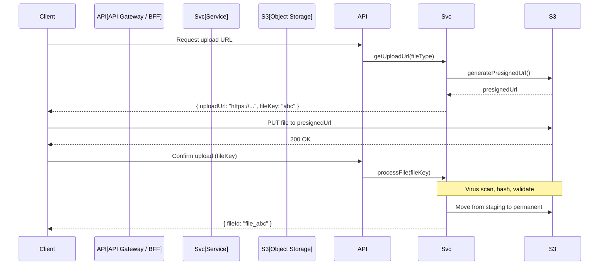

# File Uploads

## Purpose

This document defines the file upload architecture for the Patorbit API, enabling secure, resumable uploads for evidence documents, profile images, and resume exports.

## Scope

This document covers upload strategies, signed URLs, virus scanning, and limits.

---

## Upload Architecture

---

## Upload Types

| File Type          | Max Size | Allowed Formats            |
| ------------------ | -------- | -------------------------- |
| Evidence Documents | 20 MB    | PDF, PNG, JPG, DOCX        |
| Evidence Links     | N/A      | URLs (validated reachable) |
| Profile Photos     | 5 MB     | JPG, PNG, WebP             |
| Resume Exports     | 10 MB    | PDF, DOCX, HTML            |
| AI Uploads         | 10 MB    | PDF, DOCX, TXT             |

## Virus Scanning

- All uploaded files are scanned for viruses using ClamAV.
- Files are quarantined in a staging bucket during scanning.
- If clean: files are moved to the permanent bucket.
- If infected: files are deleted, and the user is notified.

## Signed URLs

- Upload URLs are pre-signed with a short expiration (15 minutes).
- Download URLs for evidence files are pre-signed with a longer expiration (1 hour).
- Signed URLs can be revoked if the associated claim or evidence is deleted.

## Resumable Uploads

For large files (> 5 MB), the client can use S3's multipart upload API:

1. **Initiate**: Request a multipart upload.
2. **Upload Parts**: Upload individual parts with part numbers.
3. **Complete**: Signal completion; S3 assembles the file.

## File Handling Limits

| Limit                               | Value |
| ----------------------------------- | ----- |
| Maximum file size                   | 20 MB |
| Maximum concurrent uploads per user | 5     |

## References

- [Media Handling](media-handling.md): Post-upload processing.
- [Storage Strategy](../architecture/storage-strategy.md): Storage architecture.
- [API Security](api-security.md): Secure file handling.
