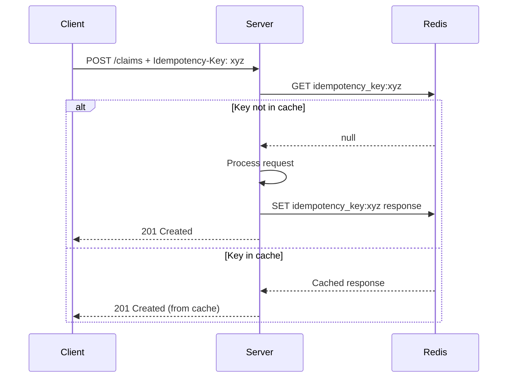

# Idempotency

## Purpose

This document defines the idempotency strategy for the Patorbit API, ensuring that mutating requests (`POST`, `PUT`, `PATCH`, `DELETE`) can be safely retried without unintended side effects.

## Scope

This document covers idempotency keys, request deduplication, and conflict handling.

---

## Idempotency Flow

## Idempotency Key

- **Header**: `Idempotency-Key`
- **Value**: A unique, client-generated UUID.
- **Lifetime**: The server stores the result of the first request with a given idempotency key for 24 hours.

## Behavior

1. **First Request**: The server processes the request and stores the response and status code in a cache (Redis), keyed by the `Idempotency-Key`.
2. **Subsequent Requests**: If the same request (same key, same body) is received within 24 hours, the server returns the cached response without reprocessing the request.
3. **Conflict**: If a request with the same key but a different body is received, the server returns `409 Conflict`.

## Supported Methods

- `POST`
- `PUT`
- `PATCH`
- `DELETE`

## Conflict Handling

A `409 Conflict` error is returned if a retry is attempted with a different request body but the same idempotency key.

## References

- [API Principles](api-principles.md): Idempotency as a core principle.
- [Error Model](error-model.md): 409 Conflict error.
- [Rate Limiting](rate-limiting.md): Retries and rate limits.
