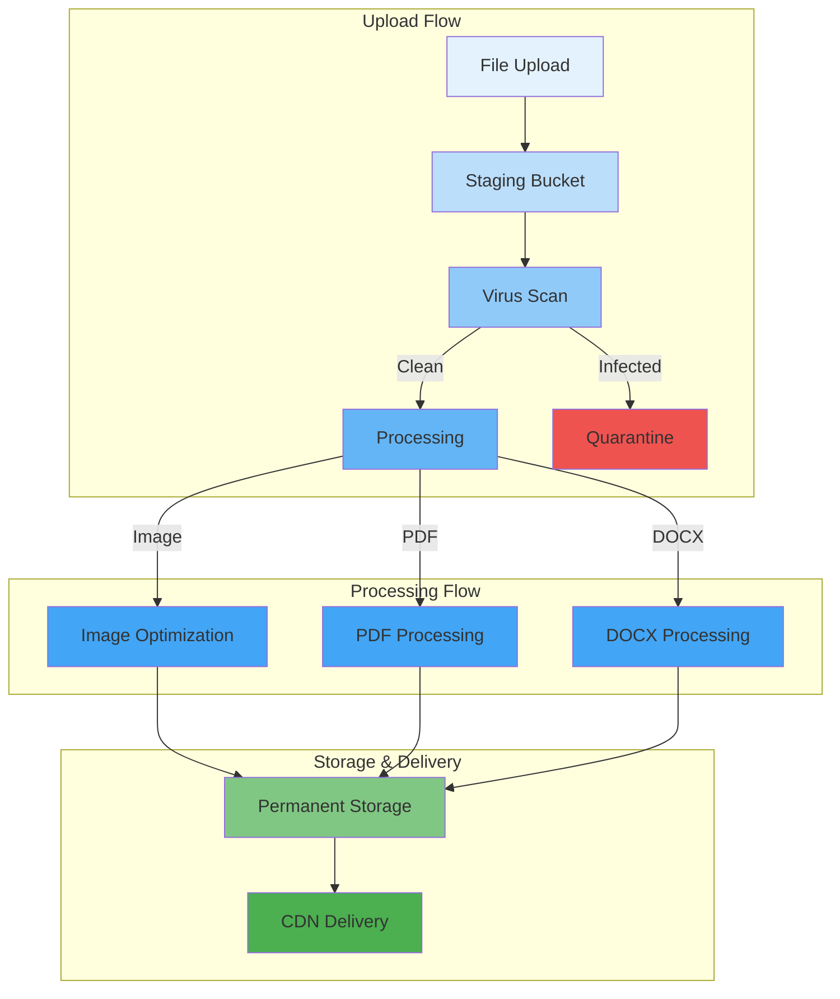

# Media Handling

## Purpose

This document defines the media handling strategy for the Patorbit API, covering PDFs, images, generated resumes, and evidence files.

## Scope

This document covers media processing, storage, delivery, and security.

---

## Media Processing Pipeline

---

## Image Handling

### Processing

- **Resize**: Create multiple sizes (thumbnail, medium, large).
- **Optimize**: Compress with WebP/AVIF.
- **Watermark**: Add a subtle watermark for sensitive evidence.
- **Metadata**: Strip EXIF data to protect privacy.

### Storage

- **Permanent Bucket**: Different sizes stored for efficient retrieval.
- **CDN**: All image sizes served via CDN with long TTL.

## PDF Handling

### Processing

- **Text Extraction**: Extract text for search indexing and AI analysis.
- **Thumbnail**: Generate a thumbnail of the first page.
- **Sanitization**: Sanitize PDFs to remove malicious content.

### Storage

- **Original**: Stored in a private bucket.
- **Extracted Text**: Stored in OpenSearch.

## Resume Generation

- **Formats**: PDF, DOCX, HTML.
- **Generation**: Generated on-demand using a templating engine (Puppeteer, DOCX-tpl).
- **Storage**: Cached for a short period (10 minutes) to avoid re-generation.

## Evidence Files

- **Originals**: Original files are stored indefinitely in an archival tier.
- **Access**: Access is strictly controlled via pre-signed URLs.
- **Audit**: All access to evidence files is logged.

## Security

- **MIME Type Validation**: Validate file MIME type on upload.
- **Content Sniffing**: Disable content sniffing (`X-Content-Type-Options: nosniff`).
- **Permissions**: All media is private by default; public access is granted via CDN or pre-signed URLs.

## References

- [File Uploads](file-uploads.md): Upload process.
- [Storage Strategy](../architecture/storage-strategy.md): Storage buckets and policies.
- [API Security](api-security.md): Security controls.
