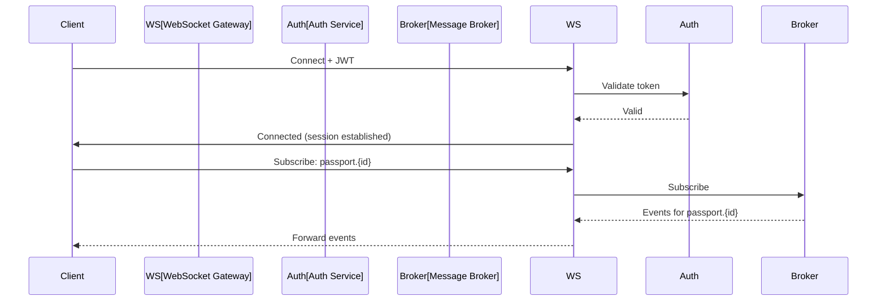

# Realtime

## Purpose

This document defines the real-time API architecture for the Patorbit platform, enabling live updates, notifications, and presence for interactive features.

## Scope

This document covers WebSockets, Server-Sent Events (SSE), and notification delivery.

---

## Real-Time Communication

### Primary: WebSockets

**Use Case**: Bidirectional communication for resume builder collaboration, recruiter chat, and live notifications.

**Flow**:



### Secondary: Server-Sent Events (SSE)

**Use Case**: One-way server-to-client streaming for event feeds and activity streams.

## WebSocket Events

```json
// Client → Server (Subscribe)
{
  "type": "subscribe",
  "channel": "passport.pass_123"
}

// Server → Client (Event)
{
  "type": "event",
  "channel": "passport.pass_123",
  "event": {
    "type": "claim.verified",
    "data": { "claimId": "claim_456" }
  }
}
```

## Channels

| Channel                 | Description             | Authorization       |
| ----------------------- | ----------------------- | ------------------- |
| `passport.{passportId}` | Passport updates        | Passport owner only |
| `organization.{orgId}`  | Organization activity   | Org members         |
| `user.{userId}`         | User notifications      | User themselves     |
| `workspace.{wsId}`      | Workspace collaboration | Workspace members   |

## References

- [Webhooks](webhooks.md): Webhook-based event delivery.
- [Event API](event-api.md): Event contracts.
- [API Security](api-security.md): WebSocket authentication.
