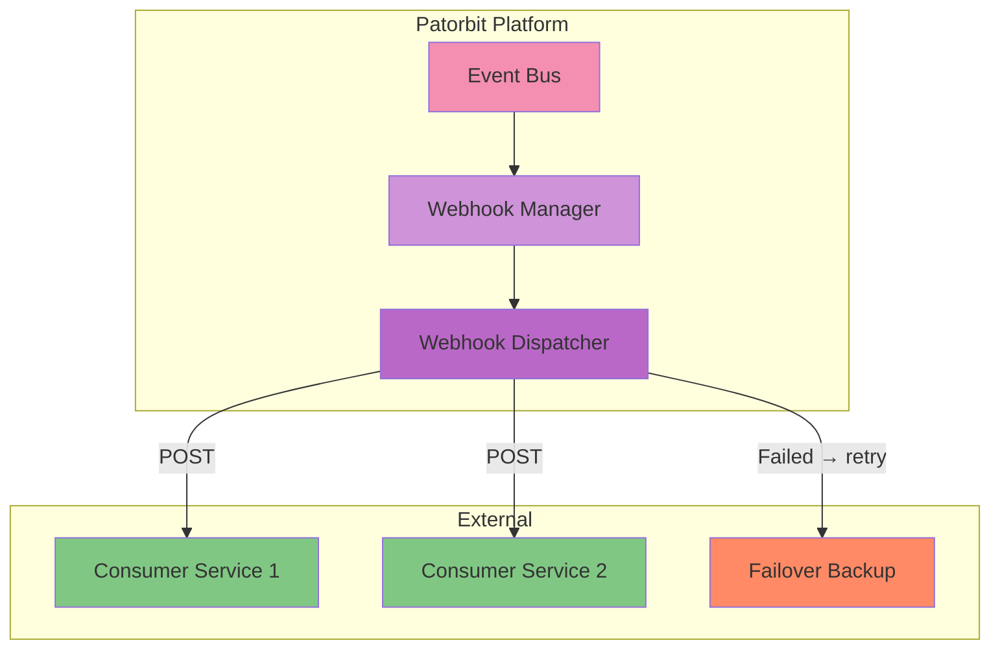

# Webhooks

## Purpose

This document defines the webhook architecture for the Patorbit platform, enabling event-driven integrations with external systems.

## Scope

This document covers webhook event subscriptions, delivery, security, retries, and management.

---

## Webhook Architecture



---

## Event Subscription

### Registering a Webhook

```
POST /v1/webhooks
{
  "url": "https://example.com/patorbit-events",
  "events": [
    "passport.published",
    "verification.completed"
  ],
  "description": "My integration"
}
```

### Supported Events

| Event                    | Description                       |
| ------------------------ | --------------------------------- |
| `passport.published`     | A passport has been published     |
| `claim.created`          | A new claim has been created      |
| `verification.completed` | A verification has been completed |
| `evidence.submitted`     | New evidence has been submitted   |
| `organization.verified`  | An organization has been verified |

---

## Delivery

- **Method**: `POST` to the registered URL.
- **Content-Type**: `application/json`.
- **Timeout**: 10 seconds.
- **Payload**: The event payload conforms to the standard event envelope.

### Security

- **Signature**: Every payload is signed with `SHA256` of the payload body plus the client secret.
- **Header**: `X-Patorbit-Signature: t=1729852800,sig={signature}`
- **Verification**: The client must verify the signature to ensure the payload was sent by Patorbit.

### Retries

| Attempt | Delay                  |
| ------- | ---------------------- |
| 1st     | Immediate              |
| 2nd     | 10 seconds             |
| 3rd     | 60 seconds             |
| 4th     | 5 minutes              |
| 5th     | 30 minutes             |
| 6th     | 2 hours                |
| Final   | Fail → marked inactive |

## Managing Webhooks

- **List**: `GET /v1/webhooks`
- **Get**: `GET /v1/webhooks/{webhookId}`
- **Update**: `PATCH /v1/webhooks/{webhookId}`
- **Delete**: `DELETE /v1/webhooks/{webhookId}`

## Replay Protection

- Each event has a unique `id`.
- Events may be delivered more than once (at-least-once delivery).
- Consumers should track processed event IDs for idempotency.

## References

- [Event API](event-api.md): Event contracts.
- [API Security](api-security.md): Signature verification.
- [API Testing](api-testing.md): Testing webhook endpoints.
