# System Architecture

## Overview

This document set defines the complete system architecture for the **Patorbit platform**, an AI-powered Career Intelligence Platform. The architecture is designed using Clean Architecture, Hexagonal Architecture, Event-Driven Architecture, and Cloud Native principles to support millions of users worldwide.

This is the canonical engineering reference for all platform infrastructure, deployment, security, data, AI, and operational decisions.

## Navigation Guide

### For Infrastructure Engineers

Start with **Infrastructure**, **Deployment Architecture**, and **Scalability**. Then study **Disaster Recovery**, **Cost Optimization**, and **Technology Decisions**.

### For Backend Engineers

Start with **Backend Architecture**, **Module Architecture**, and **Service Boundaries**. Then study **API Architecture**, **Data Architecture**, **Events**, and **Messaging**.

### For Frontend Engineers

Start with **Frontend Architecture**, then review **API Architecture** (consumption patterns) and **Performance** for load-time budgets.

### For AI Engineers

Start with **AI Architecture**, then study **Data Architecture** (vector storage), **Caching Strategy** (model output caching), and **Cost Optimization** (inference cost).

### For Security Engineers

Start with **Security Architecture**, **Authentication**, and **Authorization**. Then review all documents for compliance and security posture.

### For SRE / DevOps

Start with **Observability**, **Monitoring**, **Logging**, and **Resiliency**. Then study **Deployment Architecture** and **Disaster Recovery**.

## Document Map

```mermaid
graph TB
    subgraph "Foundation"
        AP[Architecture Principles]
        SO[System Overview]
    end

    subgraph "Structural"
        CA[Component Architecture]
        MA[Module Architecture]
        SB[Service Boundaries]
    end

    subgraph "Interface"
        AA[API Architecture]
        FA[Frontend Architecture]
        BA[Backend Architecture]
    end

    subgraph "AI & Data"
        AI[AI Architecture]
        DA[Data Architecture]
        SS[Storage Strategy]
        CS[Caching Strategy]
    end

    subgraph "Communication"
        EA[Event Architecture]
        MS[Messaging]
    end

    subgraph "Security"
        SA[Security Architecture]
        AU[Authentication]
        AZ[Authorization]
    end

    subgraph "Operations"
        DEP[Deployment Architecture]
        INF[Infrastructure]
        SCL[Scalability]
        RSL[Resiliency]
        DR[Disaster Recovery]
    end

    subgraph "Observability"
        OBS[Observability]
        LOG[Logging]
        MON[Monitoring]
    end

    subgraph "Optimization"
        PERF[Performance]
        COST[Cost Optimization]
    end

    subgraph "Governance"
        TD[Technology Decisions]
        ADR[Architecture Decision Records]
    end

    FA --> AA
    BA --> AA
    BA --> DA
    BA --> EA
    BA --> MA
    AI --> DA
    AI --> CS
    AU --> SA
    AZ --> SA
    EA --> MS
    SCL --> DEP
    RSL --> DEP
    DR --> INF
    OBS --> MON
    OBS --> LOG
    PERF --> CS
    COST --> SCL

    style AP fill:#e3f2fd
    style SO fill:#e3f2fd
    style TD fill:#fce4ec
    style ADR fill:#fce4ec
```

## Document List

| #   | Document                                                          | Description                                        | Audience               |
| --- | ----------------------------------------------------------------- | -------------------------------------------------- | ---------------------- |
| 1   | [Architecture Principles](architecture-principles.md)             | Foundational engineering principles                | All                    |
| 2   | [System Overview](system-overview.md)                             | High-level architecture diagram and system context | All                    |
| 3   | [Component Architecture](component-architecture.md)               | Major platform component descriptions              | Architects             |
| 4   | [Module Architecture](module-architecture.md)                     | Internal module decomposition                      | Backend Engineers      |
| 5   | [Service Boundaries](service-boundaries.md)                       | Logical service boundary definitions               | Architects             |
| 6   | [API Architecture](api-architecture.md)                           | REST, Webhooks, GraphQL, OpenAPI strategy          | Backend/Frontend       |
| 7   | [Frontend Architecture](frontend-architecture.md)                 | React/Next.js frontend design                      | Frontend Engineers     |
| 8   | [Backend Architecture](backend-architecture.md)                   | NestJS backend layers                              | Backend Engineers      |
| 9   | [AI Architecture](ai-architecture.md)                             | AI/LLM integration, RAG, prompts                   | AI Engineers           |
| 10  | [Data Architecture](data-architecture.md)                         | Database strategy and data ownership               | Backend/Data Engineers |
| 11  | [Storage Strategy](storage-strategy.md)                           | Object storage, file handling, retention           | Infrastructure         |
| 12  | [Caching Strategy](caching-strategy.md)                           | Multi-layer caching design                         | All                    |
| 13  | [Event Architecture](event-architecture.md)                       | Domain events, commands, event flows               | Backend                |
| 14  | [Messaging](messaging.md)                                         | Async communication, queues, topics                | Backend                |
| 15  | [Security Architecture](security-architecture.md)                 | Threat model, encryption, compliance               | Security/All           |
| 16  | [Authentication](authentication.md)                               | OAuth, JWT, MFA, session management                | Security/Backend       |
| 17  | [Authorization](authorization.md)                                 | RBAC, ABAC, policy enforcement                     | Security/Backend       |
| 18  | [Deployment Architecture](deployment-architecture.md)             | CI/CD, containers, environments                    | DevOps                 |
| 19  | [Infrastructure](infrastructure.md)                               | Cloud architecture, networking, DNS                | Infrastructure         |
| 20  | [Scalability](scalability.md)                                     | Horizontal/vertical scaling strategy               | DevOps/All             |
| 21  | [Resiliency](resiliency.md)                                       | Circuit breakers, retries, fallbacks               | Backend/DevOps         |
| 22  | [Disaster Recovery](disaster-recovery.md)                         | RPO/RTO, backups, failover                         | Infrastructure         |
| 23  | [Observability](observability.md)                                 | Tracing, metrics, SLIs, SLOs                       | SRE/All                |
| 24  | [Logging](logging.md)                                             | Structured logging, correlation                    | Backend/DevOps         |
| 25  | [Monitoring](monitoring.md)                                       | Dashboards, alerting, synthetic monitoring         | SRE                    |
| 26  | [Performance](performance.md)                                     | Budgets, Core Web Vitals, optimization             | All                    |
| 27  | [Cost Optimization](cost-optimization.md)                         | Cloud cost, AI inference, storage ROI              | Infrastructure         |
| 28  | [Technology Decisions](technology-decisions.md)                   | Technology selections and trade-offs               | Architects             |
| 29  | [Architecture Decision Records](architecture-decision-records.md) | ADR index and template                             | Architects             |

## Versioning

This architecture specification is versioned independently. Current version: **1.0.0**.

## References

- [Domain Architecture](../domain/README.md): The domain model this architecture implements.
