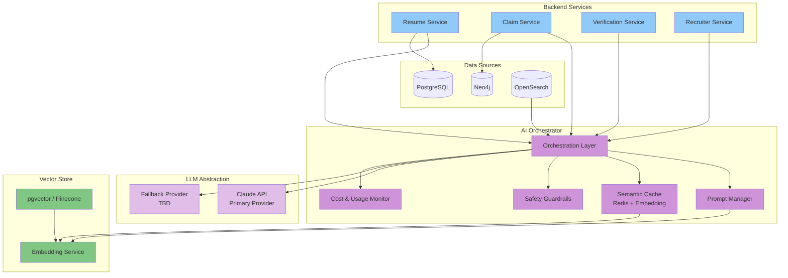

# AI Architecture

## Purpose

This document defines the AI architecture for the Patorbit platform. It covers LLM integration, prompt management, vector search, RAG (Retrieval-Augmented Generation), model abstraction, safety, and cost management.

## Scope

This document covers all AI-powered features, including resume analysis, skill extraction, claim suggestions, matching, and insights.

---

## AI Integration Overview



---

## AI Orchestrator

The AI Orchestrator is a central service that manages all AI interactions. It abstracts the complexity of LLM integration from backend services.

**Responsibilities**:

- Route AI requests to appropriate LLM provider based on capability and cost.
- Manage prompt templates (versioned, stored in database).
- Cache semantically similar requests to reduce cost and latency.
- Monitor and enforce token usage budgets.
- Apply safety guardrails (content filtering, PII detection).
- Retry with exponential backoff on transient failures.
- Provide a unified API for all AI features.

## Model Abstraction

**Primary Provider**: Claude API (Anthropic)

Selected for superior understanding of resume structures, strong reasoning capabilities, and structured output (tool use) for data extraction.

**Fallback Provider**: OpenAI API

Used for specific tasks where Claude is less optimal (e.g., certain embedding models). Provides redundancy if primary provider has an outage.

**Abstraction Layer**:

```typescript
interface LLMProvider {
  generate(prompt: Prompt, options?: ModelOptions): Promise<LLMResponse>;
  embed(text: string): Promise<Embedding>;
  getModelInfo(): ModelInfo;
}
```

This allows adding new providers without changing consuming services.

## Prompt Management

- **Prompt Templates**: Stored in PostgreSQL with versioning. Each template has an ID, version, and compiled template text.
- **Template Language**: Handlebars or Liquid-style templating for dynamic prompt construction.
- **Versioning**: Prompt templates are versioned. A new version is created when prompts are optimized.
- **A/B Testing**: Support for testing multiple prompt variants and comparing output quality.
- **Registry**: Prompt templates are registered and discoverable via a prompt registry API.

### Prompt Types

| Prompt Type            | Example Purpose                         | Context                               |
| ---------------------- | --------------------------------------- | ------------------------------------- |
| **Resume Analysis**    | Extract structured claims from a resume | Document text, claim types            |
| **Skill Extraction**   | Identify skills with context            | Job description, experience narrative |
| **Claim Optimization** | Improve claim phrasing                  | Claim text, target role               |
| **Match Scoring**      | Score candidate-job match               | Claim list, job description           |
| **Career Insight**     | Suggest career paths                    | Skill set, experience                 |
| **Anomaly Detection**  | Flag inconsistencies                    | Claim timeline, evidence              |

## Semantic Caching

To reduce cost and latency, semantically similar AI requests are cached.

- **Cache Key**: Compute embedding of the input prompt, find nearest neighbors in vector store.
- **Similarity Threshold**: If a cached result exists with cosine similarity > 0.95, return cached result.
- **TTL**: Cache entries expire based on time (1-24 hours) or invalidation events.
- **Storage**: Redis for fast lookup, vector store for semantic search.

## RAG (Retrieval-Augmented Generation)

For tasks that require context from the knowledge graph or user data:

1. **Query Construction**: AI Orchestrator receives a request with relevant entity IDs.
2. **Context Retrieval**: Retrieve relevant data from PostgreSQL, Neo4j (Knowledge Graph), or OpenSearch.
3. **Context Injection**: Inject retrieved context into the prompt.
4. **Generation**: LLM generates the response based on the augmented prompt.

**Example: Resume Analysis**

```
1. Request: analyze(userId, resumeDocument)
2. Retrieve: user's existing claims, skill taxonomy, relevant knowledge graph nodes.
3. Inject: "The user has existing claims for: {claims}. The resume states: {resumeText}."
4. Generate: "Extract new claims, suggest updates to existing claims, identify skills."
```

## Embeddings

- **Model**: text-embedding-3-small (OpenAI) or similar for general-purpose embeddings.
- **Storage**: pgvector (PostgreSQL extension) for operational embeddings, or Pinecone for high-scale.
- **Usage**: Semantic search, related claim discovery, skill matching, candidate-job matching.
- **Batching**: Embeddings are generated in batches for efficiency.

## Safety and Guardrails

- **Content Filtering**: Prompt and response are scanned for toxic, harmful, or deceptive content.
- **PII Detection**: Sensitive information (SSNs, credit cards, etc.) is detected and redacted before sending to the LLM.
- **Rate Limiting**: AI requests are rate-limited per user and per workspace.
- **Audit**: All AI requests and responses are logged for audit and quality monitoring.
- **Human-in-the-Loop**: High-stakes decisions (e.g., verification disputes) require human approval.

## Cost Management

| Strategy                | Description                          | Expected Savings |
| ----------------------- | ------------------------------------ | ---------------- |
| **Semantic Caching**    | Cache similar prompt results         | 30-50% reduction |
| **Prompt Optimization** | Minimize token usage per prompt      | 20-40% reduction |
| **Model Tiering**       | Use smaller models for simple tasks  | 40-60% reduction |
| **Batching**            | Batch embedding requests             | 10-20% reduction |
| **Rate Limiting**       | Prevent runaway costs                | Preventative     |
| **Budget Alerts**       | Automated alerts on spend thresholds | Preventative     |

## Observability

- **Token Usage**: Track input/output tokens per request, user, and feature.
- **Latency**: Monitor P50/P95/P99 response times per LLM provider.
- **Cost**: Real-time cost tracking per request and aggregated by time period.
- **Quality**: Track prompt success rate, error rate, and retry rate.
- **Feedback Loop**: User feedback on AI outputs (thumbs up/down) is captured to improve prompts and model selection.

## References

- [Data Architecture](data-architecture.md): Vector store and knowledge graph integration.
- [Caching Strategy](caching-strategy.md): Semantic caching details.
- [Cost Optimization](cost-optimization.md): AI inference cost management.
- [Observability](observability.md): AI monitoring dashboards.
- [Domain Architecture](../domain/domain-services.md): Domain services using AI.
