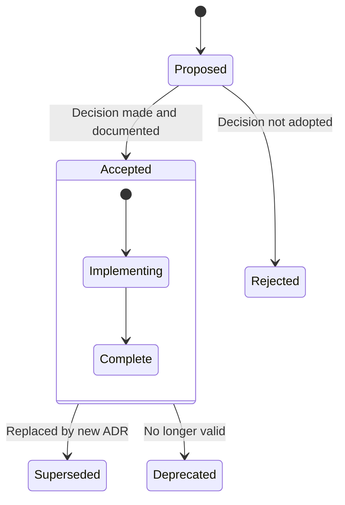

# Architecture Decision Records

## Purpose

This document serves as the index for Architecture Decision Records (ADRs) related to the system architecture of the Patorbit platform. ADRs capture significant architectural decisions, including the context, decision, and consequences.

## Scope

This document covers the ADR template, an index of existing ADRs, and links to the full ADR documents (stored in the `adr/` directory).

---

## ADR Template

```markdown
# [Number]. [Title of Decision]

- **Status**: [Proposed | Accepted | Deprecated | Superseded]
- **Date**: [YYYY-MM-DD]
- **Author**: [Name]

## Context

What is the context of this decision? Why is this decision needed? What problem does it solve?

## Decision Drivers

- [Driver 1]
- [Driver 2]
- [Driver 3]

## Considered Options

1. [Option 1]
2. [Option 2]
3. [Option 3]

## Decision Outcome

**Chosen option**: [Option X], because [justification].

### Consequences

- **Positive**: [List positive consequences]
- **Negative**: [List negative consequences]
- **Neutral**: [List neutral consequences]

## Validation

How will this decision be validated? What criteria will indicate success or failure?

## References

- [Link to related documents]
```

---

## ADR Index

| ADR # | Title                                                                           | Status   | Date       |
| ----- | ------------------------------------------------------------------------------- | -------- | ---------- |
| 001   | [Use Next.js for Frontend Framework](adr/001-nextjs-frontend.md)                | Accepted | 2026-07-21 |
| 002   | [Use NestJS for Backend Framework](adr/002-nestjs-backend.md)                   | Accepted | 2026-07-21 |
| 003   | [Use PostgreSQL as Primary Database](adr/003-postgresql-database.md)            | Accepted | 2026-07-21 |
| 004   | [Use Neo4j for Knowledge Graph](adr/004-neo4j-knowledge-graph.md)               | Accepted | 2026-07-21 |
| 005   | [Use OpenSearch for Search](adr/005-opensearch-search.md)                       | Accepted | 2026-07-21 |
| 006   | [Use Claude API as Primary LLM Provider](adr/006-claude-llm.md)                 | Accepted | 2026-07-21 |
| 007   | [Use RabbitMQ for Async Messaging](adr/007-rabbitmq-messaging.md)               | Accepted | 2026-07-21 |
| 008   | [Adopt Modular Monolith Architecture](adr/008-modular-monolith.md)              | Accepted | 2026-07-21 |
| 009   | [Use REST as Primary API Architecture](adr/009-rest-api.md)                     | Accepted | 2026-07-21 |
| 010   | [Use OpenTelemetry for Observability](adr/010-opentelemetry-observability.md)   | Accepted | 2026-07-21 |
| 011   | [Use Transactional Outbox for Reliable Events](adr/011-transactional-outbox.md) | Accepted | 2026-07-21 |
| 012   | [Use Cloudflare for CDN and DNS](adr/012-cloudflare-cdn.md)                     | Accepted | 2026-07-21 |

---

## ADR Document Links

The full text of each ADR is stored in the project's `adr/` directory. The document links below reference ADR documents created within the architecture specification context. For ADRs that apply to the domain architecture, see the top-level `adr/` directory.

| #   | Title            | Document                      |
| --- | ---------------- | ----------------------------- |
| 008 | Modular Monolith | `adr/008-modular-monolith.md` |

---

## ADR Lifecycle



## References

- [Architecture Principles](architecture-principles.md): Principles guiding these decisions.
- [Technology Decisions](technology-decisions.md): Detailed technology selection rationale.
- [Domain Architecture ADRs](../domain/README.md): ADRs related to the domain model.
