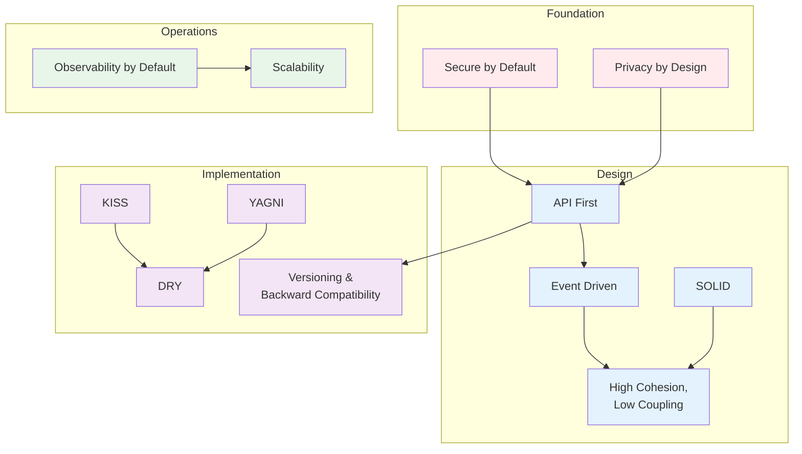

# Architecture Principles

## Purpose

This document defines the engineering principles that guide all architectural decisions for the Patorbit platform. These principles are the foundation for every design choice, code review, and technology selection. They ensure consistency, maintainability, and quality across the entire engineering organization.

## Scope

This document covers principles applicable to architecture, development, operations, and security.

---

## 1. API First

**Principle**: Design and document APIs before implementing any feature. APIs are contracts that define how components interact.

**Rationale**: API-first development ensures that service boundaries are well-defined, enables parallel frontend and backend development, and produces a consistent developer experience for both internal and external consumers.

**Application**:

- All APIs are documented in OpenAPI 3.1 specification before implementation begins.
- API changes follow a versioning strategy.
- Public APIs are reviewed by the architecture team before implementation.

## 2. SOLID Principles

**Principle**: Apply the five SOLID design principles to all OOP code.

**Rationale**: SOLID principles produce maintainable, testable, and scalable code that can evolve with business requirements.

**Application**:

- **Single Responsibility**: Each module and class has one reason to change.
- **Open/Closed**: Modules are open for extension, closed for modification.
- **Liskov Substitution**: Derived types are substitutable for their base types.
- **Interface Segregation**: Clients are not forced to depend on interfaces they do not use.
- **Dependency Inversion**: High-level modules do not depend on low-level modules. Both depend on abstractions.

## 3. DRY (Don't Repeat Yourself)

**Principle**: Every piece of knowledge has a single, unambiguous, authoritative representation within the system.

**Rationale**: Duplication creates maintenance overhead, increases bug surface area, and leads to inconsistency.

**Application**:

- Business logic lives in the domain layer.
- Cross-cutting concerns (logging, auth, rate limiting) are implemented as middleware or decorators.
- Configuration is centralized and environment-parameterized.

## 4. KISS (Keep It Simple, Stupid)

**Principle**: Simplicity is the ultimate sophistication. Prefer simple solutions over complex ones.

**Rationale**: Simple systems are easier to understand, maintain, debug, and extend. Complexity is the primary cause of defects and delays.

**Application**:

- Prefer straightforward implementations over clever optimizations.
- Use well-known patterns before custom solutions.
- If a solution cannot be explained in five minutes, it may be too complex.

## 5. YAGNI (You Ain't Gonna Need It)

**Principle**: Do not add functionality until it is demonstrably needed.

**Rationale**: Anticipated features often turn out to be wrong, leading to wasted effort and unnecessary complexity.

**Application**:

- Build only what the current iteration requires.
- Abstraction should pay for itself within a reasonable time frame.
- Premature abstraction is as harmful as premature optimization.

## 6. Secure by Default

**Principle**: Security is not an afterthought. Systems are designed to be secure by default, with security built into every layer.

**Rationale**: Security vulnerabilities are exponentially more expensive to fix after deployment. A secure-by-default approach minimizes risk surface.

**Application**:

- All data in transit is encrypted (TLS 1.3 minimum).
- All data at rest is encrypted (AES-256).
- Authentication is required for all endpoints unless explicitly marked public.
- Input validation is mandatory on all API boundaries.
- Secrets are never stored in code or configuration files.

## 7. Privacy by Design

**Principle**: Privacy is embedded into the design of the system, not retrofitted.

**Rationale**: Regulatory requirements (GDPR, CCPA) demand privacy-by-default. Users expect their career data to be handled with the highest standard of care.

**Application**:

- Personal data is minimized to what is strictly necessary.
- Data retention policies are enforced automatically.
- Users have self-service access to their data (view, export, delete).
- Audit logs track all access to sensitive data.

## 8. Observability by Default

**Principle**: Every component emits structured logs, metrics, and traces. Nothing is a black box.

**Rationale**: At millions of users, traditional debugging is impossible. Observability is required for understanding system behavior, diagnosing issues, and measuring performance.

**Application**:

- All services emit structured logs with correlation IDs.
- Key business and technical metrics are instrumented.
- Distributed tracing spans every cross-service call.
- Health check endpoints are provided by every service.

## 9. Scalability

**Principle**: The architecture supports horizontal scaling for all components. Scale is a primary design constraint, not an afterthought.

**Rationale**: The platform targets millions of users with bursty usage patterns. The architecture must scale cost-effectively.

**Application**:

- Services are stateless, enabling horizontal pod scaling.
- Databases use read replicas and horizontal sharding where necessary.
- Background workloads are queue-driven.
- Cache tiers reduce database load.

## 10. High Cohesion, Low Coupling

**Principle**: Related functionality is grouped together (high cohesion), and dependencies between modules are minimized (low coupling).

**Rationale**: High cohesion makes modules easier to understand and maintain. Low coupling allows modules to evolve independently.

**Application**:

- Modules encapsulate their data and expose it through defined interfaces.
- Inter-module communication uses events, not direct calls.
- Shared infrastructure is abstracted behind interfaces.
- Domain boundaries are respected between modules.

## 11. Event Driven

**Principle**: Significant state changes are communicated as events. Events are the primary integration mechanism between bounded contexts.

**Rationale**: Event-driven architecture enables loose coupling, asynchronous processing, auditability, and independent evolution of services.

**Application**:

- All aggregate state changes produce domain events.
- Cross-context communication uses events.
- Events are durable and replayable.
- Event schemas are versioned.

## 12. Versioning and Backward Compatibility

**Principle**: All interfaces (APIs, events, data schemas) support versioning. Changes are backward compatible within a major version.

**Rationale**: The platform serves long-lived integrations. Breaking changes must be coordinated and communicated.

**Application**:

- APIs follow semantic versioning in the URL or header.
- Events carry schema version metadata.
- Database migrations are backward compatible (additive only within a major version).
- Deprecation policies are documented and communicated with adequate notice.

## Principle Hierarchy

## References

- [System Overview](system-overview.md): High-level architecture applying these principles.
- [Security Architecture](security-architecture.md): Detailed security application of Secure by Default.
- [Observability](observability.md): Implementation of Observability by Default.
- [API Architecture](api-architecture.md): API First implementation.
