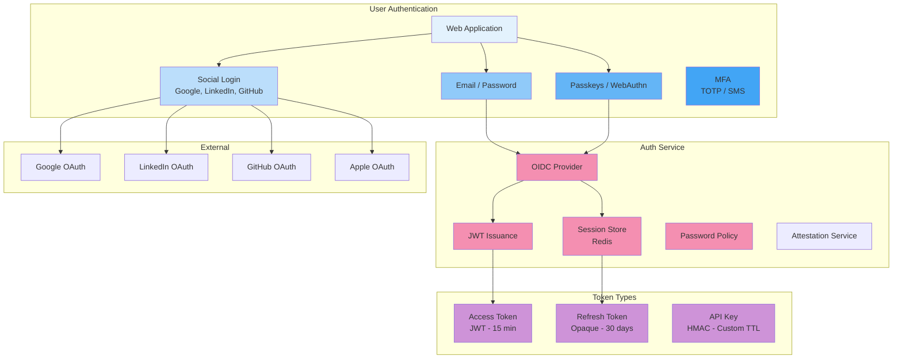
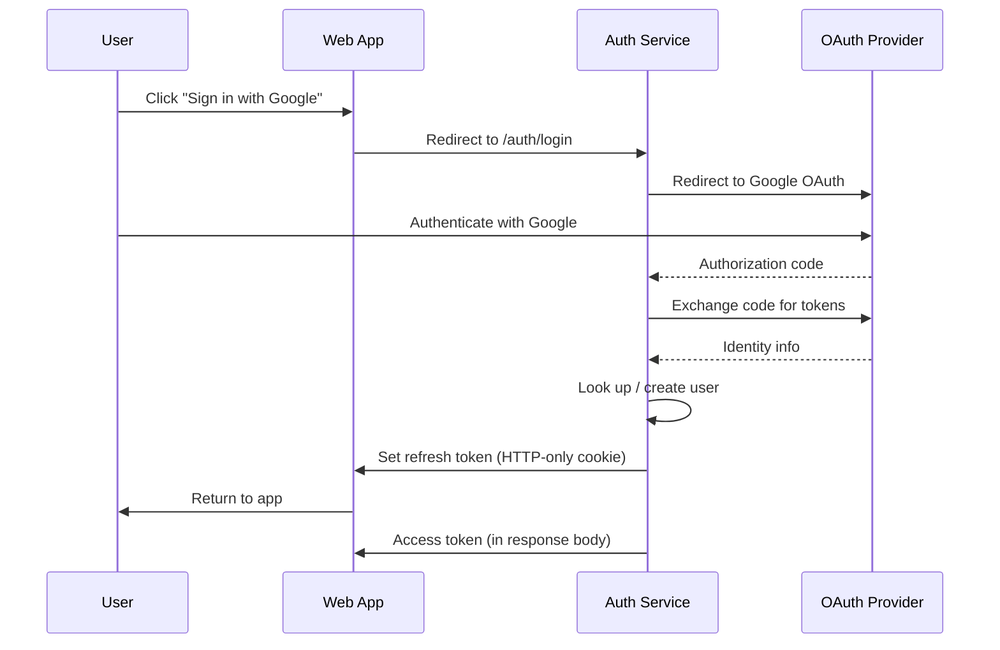

# Authentication

## Purpose

This document defines the authentication architecture for the Patorbit platform. Authentication verifies the identity of users and system components accessing the platform.

## Scope

This document covers OAuth, JWT, refresh tokens, MFA, passwordless authentication, session management, and device trust.

---

## Authentication Overview



---

## Authentication Methods

| Method                   | Use Case                                               | Security Level |
| ------------------------ | ------------------------------------------------------ | -------------- |
| **Email + Password**     | Standard registration/login                            | Standard       |
| **OAuth / Social Login** | Quick registration via Google, LinkedIn, GitHub, Apple | Standard       |
| **Passkeys / WebAuthn**  | Passwordless login on supported devices                | High           |
| **MFA (TOTP)**           | Additional security for sensitive actions              | High           |
| **SMS OTP**              | Phone verification, passwordless login                 | Medium         |
| **Magic Link**           | Email-based passwordless login                         | Standard       |
| **API Key**              | Machine-to-machine communication                       | High           |

---

## Token Strategy

### Access Token

- **Type**: JWT (JSON Web Token)
- **Lifetime**: 15 minutes
- **Storage**: Browser memory (not accessible to JavaScript for maximum security)
- **Content**:

```json
{
  "sub": "user_abcdef",
  "email": "user@example.com",
  "roles": ["user", "recruiter"],
  "iat": 1690000000,
  "exp": 1690000900,
  "jti": "token_unique_id"
}
```

### Refresh Token

- **Type**: Opaque string (not a JWT)
- **Lifetime**: 30 days (rolling)
- **Storage**: HttpOnly, Secure, SameSite cookie
- **Rotation**: A new refresh token is issued with each refresh; old one is revoked.

### API Key

- **Type**: HMAC-signed key pair
- **Lifetime**: Custom (30 days to 1 year)
- **Storage**: Hashed in database, plaintext shown only once at creation
- **Usage**: Server-to-server communication

---

## OAuth/OpenID Connect Flow



---

## Session Management

- **Session Store**: Redis (TTL-based expiration).
- **Concurrent Sessions**: Multiple sessions allowed (one per device/browser).
- **Session Revocation (Cross-Device)**: Refresh token rotation allows immediate revocation.
- **Device Fingerprinting**: Optional enhancement for detecting compromised sessions.

### Session Lifecycle

1. Login → Access token + Refresh token issued.
2. Access token expired → Refresh token used to get new access token (transparent to user).
3. Refresh token expired (30 days) → User must re-authenticate.
4. User logs out → Refresh token revoked, session terminated.
5. User changes password → All sessions terminated.

## Password Policy

| Requirement       | Value                                                    |
| ----------------- | -------------------------------------------------------- |
| Minimum Length    | 12 characters                                            |
| Complexity        | At least 1 upper, 1 lower, 1 number, 1 special character |
| Hashing Algorithm | bcrypt (cost factor 12)                                  |
| History           | No reuse of last 5 passwords                             |
| Account Lockout   | 10 failed attempts → 15-minute lockout                   |

## MFA

- **Methods**: TOTP (authenticator app), SMS OTP.
- **Enforcement**: Optional for personal accounts. Required for Organization Admin and Recruiter accounts.
- **Recovery**: Backup codes (pre-generated, single-use) for account recovery.

## Future Evolution

- **Device Trust**: Client certificates for device-bound authentication.
- **Biometric Authentication**: Leverage platform biometric APIs (Touch ID, Face ID).
- **Continuous Authentication**: Behavioral analysis (mouse movements, typing patterns) for ongoing authentication.
- **Passkeys (Multi-Device)**: Cross-platform passkey support via iCloud Keychain, Google Password Manager.

## References

- [Authorization](authorization.md): Authorization after authentication.
- [Security Architecture](security-architecture.md): Overall security posture.
- [Infrastructure](infrastructure.md): Network and service security controls.
