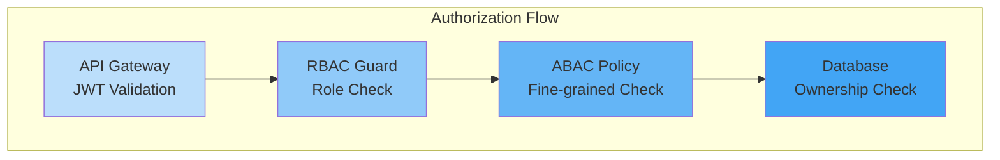

# Authorization

## Purpose

This document defines the authorization architecture for the Patorbit platform, outlining how permissions are granted, checked, and enforced.

## Scope

This document covers Role-Based Access Control (RBAC), Attribute-Based Access Control (ABAC), ownership, permission inheritance, and fine-grained authorization.

---

## Authorization Model: Hybrid (RBAC + ABAC)

- **RBAC (Role-Based Access Control)**: Broad permissions are granted based on user roles (User, Recruiter, Admin).
- **ABAC (Attribute-Based Access Control)**: Fine-grained permissions are granted based on attributes of the user, resource, and environment.

**Example**:

- **RBAC**: A `Recruiter` can search candidates.
- **ABAC**: A `Recruiter` can view a candidate's profile only if the candidate's `visibility` is `public` or `recruiters_only`.

---

## Roles and Permissions

| Role          | Permissions                                                      |
| ------------- | ---------------------------------------------------------------- |
| **User**      | CRUD own passport, claims, evidence. View public data.           |
| **Recruiter** | Search candidates, view published passports, contact candidates. |
| **Org Admin** | Manage organization, invite members, verify employee claims.     |
| **Verifier**  | View and verify assigned evidence.                               |
| **Admin**     | Full access to all platform data (for operational purposes).     |

---

## Attribute-Based Access Control (ABAC)

ABAC policies are defined using attributes from:

- **Subject (User)**: `userId`, `roles`, `organizationId`, `is_verified`
- **Resource (Object)**: `ownerId`, `visibility`, `status`
- **Action**: `read`, `write`, `delete`, `share`, `verify`
- **Environment**: `ip_address`, `time_of_day`, `device_id`

**Policy Example**:

```
ALLOW 'read' on 'passport'
IF subject.roles CONTAINS 'Recruiter'
AND resource.status == 'published'
AND resource.visibility IN ('public', 'recruiters_only')
```

---

## Permission Enforcement



1. **Gateway**: Authenticates the request and validates the JWT.
2. **RBAC Guard**: Checks if the user's role has permission for the action.
3. **ABAC Policy Engine**: Evaluates fine-grained policies.
4. **Database Query**: Queries are filtered based on ownership (e.g., `WHERE ownerId = ?`).

## Ownership Model

- **Passport, Claim, Evidence**: Owned by `Identity`.
- **Organization, Workspace**: Owned by `Organization`.
- **Subscription**: Owned by `Identity` or `Organization`.
- **Verifications**: Owned by the `Verifier`, but the `Identity` has read access.

## Permission Inheritance

- **Org Admin** inherits all permissions of `Org Member`.
- **Platform Admin** inherits all permissions of all other roles (for operational purposes).
- Roles are additive. A user who is both a `Recruiter` and an `Org Member` has the combined permissions of both roles.

## Fine-Grained Authorization

| Use Case                | Approach                                                                                        |
| ----------------------- | ----------------------------------------------------------------------------------------------- |
| **View Passport**       | ABAC policy on `visibility` attribute                                                           |
| **Edit Claim**          | Check if `claim.ownerId == currentUser.id`                                                      |
| **Verify Evidence**     | Check if `verifier.id` is assigned to `verification`                                            |
| **Manage Organization** | Check if `user.organizationId == resource.organizationId` AND `user.roles` contains `Org Admin` |

## Technology

- **Policy Engine**: Open Policy Agent (OPA) or Casbin.
- **Policy Storage**: Policies defined as code, stored in Git.
- **Policy Enforcement Points**: NestJS Guards in the backend.

## Future Evolution

- **User-Managed Access Control (UMAC)**: Allow users to grant granular, time-limited access to their passport to specific people.
- **Dynamic Scopes**: OAuth scopes that change based on user consent.
- **Geo-fencing**: Restrict access based on geographic location.
- **Risk-Based Authentication**: Require step-up authentication (MFA) for high-risk actions.

## References

- [Authentication](authentication.md): Authentication mechanisms.
- [Security Architecture](security-architecture.md): Overall security posture.
- [Domain Architecture](../domain/permissions.md): Domain-level permission model.
- [Backend Architecture](backend-architecture.md): Guard implementation.
