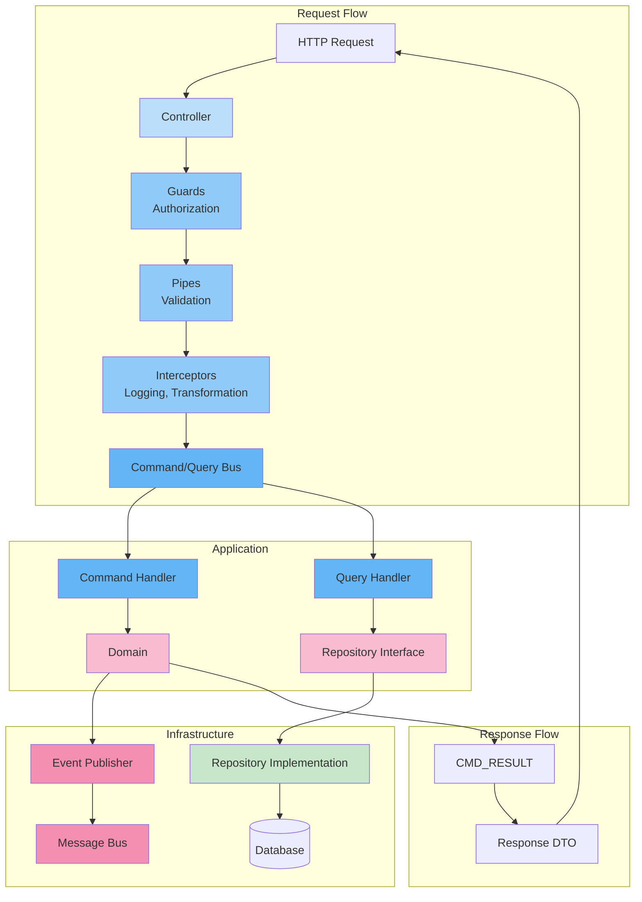

# Backend Architecture

## Purpose

This document defines the backend architecture for the Patorbit platform. It describes the technical layers, frameworks, patterns, and implementation strategies for building a robust, scalable, and maintainable backend.

## Scope

This document covers the presentation layer, application layer, domain layer, and infrastructure layer implementations.

---

## Framework: NestJS

**Rationale**: NestJS provides a mature, opinionated framework for building scalable Node.js server-side applications. It supports TypeScript out of the box, provides dependency injection, modular organization, and integrates seamlessly with various libraries.

### Key Benefits

- **Modularity**: Each bounded context is a NestJS module.
- **Dependency Injection**: Built-in IoC container for managing dependencies.
- **Decorator-Based**: Controllers, services, and handlers are defined with decorators.
- **Pipes, Guards, Interceptors**: Built-in support for validation, authorization, and cross-cutting concerns.
- **Testing**: Integrated testing utilities for unit and integration tests.

---

## Backend Layer Diagram



---

## Layer Details

### 1. Controllers (Presentation)

- Thin controllers that define HTTP routes and delegate to the application layer.
- Use NestJS `@Controller()` and route decorators.
- All inputs validated via `ValidationPipe` with class-validator DTOs.
- All outputs transformed by interceptors into standardized response format.
- Controllers do NOT contain any business logic.

### 2. Guards (Authorization)

- Guard interfaces check user permissions before the request proceeds to the controller.
- Use NestJS `@Guard()` decorator.
- Guards can be applied at controller or route level.
- Auth guard validates JWT token; role guard enforces RBAC/ABAC.

### 3. Pipes (Validation)

- Validate and transform input data.
- Use built-in `ValidationPipe` with DTOs decorated with `class-validator` decorators.
- Custom pipes for specialized transformations (e.g., string to Date, ID validation).

### 4. Interceptors (Cross-Cutting Concerns)

- **Logging Interceptor**: Logs request/response metadata with correlation IDs.
- **Timing Interceptor**: Records request duration metrics.
- **Transform Interceptor**: Wraps responses in standard envelope.
- **Cache Interceptor**: Caches GET responses where applicable.

### 5. Command/Query Bus (Application)

- Implements the CQRS pattern at the application layer.
- Commands represent write operations; Queries represent read operations.
- Each command/query has a dedicated handler class.
- The bus handles dispatching, orchestration, and event publishing.

### 6. Domain Layer

- NestJS `@Injectable()` services for domain services.
- Pure TypeScript classes for entities, value objects, and aggregates.
- Repository interfaces (contracts) in the domain layer.
- Business logic is encapsulated here.

### 7. Repositories (Infrastructure)

- Implement domain repository interfaces.
- Use an ORM (TypeORM / Prisma) for database access.
- Handle data mapping between domain objects and persistence models.

---

## Dependency Injection

- NestJS's built-in DI container manages dependencies across layers.
- Each module declares its exports, controllers, providers, and imports.
- Domain layers are provided in modules; they depend on repository interfaces.
- Infrastructure layers implement interfaces and are injected via DI tokens.

```typescript
// Example module structure
@Module({
  imports: [TypeOrmModule.forFeature([PassportEntity])],
  controllers: [PassportController],
  providers: [
    PassportService,
    CreatePassportHandler,
    GetPassportHandler,
    { provide: 'IPassportRepository', useClass: PostgresPassportRepository },
  ],
  exports: [PassportService],
})
export class PassportModule {}
```

---

## Transactions

- **Local Transactions**: Within a single database service, use the ORM's transaction API.
- **Distributed Transactions**: Avoid distributed transactions. Use the Sagas pattern for operations spanning multiple services.
- **Eventual Consistency**: Accept short periods of inconsistency between services, using event-driven eventual consistency.

## Background Jobs

- **Scheduled Jobs**: Use NestJS `@Schedule()` (via `@nestjs/schedule`) for cron-like tasks (e.g., purge stale tokens, expire subscriptions).
- **Queue Jobs**: Use a message broker (RabbitMQ) for long-running or asynchronous tasks (e.g., AI analysis, PDF generation).
- **Job Monitoring**: All background jobs emit metrics and logs with correlation IDs for traceability.

## Validation

- **API Validation**: `class-validator` decorators on DTOs.
- **Domain Validation**: Business rule validation in domain entities and domain services.
- **Cross-Field Validation**: Validators that check multiple fields (e.g., end date after start date).
- **Failure Model**: Validation errors return a standardized error response with field-level details.

## References

- [Module Architecture](module-architecture.md): Module decomposition.
- [API Architecture](api-architecture.md): API design.
- [Data Architecture](data-architecture.md): Data persistence.
- [Event Architecture](event-architecture.md): Event handling in the application layer.
- [Messaging](messaging.md): Async communication patterns.
