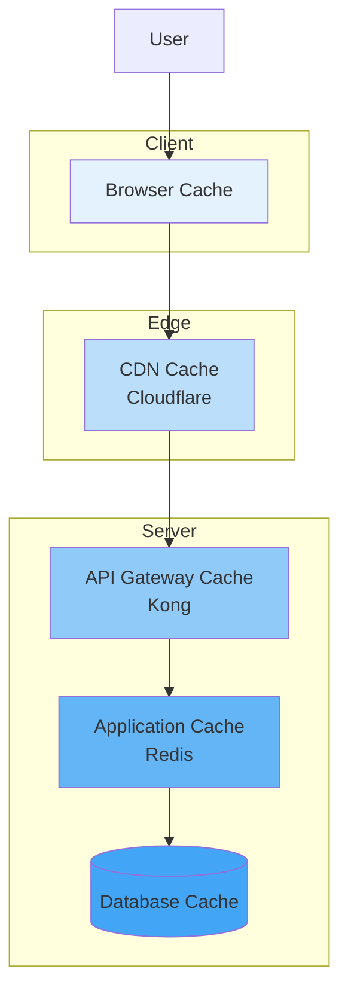
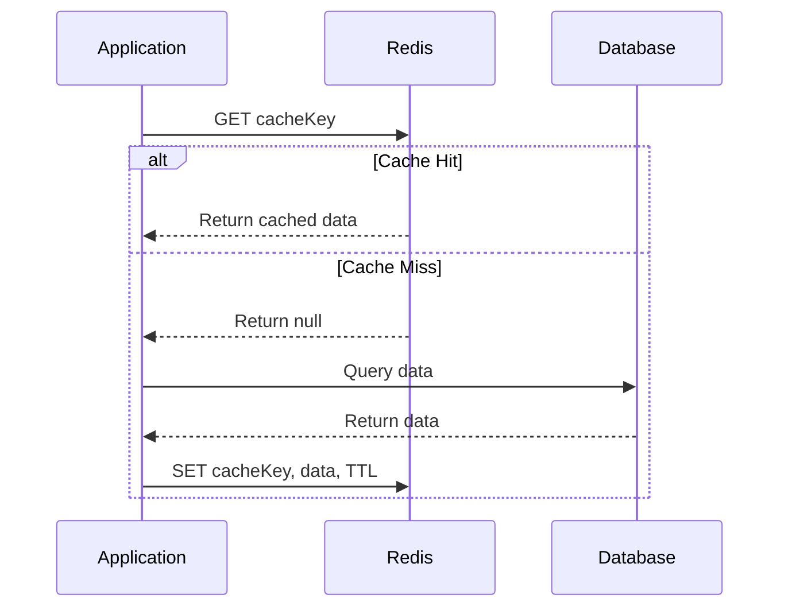
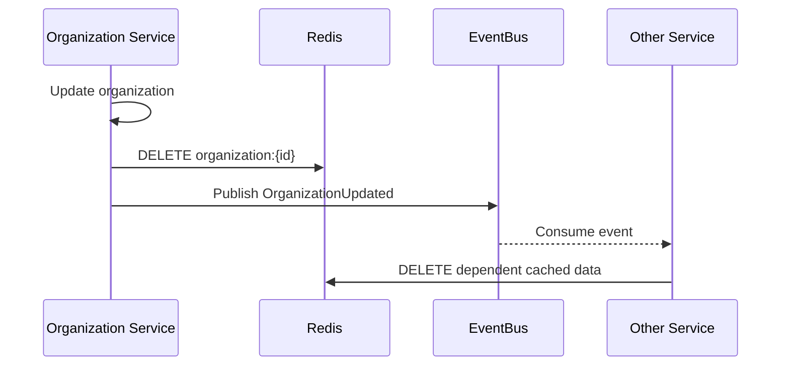

# Caching Strategy

## Purpose

This document defines the multi-layer caching strategy for the Patorbit platform to improve performance, reduce latency, and lower costs.

## Scope

This document covers all caching layers, from client-side to server-side, including browser, CDN, API, and in-memory caching.

---

## Caching Layers

---

## 1. Browser Caching

**Purpose**: Reduce network requests for repeat visits.

| Asset Type                     | Cache-Control Header                  | ETag |
| ------------------------------ | ------------------------------------- | ---- |
| Static Assets (JS, CSS, Fonts) | `public, max-age=31536000, immutable` | Yes  |
| Profile Photos                 | `public, max-age=86400`               | Yes  |
| API GET Requests               | `private, max-age=60`                 | Yes  |
| Service Worker                 | Controlled by `ngsw-config.json`      | N/A  |

## 2. CDN Caching

**Technology**: Cloudflare

**Purpose**: Cache static assets and public API responses at the edge, closer to the user.

| Asset Type                   | Cache Level        | TTL       |
| ---------------------------- | ------------------ | --------- |
| Static Assets                | `Cache Everything` | 1 year    |
| Profile Photos               | `Cache Everything` | 1 day     |
| Public Organization Profiles | `Cache Everything` | 1 hour    |
| Public API GET Responses     | `Cache Standard`   | 5 minutes |

**Cache Invalidation**:

- Purge by URL or tag on content updates.
- Stale-while-revalidate for high-traffic assets.

## 3. API Gateway Caching

**Technology**: Kong API Gateway Cache Plugin

**Purpose**: Cache authenticated API responses to reduce load on backend services.

| Endpoint                  | Cache Key                        | TTL        |
| ------------------------- | -------------------------------- | ---------- |
| `GET /passports/{id}`     | `userId:{userId}`                | 60 seconds |
| `GET /claims`             | `userId:{userId}:page:{pageNum}` | 30 seconds |
| `GET /organizations/{id}` | `orgId:{orgId}`                  | 5 minutes  |

**Cache Invalidation**:

- Invalidation via an internal `PURGE` API endpoint, called by services on data mutation (`POST`, `PUT`, `DELETE`).

## 4. Application Cache (Redis)

**Technology**: Redis

**Purpose**: Shared cache for application-level data to reduce database load.

| Cache Type              | Purpose                      | Example Data                      | Eviction Policy | TTL        |
| ----------------------- | ---------------------------- | --------------------------------- | --------------- | ---------- |
| **Session Store**       | User sessions                | Session ID -> User ID, Roles      | LRU             | 24 hours   |
| **Domain Object Cache** | Frequently accessed entities | `organization:{id}`, `claim:{id}` | LRU             | 5 minutes  |
| **Semantic Cache**      | AI prompt responses          | Prompt embedding hash             | LFU             | 24 hours   |
| **Distributed Locks**   | Concurrency control          | `lock:verification:{id}`          | N/A             | 10 seconds |
| **Rate Limiting**       | Track request counts         | `rate:user:{userId}`              | N/A             | 1 minute   |

### Cache-Aside Pattern

The primary pattern used for application caching:

## 5. Database Caching

**Technology**: PostgreSQL Shared Buffers, Query Cache

**Purpose**: Internal database caching to optimize query performance.

**Strategy**:

- **Tuning**: Allocate sufficient `shared_buffers` memory (25% of system RAM).
- **Indexing**: Proper indexing reduces disk I/O, allowing more data to be served from cache.
- **Prepared Statements**: Use prepared statements to cache query execution plans.

## Cache Invalidation Strategy

| Layer       | Invalidation Method                                                                                                   |
| ----------- | --------------------------------------------------------------------------------------------------------------------- |
| Browser     | `Cache-Control` headers, ETags                                                                                        |
| CDN         | API purge (by tag or URL)                                                                                             |
| API Gateway | Internal `PURGE` API endpoint                                                                                         |
| Application | **Write-Through**: Invalidate on write. **Event-Driven**: Invalidate on domain event. **TTL**: Time-based expiration. |

### Event-Driven Invalidation Flow

This ensures that all services that cache organization data can invalidate their caches when the source data changes.

## References

- [Data Architecture](data-architecture.md): Redis usage and database caching.
- [API Architecture](api-architecture.md): Caching headers and policies.
- [Performance](performance.md): Impact of caching on performance.
- [Cost Optimization](cost-optimization.md): Caching's role in reducing costs.
