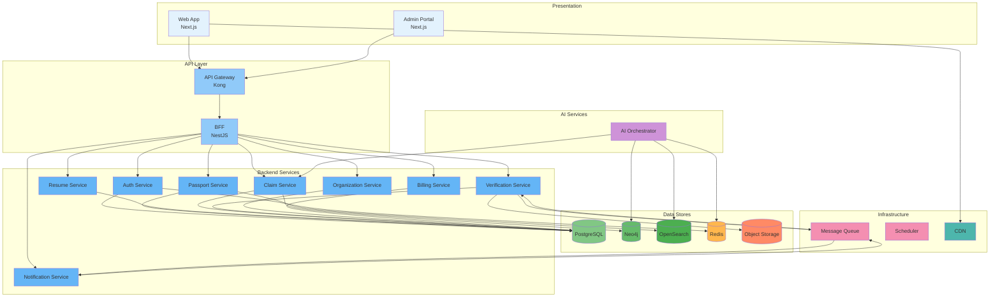
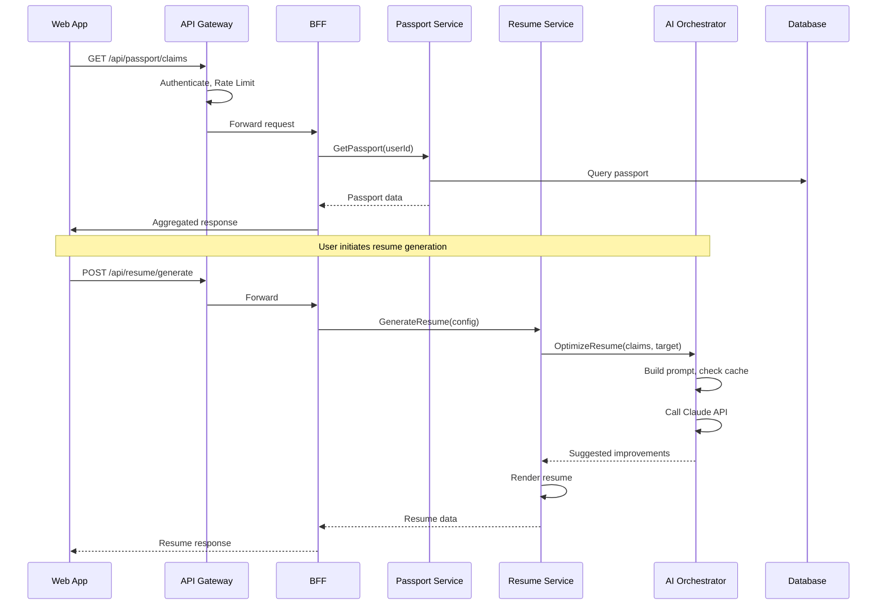

# Component Architecture

## Purpose

This document describes every major platform component, its responsibilities, dependencies, and interactions. This is the C4 Level 2 view of the architecture.

## Scope

This document covers all primary components across frontend, backend, AI, data, and infrastructure layers.

---

## Component Map

---

## Component Details

### 1. Web Application (Next.js)

**Responsibilities**:

- Server-side rendering of all pages for SEO and performance.
- Client-side interactivity for resume building, claim management.
- Form validation and optimistic UI updates.
- Service worker for offline capability and push notifications.

**Dependencies**:

- API Gateway (all API calls)
- CDN (static assets)
- Auth Provider Browser SDK (for OAuth flows)

### 2. Admin Portal (Next.js)

**Responsibilities**:

- Platform administration interface.
- User and organization management.
- System monitoring dashboards.
- Manual verification queue.

**Dependencies**:

- API Gateway (admin-only endpoints)
- Auth Service (admin authentication)

### 3. API Gateway (Kong)

**Responsibilities**:

- TLS termination.
- Rate limiting and throttling.
- Request authentication and API key validation.
- Request routing to appropriate services.
- Response caching.
- CORS enforcement.
- Access logging.

**Dependencies**:

- Auth Service (token validation)

### 4. Backend for Frontend (BFF / NestJS)

**Responsibilities**:

- Aggregate API responses for frontend consumption.
- Transform domain data to presentation format.
- Handle session management.
- Manage CSRF protection.
- Compose data from multiple downstream services.

**Dependencies**:

- All backend services
- Redis (session storage)

### 5. Auth Service

**Responsibilities**:

- User registration and authentication.
- OAuth provider integration.
- JWT token issuance and validation.
- MFA enforcement.
- Password hashing and validation.
- Session management.

**Dependencies**:

- PostgreSQL (user credentials, refresh tokens)
- Redis (session cache, rate limiting)

### 6. Passport Service

**Responsibilities**:

- Career Passport CRUD operations.
- Passport version management and publication.
- Passport sharing (links, visibility).
- Passport export.

**Dependencies**:

- PostgreSQL (passport data)
- OpenSearch (passport search index)

### 7. Resume Service

**Responsibilities**:

- Resume creation from passport claims.
- Template application and rendering.
- Resume export (PDF, DOCX, HTML, JSON).
- Resume targeting configuration.

**Dependencies**:

- PostgreSQL (resume data)
- AI Orchestrator (optimization suggestions)
- Object Storage (exported files)

### 8. Claim Service

**Responsibilities**:

- Claim CRUD operations.
- Claim status management.
- Evidence linking.
- Claim search and filtering.

**Dependencies**:

- PostgreSQL (claim data)
- Neo4j (knowledge graph)
- OpenSearch (full-text search)

### 9. Verification Service

**Responsibilities**:

- Evidence submission and processing.
- Verification workflow orchestration.
- Verifier assignment and management.
- Trust score computation triggers.
- Challenge handling.

**Dependencies**:

- PostgreSQL (verification data)
- Object Storage (evidence files)
- AI Orchestrator (automated verification)
- Message Queue (async processing)

### 10. Organization Service

**Responsibilities**:

- Organization registration and verification.
- Domain ownership verification.
- Member management.
- Workspace management.
- Credential issuance.

**Dependencies**:

- PostgreSQL (organization data)
- Neo4j (knowledge graph)

### 11. Billing Service

**Responsibilities**:

- Subscription plan management.
- Payment processing via Stripe.
- Invoice generation.
- Usage metering.
- Entitlement enforcement.

**Dependencies**:

- PostgreSQL (billing data)
- Stripe API

### 12. Notification Service

**Responsibilities**:

- Email, SMS, and in-app notification delivery.
- Notification templating.
- Preference management.
- Delivery status tracking.

**Dependencies**:

- Message Queue (notification events)
- SendGrid (email)
- Twilio (SMS)

### 13. AI Orchestrator

**Responsibilities**:

- LLM provider abstraction and routing.
- Prompt template management.
- Response caching (semantic cache).
- Token usage tracking and cost management.
- Model version management.
- Content safety filtering.

**Dependencies**:

- Claude API (primary LLM)
- pgvector / Pinecone (vector store for RAG)
- Redis (response cache)
- PostgreSQL (prompt templates, usage logs)

## Component Interactions

## References

- [Service Boundaries](service-boundaries.md): Ownership and boundary definitions.
- [Module Architecture](module-architecture.md): Internal decomposition of each service.
- [API Architecture](api-architecture.md): API design for each component.
- [Backend Architecture](backend-architecture.md): Backend implementation patterns.
