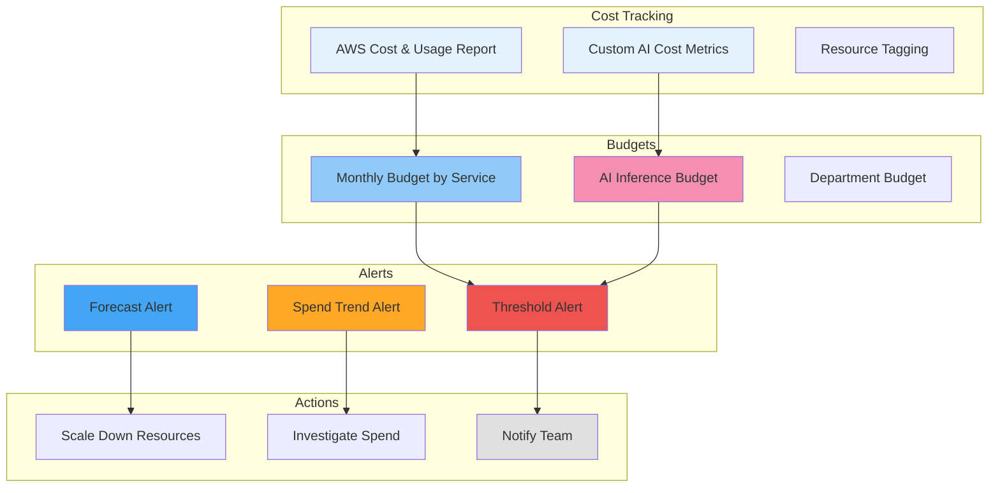

# Cost Optimization

## Purpose

This document defines the cost optimization strategy for the Patorbit platform. It identifies cost drivers, optimization strategies, and monitoring practices to maintain predictable and efficient cloud spending.

## Scope

This document covers cloud infrastructure costs, AI inference costs, storage lifecycle, caching ROI, autoscaling, and reserved capacity.

---

## Cost Drivers

| Category                 | Major Cost Drivers                 | % of Total (Estimated) |
| ------------------------ | ---------------------------------- | ---------------------- |
| **Compute (Kubernetes)** | Pod CPU/memory, node instances     | 35%                    |
| **AI Inference**         | LLM API calls, GPU instances       | 20%                    |
| **Databases**            | RDS, Neo4j, OpenSearch             | 25%                    |
| **Storage**              | S3, EBS volumes, backups           | 10%                    |
| **Network**              | Data transfer, CDN, load balancers | 5%                     |
| **Other**                | Monitoring, secrets, logging, DNS  | 5%                     |

---

## Optimization Strategies

### 1. Compute Optimization

| Strategy                          | Impact                              | Effort |
| --------------------------------- | ----------------------------------- | ------ |
| **Right-Sizing Instances**        | 10-20% reduction                    | Low    |
| **Spot Instances (Non-Critical)** | 50-70% reduction for GPU nodes      | Medium |
| **Autoscaling (HPA)**             | 20-40% reduction during low traffic | Low    |
| **Cluster Autoscaler**            | Eliminates idle node costs          | Low    |
| **Optimize Docker Images**        | Smaller images, faster deployments  | Low    |

### 2. AI Inference Optimization

| Strategy                    | Impact                                            | Effort |
| --------------------------- | ------------------------------------------------- | ------ |
| **Semantic Caching**        | 30-50% reduction in AI calls                      | High   |
| **Prompt Optimization**     | 20-40% fewer tokens per call                      | Medium |
| **Model Tiering**           | Use smaller/cheaper models for simple tasks       | Medium |
| **Batching Embeddings**     | 10-20% reduction                                  | Low    |
| **Rate Limiting & Budgets** | Prevents runaway costs                            | Low    |
| **Cache Frequent Queries**  | Cache common AI requests at the application layer | Medium |

### 3. Database Optimization

| Strategy               | Impact                             | Effort |
| ---------------------- | ---------------------------------- | ------ |
| **Read Replicas**      | Offloads query cost from primary   | Medium |
| **Connection Pooling** | Reduces database connections       | Low    |
| **Data Archival**      | Move old data to cheaper storage   | Medium |
| **Compression**        | Reduce storage footprint           | Low    |
| **Reserved Instances** | 30-60% discount on committed usage | Medium |

### 4. Storage Optimization

| Strategy                     | Impact                                        | Effort |
| ---------------------------- | --------------------------------------------- | ------ |
| **Lifecycle Policies**       | Automatic transition to cheaper storage tiers | Low    |
| **Delete Unused Data**       | Periodic cleanup of stale data                | Medium |
| **Compression**              | Compress logs, backups                        | Low    |
| **Cross-Region Replication** | Only for critical data                        | Medium |

### 5. Network Optimization

| Strategy                   | Impact                                | Effort |
| -------------------------- | ------------------------------------- | ------ |
| **CDN for Static Assets**  | Reduces origin server load            | Low    |
| **Compression**            | Brotli/gzip reduces data transfer     | Low    |
| **Optimize API Responses** | Smaller payloads = less data transfer | Medium |

---

## Cost Monitoring and Budgeting

### Budget Structure

| Budget Level          | Description                                     | Alert Threshold |
| --------------------- | ----------------------------------------------- | --------------- |
| **Service Budget**    | Per-service monthly cost target                 | 80%, 100%, 120% |
| **AI Budget**         | Monthly AI inference cost limit                 | 80%, 100%, 120% |
| **Department Budget** | Engineering department quarterly budget         | 80%, 100%       |
| **Monthly Forecast**  | Forecasted monthly spend based on current usage | 100%            |

## Reserved Capacity

| Service                  | Commitment                  | Discount |
| ------------------------ | --------------------------- | -------- |
| **Kubernetes Node Pool** | 1-year compute savings plan | 15-30%   |
| **PostgreSQL (RDS)**     | 1-year instance reservation | 15-30%   |
| **Redis (ElastiCache)**  | 1-year node reservation     | 15-30%   |
| **OpenSearch**           | 1-year instances            | 15-30%   |

## Period Cost Reviews

- **Weekly**: Spot check AI costs and unexpected anomalies.
- **Monthly**: Full cost review by service against budget.
- **Quarterly**: Infrastructure cost optimization review.
- **Annually**: Reserved instance planning for the next year.

## References

- [AI Architecture](ai-architecture.md): AI cost optimization.
- [Storage Strategy](storage-strategy.md): Lifecycle policies.
- [Scalability](scalability.md): Cost-effective scaling.
- [Caching Strategy](caching-strategy.md): Caching ROI analysis.
