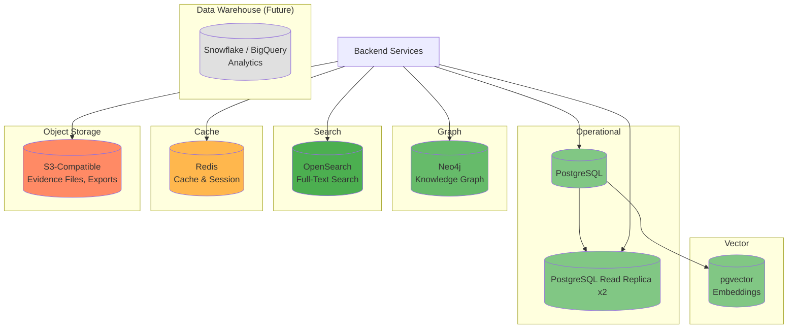

# Data Architecture

## Purpose

This document defines the data architecture for the Patorbit platform. It covers database technologies, data ownership, replication, backup, and the strategy for managing different data types.

## Scope

This document covers all databases: operational (PostgreSQL), Knowledge Graph (Neo4j), search (OpenSearch), caching (Redis), and object storage.

---

## Database Landscape

---

## PostgreSQL (Operational Database)

**Technology**: PostgreSQL 16+

**Purpose**: Primary operational data store for all transactional workloads.

**Usage**:

| Service      | Key Tables                                             | Notes                        |
| ------------ | ------------------------------------------------------ | ---------------------------- |
| Identity     | `identities`, `profiles`, `auth_methods`, `sessions`   | High read/write volume       |
| Passport     | `career_passports`, `versions`, `publications`         | Write-heavy on publish       |
| Resume       | `resumes`, `resume_sections`, `resume_versions`        | Read-heavy                   |
| Claim        | `claims`, `claim_evidence`                             | High read/write              |
| Evidence     | `evidences`, `evidence_metadata`                       | Moderate volume              |
| Verification | `verifications`, `verification_records`                | Moderate volume              |
| Organization | `organizations`, `workspaces`, `org_members`           | Read-heavy                   |
| Billing      | `subscriptions`, `invoices`, `payments`                | Low volume, high consistency |
| AI           | `prompt_templates`, `prompt_versions`, `ai_usage_logs` | Log-style data               |

**Replication**:

- Primary for writes.
- 2 synchronous read replicas for read-heavy services.
- Failover: Automatic in managed service (RDS / Cloud SQL).

**Partitioning**:

- Time-based partitioning for event and log tables (`created_at`).
- List partitioning for multi-tenant tables (`organization_id`).

**Indexing Strategy**:

- B-tree indexes for equality and range queries.
- GIN indexes for JSONB fields and full-text search.
- Partial indexes for filtered queries (e.g., `WHERE status = 'pending'`).
- Covering indexes for frequent query patterns.

## Neo4j (Knowledge Graph)

**Technology**: Neo4j 5.x (AuraDB / Self-Managed)

**Purpose**: Power the Knowledge Graph, enabling relationship traversal queries for search, matching, and insights.

**Data Model**:

- Nodes: Identity, Claim, Evidence, Organization, Credential, Skill.
- Edges: `submits`, `supported_by`, `verified_by`, `employed_at`, `uses_skill`, `employs`, `holds`, `issued`.

**Query Patterns**:

- `MATCH (i:Identity)-[:SUBMITS]->(c:Claim)-[:USES_SKILL]->(s:Skill) RETURN i, c, s`
- `MATCH (c:Claim)-[:SUPPORTED_BY]->(e:Evidence)-[:VERIFIED_BY]->(v:Verification) RETURN c, e, v`

**Replication**:

- Core cluster for high availability (3 nodes minimum).
- Read replicas for search and analytics workloads.

## OpenSearch (Search Index)

**Technology**: OpenSearch 2.x

**Purpose**: Full-text search across claims, resumes, passports, and organizations.

**Indices**:

| Index           | Documents                                | Refresh Policy |
| --------------- | ---------------------------------------- | -------------- |
| `claims`        | Claim title, description, type           | Near real-time |
| `passports`     | Passport summaries, claim aggregations   | On publish     |
| `resumes`       | Resume content and metadata              | On generate    |
| `organizations` | Organization name, industry, description | On update      |
| `candidates`    | Denormalized candidate search view       | Periodic       |

**Index Strategy**:

- Denormalized documents optimized for search query patterns.
- Synonym filters for skill and job title matching.
- Stemming and stop word removal for English.
- Custom analyzers for technical skill terms.

## Redis (Cache and Session)

**Technology**: Redis 7.x (ElastiCache / Self-Managed)

**Purpose**: Multifunctional caching layer.

**Use Cases**:

| Use Case                 | Data Type     | Eviction Policy | TTL             |
| ------------------------ | ------------- | --------------- | --------------- |
| Session Storage          | String (JSON) | LRU             | 24 hours        |
| API Response Cache       | String (JSON) | LRU             | 5-60 seconds    |
| Rate Limiting            | Sorted Set    | N/A             | 1 minute window |
| Idempotency Cache        | String        | LRU             | 24 hours        |
| Job Queue                | List          | N/A             | N/A             |
| Real-Time Notifications  | Pub/Sub       | N/A             | N/A             |
| Distributed Locks        | String        | N/A             | 10 seconds      |
| Leaderboards (Analytics) | Sorted Set    | LRU             | 1 hour          |

## Object Storage (S3-Compatible)

**Technology**: AWS S3 or S3-compatible (Cloudflare R2)

**Purpose**: Durable, scalable storage for file artifacts.

**Buckets**:

| Bucket               | Contents                         | Retention                        |
| -------------------- | -------------------------------- | -------------------------------- |
| `evidence-documents` | Scanned PDFs, images of evidence | Until claim archived + 90 days   |
| `resume-exports`     | Generated PDF/DOCX files         | 30 days                          |
| `passport-exports`   | Passport export archives         | Until new version                |
| `profile-photos`     | User profile images              | Until account deactivated        |
| `backups`            | Database backups                 | 30 days daily, 12 months monthly |

## Data Ownership

Each service owns its primary data. Cross-service data access patterns:

1. **Service-to-Database**: Each service reads/writes its own tables. Direct cross-service database access is prohibited.
2. **Read Replicas**: Services requiring read-only access to another service's data can query its read replica with coordination.
3. **Event Projections**: Services can maintain denormalized projections of other services' data, populated by consuming events.
4. **CQRS Views**: Read-optimized views can be created in separate databases for complex queries.

## References

- [Storage Strategy](storage-strategy.md): File storage, retention, and encryption.
- [Caching Strategy](caching-strategy.md): Caching layer design.
- [Event Architecture](event-architecture.md): Event-driven data synchronization.
- [Scalability](scalability.md): Database scaling strategy.
- [Disaster Recovery](disaster-recovery.md): Backup and recovery plan.
