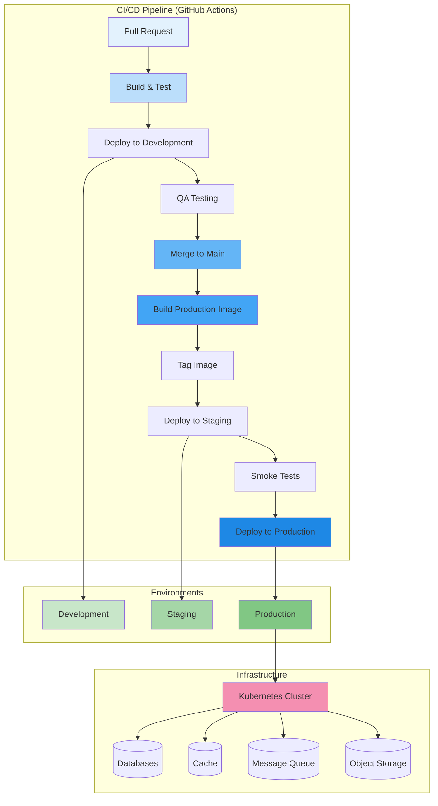

# Deployment Architecture

## Purpose

This document defines the deployment architecture for the Patorbit platform, covering environments, CI/CD, containerization, and scaling strategies.

## Scope

This document covers all aspects of deploying, running, and scaling the platform in a cloud-native environment.

---

## Deployment Overview

---

## Environments

| Environment     | Purpose                                     | URL                    | Data                               | Deployment                         |
| --------------- | ------------------------------------------- | ---------------------- | ---------------------------------- | ---------------------------------- |
| **Development** | Feature development and integration testing | `dev.patorbit.com`     | Seeded, non-sensitive              | Automatic on PR merge to `develop` |
| **Staging**     | Pre-production testing, QA, smoke tests     | `staging.patorbit.com` | Production data clone (anonymized) | Manual promotion from `develop`    |
| **Production**  | Live user-facing environment                | `app.patorbit.com`     | Live user data                     | Manual promotion from `main`       |

---

## CI/CD Pipeline

**Technology**: GitHub Actions

### Build Stage

1. **Lint**: Check code style and formatting.
2. **Unit Tests**: Run unit tests for all services.
3. **Integration Tests**: Run integration tests against a test database.
4. **Build Container Image**: Build a Docker image for each service.
5. **Scan Image**: Scan the image for vulnerabilities (Trivy).
6. **Push to Registry**: Push the image to a container registry (ECR / GCR).

### Deployment Stage

1. **Update Manifests**: Update Kubernetes deployment manifests with new image tag.
2. **Apply Manifests**: Apply the updated manifests to the Kubernetes cluster.
3. **Canary Deployment**:
   - Route 10% of traffic to the new version.
   - Monitor error rates and latency.
   - If stable, gradually roll out to 100%.
   - If not stable, automatically roll back.
4. **Smoke Tests**: Run automated smoke tests against the new deployment.
5. **Notification**: Send deployment status to Slack.

## Containerization

- **Technology**: Docker
- **Base Image**: `node:20-alpine` for lightweight, secure images.
- **Multi-stage builds**: Use multi-stage Dockerfiles to keep production images small.
- **Orchestration**: Kubernetes (EKS / GKE).

## Zero Downtime Deployments

- **Strategy**: Rolling updates with canary deployments.
- **Readiness Probes**: Ensure new pods are fully operational before receiving traffic.
- **Liveness Probes**: Automatically restart unhealthy pods.
- **Pod Disruption Budgets**: Ensure minimum number of pods are available during deployments.

## Scaling Strategy

| Component            | Scaling Method                                          | Trigger                               |
| -------------------- | ------------------------------------------------------- | ------------------------------------- |
| **Backend Services** | Horizontal Pod Autoscaler (HPA)                         | CPU/memory usage, requests per second |
| **Database**         | Read replicas for reads, vertical scaling for writes    | CPU usage, connection count           |
| **Message Queue**    | Scale consumers based on queue depth                    | Queue length                          |
| **AI Services**      | HPA for orchestrator, separate GPU instances for models | Requests per second, GPU utilization  |
| **Search Engine**    | Scale data nodes horizontally                           | Shard size, query latency             |

## Rollback Strategy

- **Automated**: Rollback is triggered automatically if canary deployment fails health checks or error rate thresholds.
- **Manual**: One-click rollback to the previous stable version from the CI/CD dashboard.
- **Database Migrations**: Migrations are written to be backward-compatible to allow for rollbacks without data loss.

## References

- [Infrastructure](infrastructure.md): Cloud infrastructure details.
- [Scalability](scalability.md): Detailed scaling strategy.
- [Resiliency](resiliency.md): High-availability patterns.
- [Observability](observability.md): Monitoring deployments.
