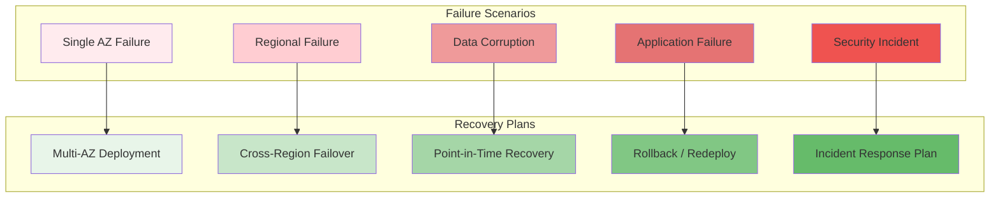

# Disaster Recovery

## Purpose

This document defines the disaster recovery (DR) strategy for the Patorbit platform. It outlines how to recover from significant system failures and maintain business continuity.

## Scope

This document covers recovery objectives, backup strategy, restore testing, regional failover, and business continuity planning.

---

## Recovery Objectives

| Metric                             | Target             | Definition                                           |
| ---------------------------------- | ------------------ | ---------------------------------------------------- |
| **Recovery Point Objective (RPO)** | 5 minutes          | Maximum acceptable data loss during a disaster       |
| **Recovery Time Objective (RTO)**  | 1 hour             | Maximum acceptable downtime for full recovery        |
| **Critical RPO**                   | 0 (zero data loss) | User identity data, claim data, verification records |
| **Critical RTO**                   | 15 minutes         | Authentication service, passport retrieval           |

---

## Failure Scenarios and Recovery Plans

---

## 1. Single AZ Failure

**Impact**: Partial capacity reduction. No data loss.

**Mitigation**:

- Multi-AZ deployment ensures instances run across 3 AZs.
- Load balancers automatically route traffic away from failed AZ.
- Database multi-AZ failover transparent to application.

**RPO**: 0 (zero data loss)
**RTO**: Automatic (seconds to minutes)

## 2. Regional Failure

**Impact**: Complete loss of primary region.

**Mitigation**:

- Passive secondary region with read-only database replicas.
- DNS failover to secondary region (Cloudflare).
- Automated promotion of secondary region to primary.

**RPO**: 5 minutes (asynchronous replication)
**RTO**: 1 hour

**Failover Steps**:

1. Operator initiates failover via runbook.
2. DNS records updated to point to secondary region.
3. Secondary region databases promoted to primary.
4. Additional compute instances provisioned in secondary region.
5. Smoke tests confirm system functionality.
6. Traffic routed to secondary region.

## 3. Data Corruption

**Impact**: Incorrect or missing data.

**Mitigation**:

- Point-in-time recovery (PITR) for databases.
- 30-day retention of database snapshots.
- Immutable audit logs for forensic analysis.
- Read replicas provide a recent consistent snapshot for validation.

**RPO**: 5 minutes (transaction log backups)
**RTO**: 15 minutes (data restore time)

## 4. Application Failure

**Impact**: Service outage or degraded performance.

**Mitigation**:

- Kubernetes automatically restarts failed pods.
- Canary deployments prevent bad code from reaching production.
- Feature flags allow toggling problematic features off.
- One-click rollback to previous stable version.

**RTO**: Automatic (pod restart) or 5 minutes (rollback).

## 5. Security Incident

**Impact**: Data breach, unauthorized access, service compromise.

**Mitigation**:

- Incident response plan with defined roles and communication.
- Automated isolation of compromised resources.
- Forensic snapshot for investigation.

---

## Backup Strategy

| Component          | Backup Type              | Frequency  | Retention  | Restore Time  |
| ------------------ | ------------------------ | ---------- | ---------- | ------------- |
| PostgreSQL         | Full snapshot            | Daily      | 30 days    | 1 hour        |
| PostgreSQL         | WAL archival             | Continuous | 7 days     | Point-in-time |
| Neo4j              | Full backup              | Daily      | 14 days    | 2 hours       |
| OpenSearch         | Snapshot                 | Daily      | 14 days    | 1 hour        |
| Object Storage     | Cross-region replication | Continuous | —          | Real-time     |
| Config (Terraform) | Git repository           | On change  | Indefinite | Immediate     |
| Secrets            | Secrets Manager backup   | Daily      | 90 days    | 15 minutes    |

## Backup Storage

- All backups are stored in a separate, locked-down S3 bucket with cross-region replication.
- Backups are encrypted at rest using a separate KMS key.
- Access to backups requires multi-party approval.

## Restore Testing

| Frequency | Type                     | Scope                                       |
| --------- | ------------------------ | ------------------------------------------- |
| Monthly   | Automated restore test   | Database restores to a test environment     |
| Quarterly | Full DR drill            | All components restored in secondary region |
| Annually  | Business continuity test | Full failover and user acceptance testing   |

## Business Continuity

| Scenario            | Communication                    | Recovery               |
| ------------------- | -------------------------------- | ---------------------- |
| Planned Maintenance | 72-hour notice to all users      | Zero downtime          |
| Minor Outage        | Status page update               | Automatic              |
| Major Outage        | Status page + email notification | 1-hour RTO             |
| Data Breach         | Legal + PR + affected users      | Incident response plan |

## References

- [Resiliency](resiliency.md): Fault tolerance patterns.
- [Infrastructure](infrastructure.md): Cloud infrastructure for DR.
- [Data Architecture](data-architecture.md): Backup and replication strategy.
- [Security Architecture](security-architecture.md): Incident response.
