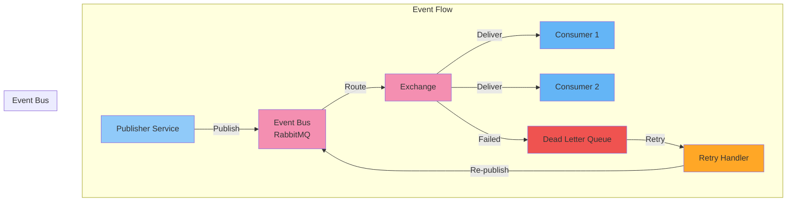
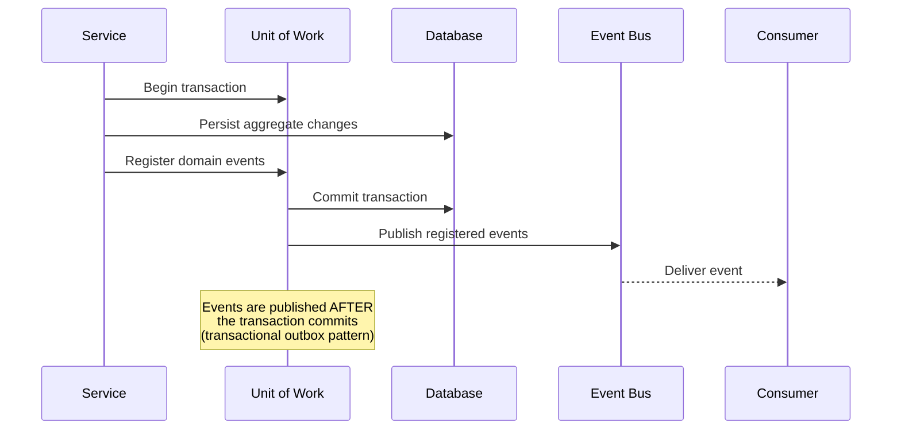

# Event Architecture

## Purpose

This document defines the event-driven architecture for the Patorbit platform. Events enable loose coupling, asynchronous processing, auditability, and scalable communication between services.

## Scope

This document covers domain events, event flow, publishing, consuming, retries, dead letter queues, and event versioning.

---

## Event-Driven Architecture Overview



---

## Event Taxonomy

Events in Patorbit are categorized into three types:

| Event Type              | Description                                          | Examples                                                       |
| ----------------------- | ---------------------------------------------------- | -------------------------------------------------------------- |
| **Domain Events**       | Business facts that happened in the past tense.      | `UserRegistered`, `PassportPublished`, `VerificationCompleted` |
| **Integration Events**  | Events published to integrate with external systems. | `PaymentProcessed`                                             |
| **Notification Events** | Events that trigger user-facing notifications.       | `IdentityVerified`, `ClaimRejected`                            |

## Event Schema

Every event must conform to a standard envelope:

```json
{
  "id": "evt_abc123",
  "type": "com.patorbit.identity.UserRegistered",
  "version": 1,
  "timestamp": "2026-07-21T14:30:00Z",
  "partitionKey": "user_123",
  "producer": "identity-service",
  "traceId": "trac_abc123",
  "correlationId": "corr_xyz789",
  "data": {},
  "metadata": {}
}
```

### Envelope Fields

- **`id`**: Unique event ID (snowflake or UUIDv7). Must be unique.
- **`type`**: Fully qualified event type name in reverse-DNS notation.
- **`version`**: Schema version number.
- **`timestamp`**: When the event was produced (UTC).
- **`partitionKey`**: Key used for ordering within a partition.
- **`producer`**: Name of the service that produced the event.
- **`traceId`**: Distributed tracing ID for the entire request chain.
- **`correlationId`**: Business process correlation ID (e.g., across multiple steps of the same workflow).
- **`data`**: Event-specific payload.
- **`metadata`**: Optional additional context (user agent, IP, etc.).

---

## Event Types Catalog

| Event                  | Type        | Version | Producer          | Consumers                                   |
| ---------------------- | ----------- | ------- | ----------------- | ------------------------------------------- |
| UserRegistered         | Domain      | 1       | Identity          | Passport, Knowledge, Billing, Notifications |
| IdentityVerified       | Domain      | 1       | Identity          | Verification, Notifications                 |
| UserDeactivated        | Domain      | 1       | Identity          | All services                                |
| PassportPublished      | Domain      | 1       | Career Passport   | Recruiter, AI, Search                       |
| PassportVersionCreated | Domain      | 1       | Career Passport   | Resume                                      |
| ResumeGenerated        | Integration | 1       | Resume Builder    | Recruiter, AI                               |
| ClaimCreated           | Domain      | 1       | Knowledge System  | Verification, AI                            |
| KnowledgeLinked        | Domain      | 1       | Knowledge System  | AI, Trust                                   |
| EvidenceSubmitted      | Domain      | 1       | Verification      | Knowledge, AI                               |
| VerificationCompleted  | Domain      | 1       | Verification      | Knowledge, Passport, Trust                  |
| OrganizationRegistered | Domain      | 1       | Organizations     | Verification, Notifications                 |
| OrganizationVerified   | Domain      | 1       | Organizations     | Knowledge                                   |
| CredentialIssued       | Domain      | 1       | Organizations     | Knowledge, Notifications                    |
| MemberAdded            | Domain      | 1       | Organizations     | Knowledge, Verification                     |
| SubscriptionActivated  | Domain      | 1       | Billing           | Organizations, Recruiter, Identity          |
| SubscriptionCancelled  | Domain      | 1       | Billing           | All                                         |
| TrustUpdated           | Domain      | 1       | Trust Engine      | AI, Search, Recruiter                       |
| ConfidenceUpdated      | Domain      | 1       | Confidence Engine | Passport, AI, Search                        |

---

## Event Publishing Flow



### Transactional Outbox Pattern

To ensure reliable delivery, events are published using the **Transactional Outbox** pattern:

1. Service writes aggregate changes AND outbox entries in the same database transaction.
2. A background process (Outbox Publisher) reads from the `outbox` table.
3. Outbox Publisher publishes events to the message broker.
4. On success, outbox entry is marked as published (or deleted).
5. On failure, retry with exponential backoff.

This guarantees at-least-once delivery without requiring distributed transactions.

---

## Event Consumption

Consumers must be **idempotent** to handle at-least-once delivery semantics.

**Idempotency Key**: Event `id` is the idempotency key. Consumers track processed event IDs to skip duplicates.

**Error Handling**:

- Transient errors (network, timeouts): Retry 3 times with exponential backoff.
- Permanent errors (validation, business logic): Route to Dead Letter Queue (DLQ).
- DLQ alerts trigger manual intervention.

### Retry Policy

| Retry     | Delay Before Retry |
| --------- | ------------------ |
| 1st       | 1 second           |
| 2nd       | 10 seconds         |
| 3rd       | 60 seconds         |
| 4th (DLQ) | N/A                |

---

## Event Versioning

Event schemas evolve over time. Follow these rules:

1. **Additive changes only within a major version**: New optional fields are allowed.
2. **New version for breaking changes**: Increment the `version` field, create a new event type with a new version.
3. **Backward compatibility period**: Producers support publishing old and new versions for 30 days.
4. **Consumer migration**: Consumers must support the old version for 30 days after a new version is introduced.

---

## Dead Letter Queue (DLQ)

Events that cannot be processed after retries are moved to the DLQ.

- **Monitoring**: DLQ depth is monitored and alerts are triggered.
- **Manual Review**: Operators can inspect and replay DLQ events.
- **Automated Replay**: For certain event types, automated replay scripts can be triggered after fixing the root cause.

## References

- [Messaging](messaging.md): Message broker design and configuration.
- [Domain Architecture](../domain/domain-events.md): Domain event specifications.
- [Observability](observability.md): Event monitoring and tracing.
- [Resiliency](resiliency.md): Error handling and retries.
