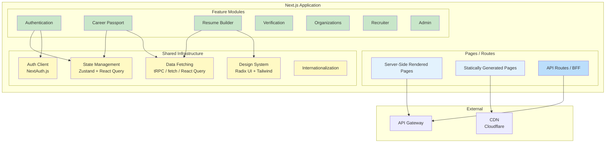

# Frontend Architecture

## Purpose

This document defines the frontend architecture for the Patorbit platform. It covers the structure, patterns, and best practices for building scalable, maintainable, and performant web applications.

## Scope

This document covers the primary web application (Next.js), the admin portal, the design system, and shared frontend infrastructure.

---

## Application Architecture



## Framework: Next.js 14+

**Rationale**: Next.js provides server-side rendering (SSR), static site generation (SSG), API routes, and excellent developer experience (DX). It supports React Server Components for efficient rendering.

- Use the App Router for nested layouts and route groups.
- Server Components for data fetching and SEO-critical pages.
- Client Components for interactive UI (forms, resume builder canvas).
- API Routes in Next.js are used exclusively for the Backend for Frontend (BFF) pattern.

## State Management

- **Server State**: All data from the API is managed by React Query (TanStack Query). It handles caching, refetching, optimistic updates, and pagination.
- **Client State**: Local UI state (modals, form inputs, toggles) is managed with Zustand or React Context.
- **URL State**: Search parameters, filters, and pagination state live in the URL for shareability and SSR compatibility.

## Data Fetching Strategy

- **Server Components**: Fetch data directly from the BFF. This is ideal for initial page load and SEO.
- **Client Components**: Use React Query hooks for data fetching, mutation, and caching. This is used for interactive features like the resume builder.
- **Incremental Static Regeneration (ISR)**: Used for public, semi-static pages like organization profiles.

## Design System

- **Component Library**: Radix UI primitives (accessible, composable).
- **Styling**: Tailwind CSS for utility-first styling.
- **Theming**: CSS custom properties for light/dark mode.
- **Typography**: Inter font family, with system font fallback.

## Accessibility (a11y)

- **Standards**: WCAG 2.1 AA compliance target.
- **Tooling**: eslint-plugin-jsx-a11y, axe-core for automated testing.
- **Manual Testing**: Screen reader (VoiceOver, NVDA) and keyboard navigation testing.
- **Components**: Radix UI provides accessible primitives out of the box.

## Performance

- **Core Web Vitals Targets**:
  - LCP: < 2.5s (target 1.8s)
  - FID/INP: < 200ms (target 100ms)
  - CLS: < 0.1 (target 0.05)
- **Bundle Optimization**: Code splitting at route level, dynamic imports for heavy components.
- **Image Optimization**: Next.js Image component with Cloudflare CDN.
- **Font Optimization**: Self-hosted Inter font with subsetting.

## Testing Strategy

| Type              | Tool                  | Scope                                 |
| ----------------- | --------------------- | ------------------------------------- |
| Unit Tests        | Vitest                | Utility functions, hooks, state logic |
| Component Tests   | React Testing Library | UI components                         |
| Integration Tests | Playwright            | User flows, page interactions         |
| Visual Regression | Percy / Chromatic     | Design system components              |
| Accessibility     | axe-core + Playwright | Automated a11y checks                 |

## Folder Structure

```typescript
src/
  app/                     // Next.js App Router pages
    (auth)/                // Authentication routes
    (dashboard)/           // Authenticated routes (layout)
    passport/
    resume/
    organizations/
    recruiter/
    admin/
  features/                // Feature modules
    auth/
      components/
      hooks/
      services/
      types/
    resume/
      components/
      hooks/
      services/
      types/
  shared/                  // Shared infrastructure
    components/            // Reusable UI components
    hooks/                 // Reusable hooks
    services/              // API clients
    types/                 // Shared TypeScript types
    utils/                 // Utility functions
    i18n/                  // Internationalization resources
  styles/                  // Global styles
```

## References

- [API Architecture](api-architecture.md): API consumption patterns.
- [Backend Architecture](backend-architecture.md): BFF integration.
- [Performance](performance.md): Web performance budgets and optimization.
