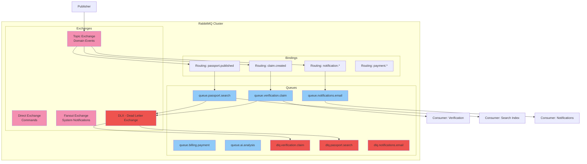
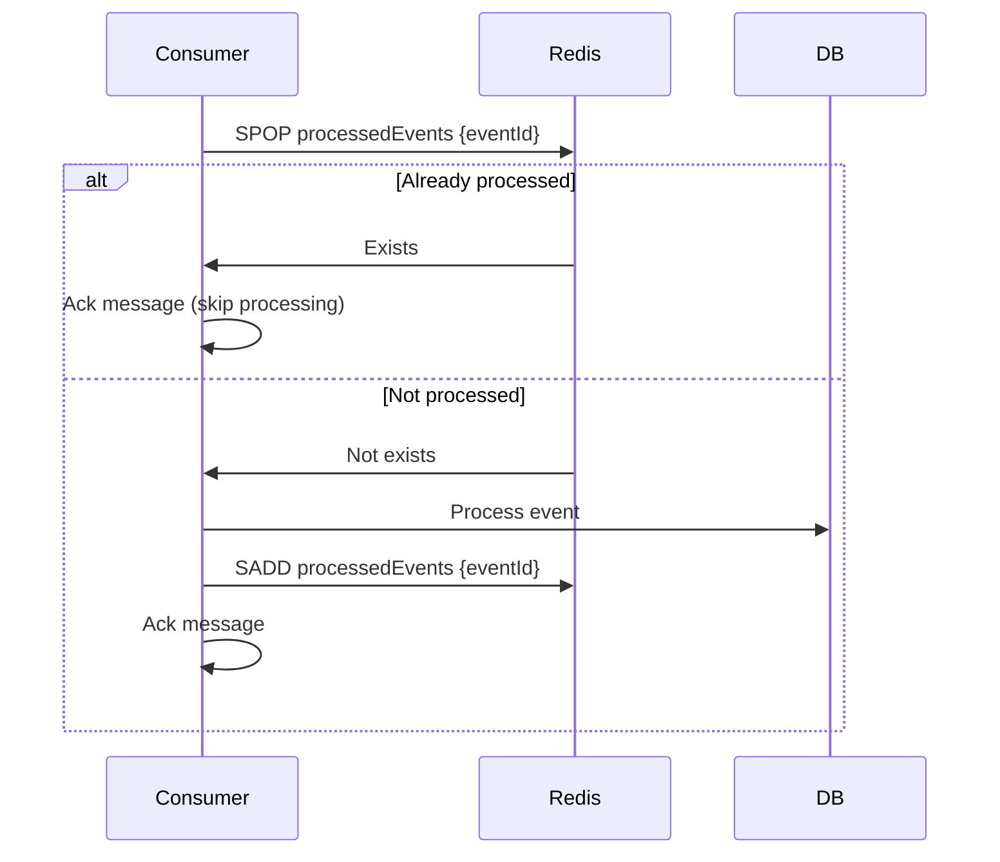

# Messaging

## Purpose

This document defines the asynchronous messaging architecture for the Patorbit platform. It covers message broker technology, routing, delivery guarantees, and operational considerations.

## Scope

This document covers message queues, topics, exchanges, routing keys, delivery semantics, and retry mechanisms.

---

## Message Broker: RabbitMQ

**Technology**: RabbitMQ

**Rationale**: RabbitMQ provides flexible routing (direct, topic, fanout exchanges), supports multiple messaging patterns (pub/sub, work queues, RPC), and is widely used in production environments.

---

## Architecture Overview

---

## Exchange Types

### 1. Topic Exchange (Primary)

**Purpose**: Routing domain events to interested consumers.

**Routing Pattern**: `{context}.{eventType}`

- `identity.user.registered`
- `verification.completed`
- `organizations.member.verified`

**Bindings**: Consumers bind with wildcard patterns (e.g., `verification.*`).

### 2. Direct Exchange

**Purpose**: Commands and point-to-point messages.

**Routing Pattern**: Direct match with queue name.

- `command.passport.publish`
- `command.verification.assign`

### 3. Fanout Exchange

**Purpose**: Broadcast events to all bound queues.

**Use Cases**:

- System notifications (maintenance, downtime).
- Cache invalidation events.
- Configuration updates.

---

## Queue Definitions

| Queue                       | Exchange | Routing Key          | Consumers            | TTL    | DLQ                       |
| --------------------------- | -------- | -------------------- | -------------------- | ------ | ------------------------- |
| `queue.verification.claim`  | Topic    | `claim.created`      | Verification Service | 5 min  | `dlq.verification.claim`  |
| `queue.passport.search`     | Topic    | `passport.published` | Search Indexer       | 30 min | `dlq.passport.search`     |
| `queue.notifications.email` | Topic    | `notification.*`     | Notification Service | 5 min  | `dlq.notifications.email` |
| `queue.billing.payment`     | Topic    | `payment.*`          | Billing Service      | 5 min  | `dlq.billing.payment`     |
| `queue.ai.analysis`         | Topic    | `ai.analysis.*`      | AI Orchestrator      | 30 min | `dlq.ai.analysis`         |
| `queue.system.alerts`       | Fanout   | —                    | Admin Service        | 1 hour | N/A                       |

---

## Delivery Guarantees

| Guarantee         | Mechanism                                                                                                                          |
| ----------------- | ---------------------------------------------------------------------------------------------------------------------------------- |
| **At-Least-Once** | Publisher confirms + consumer acknowledgements                                                                                     |
| **Ordering**      | Use `partitionKey` for sequential processing within a partition. RabbitMQ FIFO within a single queue when consumers use prefetch=1 |
| **Deduplication** | Idempotency keys in consumer                                                                                                       |
| **Persistence**   | Durable queues + `persistent` delivery mode                                                                                        |

---

## Consumer Acknowledgements

- **Manual Ack**: Consumers must manually acknowledge messages after successful processing.
- **Nack with Requeue**: On transient failure, consumer `nack`s the message and RabbitMQ requeues it.
- **Nack without Requeue**: On permanent failure, consumer `nack`s without requeue, and the message is routed to the DLQ.

## Dead Letter Queues

- Each primary queue has a corresponding DLQ.
- Consumer errors (permanent) and TTL expiration route messages to the DLQ.
- DLQ messages are monitored via alerts and dashboards.
- DLQ messages can be replayed into the original queue after fixing the root cause.

## Idempotency

Consumers track processed message IDs (using a Redis set with TTL) to prevent duplicate processing of the same event.

## Retry Mechanism

| Failure Type     | Action             | Delay                              |
| ---------------- | ------------------ | ---------------------------------- |
| Transient        | Nack + requeue     | Immediate (RabbitMQ)               |
| Processing Error | Nack + retry queue | Exponential backoff (1s, 10s, 60s) |
| Permanent        | Route to DLQ       | —                                  |

## Monitoring

- **Queue Depth**: Monitor queue depth and lag for each queue.
- **Processing Time**: Track time from publish to consumption.
- **Error Rate**: Track nack and DLQ rate vs acknowledge rate.
- **Throughput**: Monitor messages per second per queue.

## References

- [Event Architecture](event-architecture.md): Event types and publishing.
- [Resiliency](resiliency.md): Error handling and retries.
- [Observability](observability.md): Monitoring queues.
- [Scalability](scalability.md): Scaling consumers.
