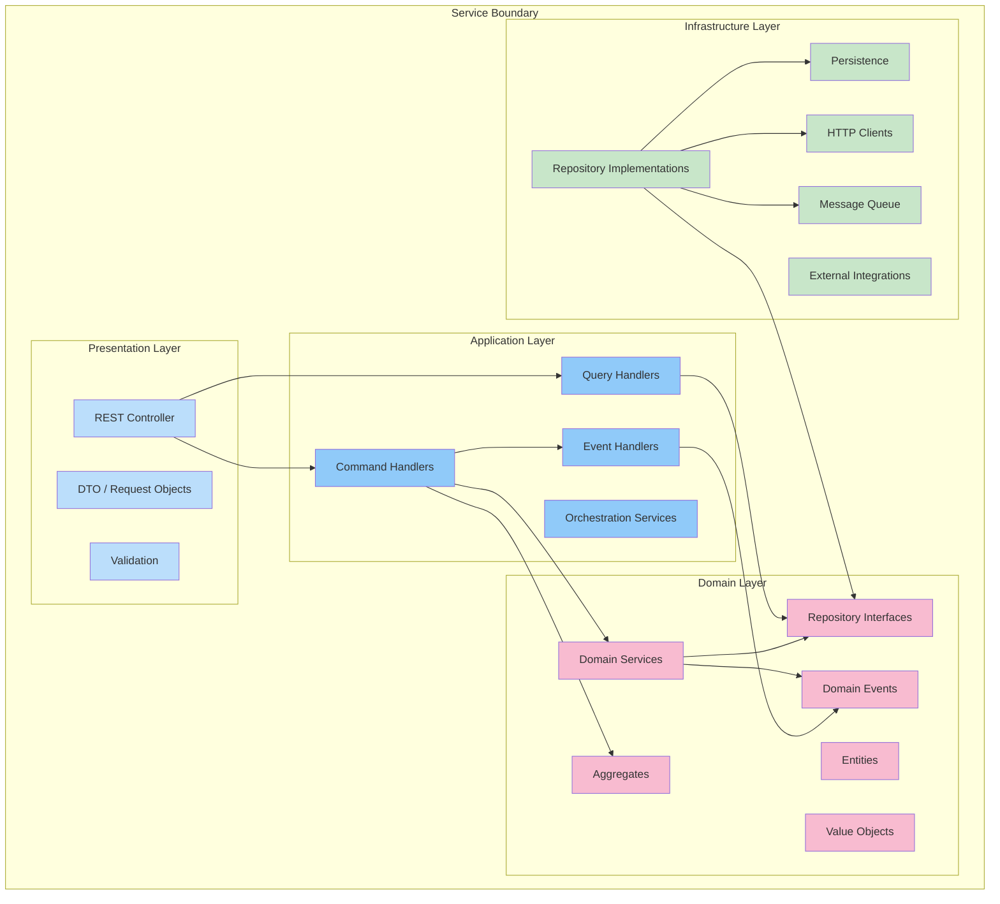
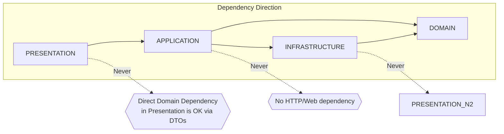

# Module Architecture

## Purpose

This document describes the internal module structure of the Patorbit backend. Each backend service is decomposed into layers following Clean Architecture and Hexagonal Architecture principles.

## Scope

This document covers the module decomposition for all backend services, layer responsibilities, dependency management, and extension points.

---

## Layered Architecture

Every backend service follows this module structure:



---

## Layer Descriptions

### Presentation Layer

**Responsibilities**:

- Handle HTTP requests and WebSocket connections.
- Validate request payloads.
- Transform domain data to response DTOs.
- Handle HTTP status codes and error responses.
- Apply security filters and rate limiting.

**Key Patters**:

- Controllers are thin: they delegate to application services.
- Input validation uses class-validator decorators or Zod schemas.
- Response DTOs are separate from domain entities.

### Application Layer

**Responsibilities**:

- Orchestrate use cases (commands and queries).
- Coordinate transactions across multiple aggregates.
- Publish domain events after successful state changes.
- Implement authorization checks.
- Manage unit of work / transaction boundaries.

**Key Patters**:

- CQRS: Commands for writes, Queries for reads.
- Each use case is a separate class or function.
- Application services do not contain business logic.

### Domain Layer

**Responsibilities**:

- Encapsulate business logic and rules.
- Define entities, value objects, and aggregates.
- Define repository interfaces (contracts).
- Define domain events.
- Enforce invariants.

**Key Patterns**:

- Rich domain model: entities contain behavior, not just data.
- Aggregate roots enforce consistency boundaries.
- Domain services contain logic that doesn't fit a single entity.
- Repository interfaces are part of the domain layer (DIP).

### Infrastructure Layer

**Responsibilities**:

- Implement repository interfaces.
- Handle database connections and queries.
- Manage HTTP communication with external services.
- Implement message queue publishers/consumers.
- Provide caching implementations.

**Key Patterns**:

- Implementations depend on abstractions (interfaces from domain layer).
- ORM mappings and migrations.
- Configuration binding and secrets retrieval.
- Circuit breaker and retry implementations.

---

## Dependency Rules



1. **Presentation Layer** depends on Application Layer and may use Domain types in DTOs.
2. **Application Layer** depends on Domain Layer and Infrastructure Layer (via interfaces).
3. **Domain Layer** has zero external dependencies. It is pure business logic.
4. **Infrastructure Layer** depends on Domain Layer (implements interfaces). It never depends on Presentation or Application directly.

---

## Standard Module Structure (per service)

```typescript
// Example directory structure for Passport Service
src /
  passport /
  // Presentation
  controllers /
  passport.controller.ts;
passport - public.controller.ts;
dto / create - passport.dto.ts;
publish - passport.dto.ts;
passport - response.dto.ts;

// Application
commands / create - passport.handler.ts;
publish - passport.handler.ts;
queries / get - passport.handler.ts;
search - passport.handler.ts;
events / passport - event.handler.ts;
services / passport - orchestration.service.ts;

// Domain
entities / career - passport.entity.ts;
passport - version.entity.ts;
value - objects / version - number.ts;
passport - status.ts;
aggregates / passport.aggregate.ts;
domain - services / version.service.ts;
events / passport - published.event.ts;
repositories / passport.repository.interface.ts;

// Infrastructure
repositories / passport.repository.impl.ts;
persistence / passport.schema.ts;
passport - version.schema.ts;
http / claim - service.client.ts;
```

## Extension Points

| Extension Point         | Mechanism            | Example                                 |
| ----------------------- | -------------------- | --------------------------------------- |
| New AI Provider         | Strategy pattern     | AI Orchestrator selects provider        |
| New Verification Method | Strategy pattern     | Verification Service routes to strategy |
| New Export Format       | Strategy + Factory   | Resume Export Service                   |
| New Event Consumer      | Pub/Sub subscription | Any service subscribes to event bus     |
| New Storage Backend     | Repository pattern   | Evidence repository interface           |
| New Auth Provider       | Adapter pattern      | Auth Service OAuth adapters             |
| New LLM Model           | Strategy pattern     | AI Orchestrator model selection         |
| New Search Engine       | Repository pattern   | Search index abstraction                |

## References

- [Service Boundaries](service-boundaries.md): Boundary definitions.
- [Backend Architecture](backend-architecture.md): Backend implementation.
- [Domain Architecture](../domain/domain-model.md): Domain layer design.
