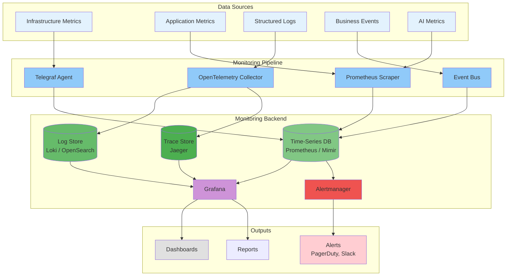

# Monitoring

## Purpose

This document defines the monitoring strategy for the Patorbit platform, ensuring proactive detection of issues and deep visibility into system health.

## Scope

This document covers infrastructure monitoring, application performance monitoring (APM), business metrics, and AI monitoring.

---

## Monitoring Architecture

---

## 1. Infrastructure Monitoring

**Purpose**: Monitor the health of underlying cloud infrastructure.

**Metrics**:

| Component          | Key Metrics                                                |
| ------------------ | ---------------------------------------------------------- |
| **Kubernetes**     | Node status, pod restarts, CPU/memory usage, disk pressure |
| **Databases**      | Connections, query latency, replication lag, disk usage    |
| **Message Queue**  | Queue depth, throughput, consumer lag                      |
| **Object Storage** | Bucket size, request count, latency                        |
| **Network**        | Bandwidth, latency, packet loss                            |

**Tools**: Prometheus Node Exporter, kube-state-metrics, cloud provider metrics.

## 2. Application Performance Monitoring (APM)

**Purpose**: Monitor the performance and health of application services.

**Metrics**:

- **Request Rate**: Requests per second (RPS).
- **Latency**: P50, P95, P99 response times.
- **Error Rate**: Percentage of 5xx errors.
- **Saturation**: CPU/memory usage.

**Tools**: OpenTelemetry for traces and metrics.

## 3. Business Metrics Monitoring

**Purpose**: Monitor key business indicators to understand platform usage and health.

**Metrics**:

- Daily/monthly active users (DAU/MAU)
- User registrations
- Passports published
- Claims created and verified
- Resumes generated
- Subscription conversions
- MRR

**Implementation**: Business events are consumed by a service that updates these metrics in a time-series database.

## 4. AI Monitoring

**Purpose**: Monitor the performance, cost, and quality of AI services.

**Metrics**:

- **Token Usage**: Input/output tokens per model, per feature.
- **Cost**: Real-time cost tracking per request.
- **Latency**: End-to-end AI request latency.
- **Cache Hit Rate**: Semantic cache hit vs. miss rate.
- **Error Rate**: LLM provider API errors.
- **Quality**: User feedback scores, prompt version performance.

## 5. Synthetic Monitoring

**Purpose**: Proactively test critical user journeys from an end-user perspective.

**Tests**:

| Test                         | Frequency        |
| ---------------------------- | ---------------- |
| **User Registration**        | Every 5 minutes  |
| **Login**                    | Every 5 minutes  |
| **Passport View**            | Every 5 minutes  |
| **Claim Submission**         | Every 15 minutes |
| **Public Page Availability** | Every 1 minute   |

**Tool**: Playwright scripts running on a schedule.

## 6. Alerting Strategy

- **Alerting on Symptoms, not Causes**: Alert on high error rates, not high CPU.
- **Actionable Alerts**: Every alert must have a corresponding runbook.
- **Severity Levels**:
  - **Critical**: PagerDuty alert to on-call engineer. Requires immediate action.
  - **Warning**: Slack alert to team channel. Requires investigation during business hours.
  - **Info**: Informational alert for awareness.
- **Alert Silencing**: Ability to silence alerts during planned maintenance.

## References

- [Observability](observability.md): Overall observability strategy.
- [Logging](logging.md): Log collection and analysis.
- [Performance](performance.md): Performance metrics and budgets.
- [Resiliency](resiliency.md): Monitoring for resiliency patterns.
