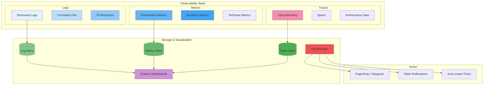

# Observability

## Purpose

This document defines the observability strategy for the Patorbit platform. Observability enables teams to understand the internal state of the system from the outside, accelerating debugging and incident response.

## Scope

This document covers distributed tracing, metrics, logging, dashboards, alerting, SLIs, SLOs, and error budgets.

---

## The Three Pillars of Observability

---

## Distributed Tracing

**Technology**: OpenTelemetry (Open Source standard)

**Instrumentation**:

- All services are instrumented with OpenTelemetry SDKs.
- Spans are created for every incoming HTTP request, database query, external API call, and queue operation.
- Trace context is propagated via HTTP headers (`traceparent`) and message headers.

**Storage**: Jaeger (self-managed) or a managed trace store (e.g., AWS Distro for OpenTelemetry + X-Ray).

**Sample Rate**:

| Traffic Level       | Sampling Rate                      |
| ------------------- | ---------------------------------- |
| Low (Development)   | 100%                               |
| Normal (Production) | 10%                                |
| High Traffic        | 1% (with 100% sampling for errors) |

## Metrics

**Technology**: Prometheus

**Technical Metrics** (collected for every service):

- Request rate (requests/second)
- Request latency (P50, P95, P99)
- Error rate (5xx responses / total requests)
- CPU usage (%)
- Memory usage (%)
- Database connection count
- Queue depth
- Active goroutines / event loop lag

**Business Metrics**:

- Active users (daily/weekly/monthly)
- Passports published
- Claims created
- Verifications completed
- Resumes generated
- AI requests (total, cached, failed)
- Subscription signups and cancellations
- Revenue metrics (MRR, ARPU)

## Logging

- Detailed in the [Logging](logging.md) document.
- All logs are structured JSON with correlation IDs.
- Log levels: DEBUG, INFO, WARN, ERROR, FATAL.

## SLIs and SLOs

### Service Level Indicators (SLIs)

| SLI                    | Definition                            | Measurement                       |
| ---------------------- | ------------------------------------- | --------------------------------- |
| **API Availability**   | Rate of successful HTTP requests      | `1 - (5xx / total)`               |
| **API Latency**        | P95 response time                     | `p95(request_duration_seconds)`   |
| **Passport Retrieval** | Success rate for passport queries     | `1 - (errors / total)`            |
| **AI Analysis**        | Success rate for AI analysis requests | `1 - (errors / total)`            |
| **Event Delivery**     | Rate of successful event deliveries   | `1 - (dlq_events / total_events)` |

### Service Level Objectives (SLOs)

| SLO                    | Target  | Measurement Period | SLI Used           |
| ---------------------- | ------- | ------------------ | ------------------ |
| **API Availability**   | 99.95%  | 30 days            | API Availability   |
| **API Latency (P95)**  | < 500ms | 30 days            | API Latency        |
| **Passport Retrieval** | 99.99%  | 30 days            | Passport Retrieval |
| **Event Delivery**     | 99.99%  | 30 days            | Event Delivery     |

### Error Budgets

- **Monthly Error Budget**: `(1 - SLO) × total requests per month`.
- **Consumption**: Each 5xx error consumes from the error budget.
- **Action**: If error budget is > 50% consumed in the first week, development velocity is reduced to prioritize reliability.

## Dashboards

**Technology**: Grafana

| Dashboard             | Audience       | Key Panels                                                            |
| --------------------- | -------------- | --------------------------------------------------------------------- |
| **Service Overview**  | Engineering    | Request rate, latency, error rate, CPU/memory by service              |
| **Business Overview** | Product/Exec   | Active users, passports published, verifications, revenue             |
| **AI Operations**     | AI Engineering | Token usage, cost, latency, cache hit rate                            |
| **Database**          | DBA            | Connections, slow queries, replication lag, disk usage                |
| **Queue**             | SRE            | Queue depth, processing time, DLQ count                               |
| **User Journey**      | Product        | Funnel: registration → passport creation → verification → publication |

## Alerting

**Technology**: Alertmanager

### Alert Rules

| Alert                    | Condition                        | Severity | Action                            |
| ------------------------ | -------------------------------- | -------- | --------------------------------- |
| **High Error Rate**      | Error rate > 5% for 5 minutes    | Critical | Page on-call                      |
| **High Latency**         | P95 > 1s for 5 minutes           | Warning  | Investigate during business hours |
| **Queue Growing**        | Queue depth > 1000 for 5 minutes | Warning  | Scale consumers                   |
| **Certificate Expiring** | TLS cert expires in < 7 days     | Critical | Renew certificate                 |
| **Disk Space**           | Disk usage > 85%                 | Warning  | Clean up or increase storage      |
| **AI Cost Spike**        | Daily AI cost > 2x normal        | Warning  | Investigate usage patterns        |

## References

- [Logging](logging.md): Structured logging details.
- [Monitoring](monitoring.md): Monitoring strategy.
- [Performance](performance.md): Performance metrics.
