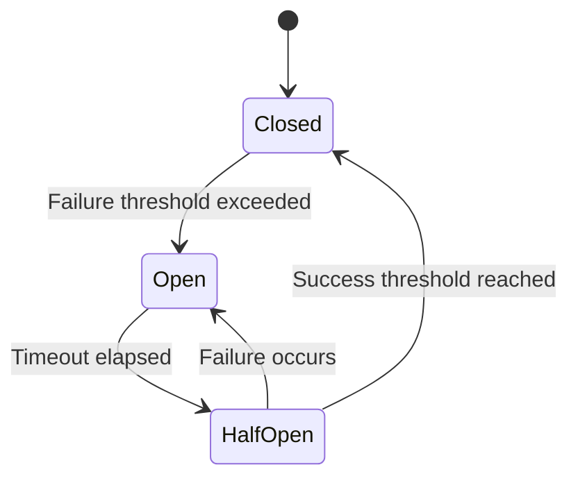

# Resiliency

## Purpose

This document defines the resiliency strategy for the Patorbit platform. Resiliency ensures the system continues to operate correctly in the face of failures, traffic spikes, and other disruptions.

## Scope

This document covers circuit breakers, retries, fallbacks, graceful degradation, bulkheads, timeouts, and fault tolerance patterns.

---

## Resiliency Principles

1. **Fail Fast**: Detect failures early and report them immediately.
2. **Design for Failure**: Expect and handle failures in every component.
3. **Graceful Degradation**: When a service fails, reduce functionality rather than crashing completely.
4. **Self-Healing**: Automated recovery mechanisms restore normal operation.
5. **Isolation**: Failure in one component does not cascade to others.

---

## Fault Tolerance Patterns

### Circuit Breaker

**Technology**: Opossum (Node.js), Istio (Service Mesh)

- **Closed**: Normal operation. Requests pass through.
- **Open**: Requests are immediately failed. Triggered when failure threshold is exceeded (e.g., 5 failures in 30 seconds).
- **Half-Open**: A probe is allowed through. If it succeeds, the circuit closes. If it fails, the circuit reopens.

**Implementation**:

- Each external dependency (database, API, message queue) has a circuit breaker.
- The failure threshold is configurable per dependency.
- Circuit breaker state is exposed as a metric.

### Retries

| Operation             | Max Retries | Backoff Strategy                          | Retryable Errors            |
| --------------------- | ----------- | ----------------------------------------- | --------------------------- |
| Database Query        | 3           | Exponential backoff (100ms, 500ms, 2s)    | Connection errors, deadlock |
| External HTTP Call    | 3           | Exponential backoff + jitter              | 5xx, timeout                |
| AI API Call           | 3           | Exponential backoff (500ms, 2s, 8s)       | 429, 5xx                    |
| Message Queue Publish | ∞           | Exponential backoff (DLQ after 3 retries) | Any                         |

### Fallbacks

- **Default Data**: Fall back to cached or default data when a service is unavailable.
- **Stale Cache**: Serve stale cached data if the source of truth is unavailable.
- **Degraded Mode**: Disable non-essential features (e.g., AI recommendations) when AI service is down.
- **Static Pages**: Serve static, pre-rendered pages when the backend is unavailable.

### Bulkhead

- **Purpose**: Isolate failures to prevent cascading failures.
- **Implementation**: Use separate thread pools or connection pools for different dependencies.
- **Example**: The resume service uses a separate connection pool for database access versus AI service calls. If the AI service becomes slow, it does not exhaust the database connection pool.

### Timeouts

| Component         | Timeout    |
| ----------------- | ---------- |
| API Gateway       | 30 seconds |
| Backend (HTTP)    | 10 seconds |
| Database Query    | 5 seconds  |
| External API Call | 10 seconds |
| AI API Call       | 60 seconds |

## Graceful Degradation Scenarios

| Failure                            | Degraded Behavior                              |
| ---------------------------------- | ---------------------------------------------- |
| **Database Unavailable**           | Serve cached data, disable writes              |
| **AI Service Unavailable**         | Resume generation without AI optimization      |
| **Search Engine Unavailable**      | Fall back to database-based basic search       |
| **Object Storage Unavailable**     | Allow passport editing but not evidence upload |
| **Message Queue Unavailable**      | Publish events synchronously (temporary)       |
| **Third-Party Auth Provider Down** | Fall back to email/password authentication     |

## Self-Healing

| Component           | Recovery Mechanism                                |
| ------------------- | ------------------------------------------------- |
| **Application Pod** | Kubernetes liveness probe restarts unhealthy pods |
| **Database**        | Managed service auto-failover to replica          |
| **Queue**           | Message re-queue after consumer failure           |
| **Cache**           | Auto-populate on cache miss (cache-aside pattern) |

## References

- [Disaster Recovery](disaster-recovery.md): Full recovery plan.
- [Scalability](scalability.md): Scaling for high availability.
- [Observability](observability.md): Monitoring resiliency metrics.
- [Event Architecture](event-architecture.md): Reliable event delivery.
