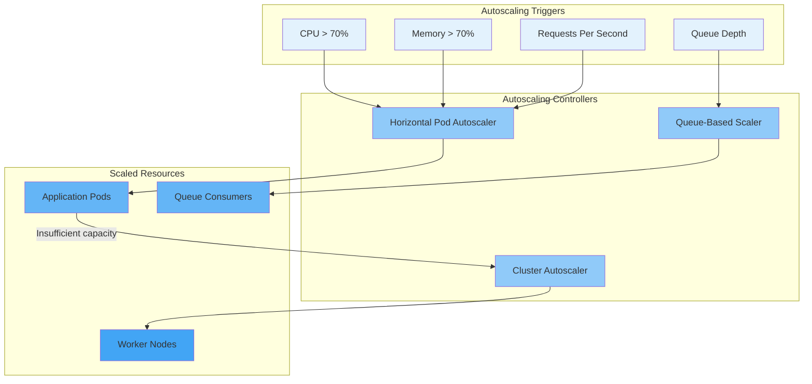

# Scalability

## Purpose

This document defines the scalability strategy for the Patorbit platform, ensuring the system can handle millions of users with predictable performance and cost.

## Scope

This document covers horizontal and vertical scaling strategies for all platform components.

---

## Scaling Principles

1. **Horizontal First**: Scale horizontally before scaling vertically.
2. **Statelessness**: Services are stateless; state is offloaded to databases and caches.
3. **Autoscaling**: All components use automated scaling based on real-time metrics.
4. **Database Efficiency**: Optimize queries and use caching before scaling databases.
5. **Cost Awareness**: Scaling decisions factor in cost efficiency.

---

## Scaling Strategy by Component

### Backend Services

| Approach             | Mechanism                                                |
| -------------------- | -------------------------------------------------------- |
| **Horizontal**       | Kubernetes HPA scales pods based on CPU, memory, and RPS |
| **Target Metrics**   | CPU < 70%, Memory < 70%                                  |
| **Min Pods**         | 3 per service (availability)                             |
| **Max Pods**         | 50 per service                                           |
| **Scaling Cooldown** | 60 seconds up, 180 seconds down                          |
| **Load Shedding**    | Queue requests during traffic spikes                     |

### PostgreSQL

| Approach               | Mechanism                                           |
| ---------------------- | --------------------------------------------------- |
| **Read Replicas**      | 2 replicas for read-heavy workloads                 |
| **Connection Pooling** | PgBouncer for efficient connection management       |
| **Vertical Scaling**   | Increase instance size if CPU consistently > 70%    |
| **Sharding (Future)**  | Shard by organization ID for multi-tenant isolation |
| **Partitioning**       | Time-based partitioning for logs and events         |

### Neo4j (Knowledge Graph)

| Approach              | Mechanism                                     |
| --------------------- | --------------------------------------------- |
| **Read Replicas**     | Graph read replicas for query-heavy workloads |
| **Core Cluster**      | 3 core nodes for write consistency            |
| **Sharding (Future)** | Federation for large-scale deployments        |

### OpenSearch

| Approach           | Mechanism                                    |
| ------------------ | -------------------------------------------- |
| **Data Nodes**     | Horizontal scaling of data nodes             |
| **Index Shards**   | 3 primary shards, 2 replica shards per index |
| **Index Rollover** | Automatic rollover of time-based indices     |

### Redis

| Approach          | Mechanism                                  |
| ----------------- | ------------------------------------------ |
| **Cluster Mode**  | Redis Cluster for automatic sharding       |
| **Read Replicas** | Replication for read-heavy cache workloads |
| **Sharding**      | Hash tags for efficient data distribution  |

### AI Services

| Approach           | Mechanism                                                 |
| ------------------ | --------------------------------------------------------- |
| **Orchestrator**   | HPA-based pod scaling                                     |
| **LLM Provider**   | Provider-side scaling (automatic)                         |
| **GPU Nodes**      | Spot instances with node auto-scaling for batch inference |
| **Semantic Cache** | Deduplicates similar requests, reducing LLM calls         |

---

## Auto Scaling Architecture

---

## Database Scaling

### Reads

- Read replicas serve GET requests and search queries.
- Application routes read queries to replicas.
- Cache-aside pattern reduces total read volume to the database.

### Writes

- Primary database instance handles all write operations.
- Connection pooling reduces connection overhead.
- Batch writes for bulk operations (e.g., event ingestion, analytics).

### Query Optimization

- Indexes are designed based on query patterns and reviewed regularly.
- Slow query log is monitored, and underperforming queries are optimized or rewritten.
- Denormalization is used cautiously for read-heavy dashboards.

## Queue Scaling

- Consumers scale based on queue depth.
- Queues are partitioned for parallelism.
- Each consumer processes one message at a time (prefetch=1) for ordered processing.

## Search Scaling

- OpenSearch indices are sharded and replicated.
- Index lifecycle management (ILM) policies automatically transition indices to lower-cost storage.
- Read replicas handle search query traffic independently of write traffic.

## References

- [Deployment Architecture](deployment-architecture.md): Deployment and autoscaling.
- [Infrastructure](infrastructure.md): Cloud infrastructure details.
- [Resiliency](resiliency.md): High-availability patterns.
- [Cost Optimization](cost-optimization.md): Cost-effective scaling.
