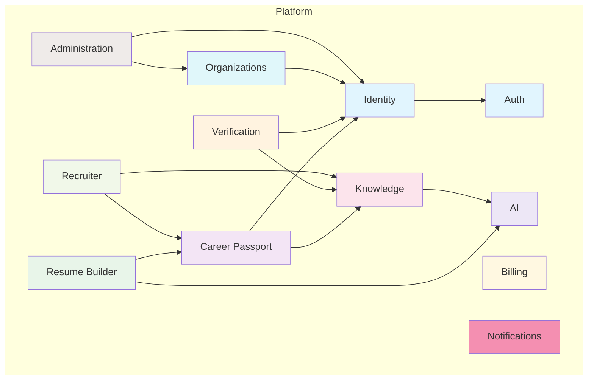
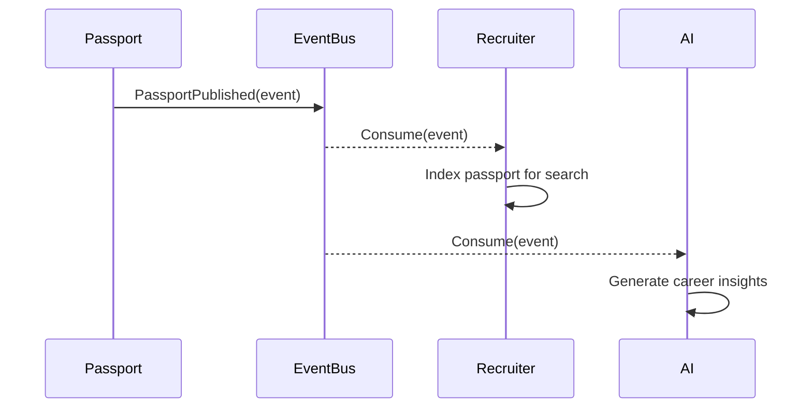

# Service Boundaries

## Purpose

This document defines the logical service boundaries for the Patorbit platform. These boundaries are aligned with the Domain-Driven Design bounded contexts, forming the foundation for our modular monolith architecture, which can evolve into microservices if needed.

## Scope

This document covers all logical services, their responsibilities, owned data, and communication patterns.

---

## Service Map

---

## Service Boundary Definitions

| Service             | Bounded Context     | Responsibilities                                                   | Owned Entities                                     | Communication |
| ------------------- | ------------------- | ------------------------------------------------------------------ | -------------------------------------------------- | ------------- |
| **Identity**        | Identity            | Identity management, user profiles, authentication integration.    | `Identity`, `Profile`, `AuthenticationMethod`      | Events, API   |
| **Auth**            | Identity            | Authentication, authorization, token issuance.                     | `Session`, `RefreshToken`                          | API           |
| **Career Passport** | Career Passport     | Passport CRUD, versioning, publishing.                             | `CareerPassport`, `PassportVersion`, `Publication` | Events, API   |
| **Resume Builder**  | Resume Builder      | Resume creation, templates, export.                                | `Resume`, `ResumeTemplate`, `ResumeVersion`        | Events, API   |
| **Knowledge**       | Knowledge System    | Knowledge Graph, claims, relationships, trust scores.              | `KnowledgeNode`, `KnowledgeEdge`, `Claim`          | Events, API   |
| **Verification**    | Verification        | Evidence processing, verification workflows, verifier management.  | `Evidence`, `Verification`, `Verifier`             | Events, API   |
| **Organizations**   | Organizations       | Organization management, members, workspaces, credential issuance. | `Organization`, `Workspace`, `OrgMember`           | Events, API   |
| **Recruiter**       | Recruiter Workspace | Candidate search, shortlisting, outreach.                          | `RecruiterWorkspace`, `SearchQuery`, `Shortlist`   | Events, API   |
| **Billing**         | Billing             | Subscriptions, payments, invoices, entitlements.                   | `Subscription`, `Invoice`, `Payment`               | Events, API   |
| **Notifications**   | N/A                 | Email, SMS, push notification delivery.                            | `Notification`, `Template`                         | Events        |
| **AI**              | AI Services         | AI orchestration, model abstraction, RAG.                          | `AIJob`, `AIResult`                                | API           |
| **Administration**  | Administration      | Platform admin portal, user management.                            | `AdminAction`, `AuditLog`                          | API           |

---

## Communication Patterns

1. **Synchronous Communication (API Calls)**:
   - Frontend to Backend (via API Gateway).
   - Service to Auth service for token validation.
   - Internal service calls when immediate consistency is required (use with caution).
   - BFF orchestrates multiple service calls for a single user request.

2. **Asynchronous Communication (Events)**:
   - Primary pattern for inter-service communication.
   - Decouples services, improves resiliency.
   - Example: `PassportPublished` event is consumed by `Recruiter` and `AI` services.
   - Published via a durable message broker (e.g., RabbitMQ).

## Data Ownership

- Each service owns its data exclusively.
- Direct database access across service boundaries is strictly prohibited.
- Data access is provided via well-defined APIs or events.
- For read-side optimization, services may maintain denormalized projections of other services' data, populated via event subscriptions.

## Evolution Strategy

The platform starts as a **modular monolith**, with each service implemented as a separate module within a single deployable artifact. This approach offers:

- **Low operational overhead**: Single codebase, single deployment pipeline.
- **Strong consistency**: Shared database transactionality is possible (used sparingly).
- **Rapid development**: No network latency between modules.

As the platform grows, services can be extracted into **microservices** with minimal code changes, following these steps:

1. **Isolate Data**: Create a separate database schema or instance for the service.
2. **Expose APIs**: Replace direct module calls with internal API calls.
3. **Deploy Separately**: Deploy the service as a separate containerized application.
4. **Update Routing**: Update the API gateway to route to the new service.

This strategy balances initial development speed with long-term scalability.

## References

- [Component Architecture](component-architecture.md): Service to component mapping.
- [Module Architecture](module-architecture.md): Internal structure of each service.
- [Event Architecture](event-architecture.md): Event flow and schema definitions.
- [Domain Architecture](../domain/bounded-contexts.md): Domain context definitions.
