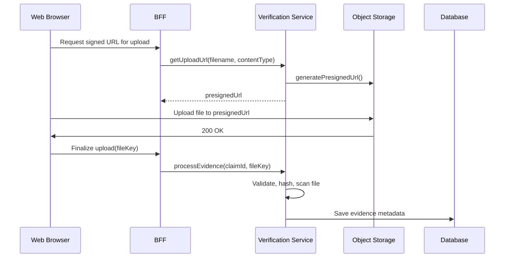

# Storage Strategy

## Purpose

This document defines the storage strategy for binary artifacts and large objects within the Patorbit platform, including evidence documents, exported resumes, images, and backups.

## Scope

This document covers object storage, file versioning, retention policies, and encryption.

---

## Object Storage

**Technology**: S3-compatible object storage (AWS S3, Cloudflare R2).

**Rationale**: Object storage provides high durability, scalability, and cost-effectiveness for unstructured data.

### Bucket Structure

| Bucket Name                        | Purpose                           | Access Control           | Replication  |
| ---------------------------------- | --------------------------------- | ------------------------ | ------------ |
| `patorbit-evidence-documents-prod` | Stores all user-uploaded evidence | Private, pre-signed URLs | Cross-region |
| `patorbit-resume-exports-prod`     | Stores generated resume files     | Private, pre-signed URLs | Same-region  |
| `patorbit-profile-photos-prod`     | Stores user profile images        | Public (via CDN)         | Same-region  |
| `patorbit-database-backups-prod`   | Stores daily database backups     | Private, admin access    | Cross-region |
| `patorbit-audit-logs-prod`         | Stores immutable audit logs       | Private, admin access    | Cross-region |

### File Upload Flow

This flow ensures that large files are uploaded directly to S3 without passing through our servers, reducing load and cost.

---

## Data Versioning

- **Object Versioning**: Enabled on all S3 buckets.
- **Benefits**:
  - Protection against accidental deletes.
  - Ability to roll back to a previous version of an evidence file.
  - Audit trail of all changes.

---

## Retention and Lifecycle Policies

| Bucket               | Lifecycle Rule           | Action                             | Timing   |
| -------------------- | ------------------------ | ---------------------------------- | -------- |
| `evidence-documents` | After claim archived     | Transition to Glacier Deep Archive | 90 days  |
|                      | After 7 years in archive | Permanent delete                   | —        |
| `resume-exports`     | After file created       | Permanent delete                   | 30 days  |
| `database-backups`   | After backup created     | Transition to Glacier              | 7 days   |
|                      | After backup created     | Permanent delete                   | 365 days |
| `audit-logs`         | After log created        | Transition to Glacier Deep Archive | 90 days  |
|                      | No delete rule           | —                                  | —        |

---

## Encryption

### Encryption in Transit

- All communication with the object storage API uses HTTPS/TLS 1.3.
- Pre-signed URLs enforce HTTPS.

### Encryption at Rest

- All data stored in S3 is encrypted at rest using **SSE-S3** (Server-Side Encryption with S3-managed keys).
- **Encryption Key**: AES-256.
- Keys are managed by the cloud provider and automatically rotated.
- For highly sensitive data (e.g., identity documents), consider using SSE-KMS with customer-managed keys for enhanced control.

---

## Content Scanning

- **Virus Scanning**: All uploaded files are scanned for viruses using a service like ClamAV running in a serverless function, triggered by S3 object creation events.
- **Content Moderation**: Profile photos and other user-generated images are scanned for inappropriate content using a service like AWS Rekognition.
- **Quarantine**: Files that fail scans are moved to a separate, isolated bucket and flagged for administrative review.

## Backups

- **Databases**: Automated snapshots of PostgreSQL and Neo4j are taken daily and stored in the `database-backups` bucket.
- **Object Storage**: Cross-region replication provides high availability. Lifecycle policies move older versions to archival storage.
- **Restore Testing**: Automated restore tests are run quarterly to ensure backup integrity and recovery procedures.

## Future Evolution

- **CDN for Downloads**: For frequently accessed public files, use Cloudflare R2 with no egress fees.
- **Edge Caching**: Cache public assets at the edge for lower latency.
- **Client-Side Encryption**: For end-to-end encrypted messaging or evidence submission, explore client-side encryption where the server never has access to the unencrypted data.

## References

- [Data Architecture](data-architecture.md): Overall data strategy.
- [Security Architecture](security-architecture.md): Encryption and access control.
- [Disaster Recovery](disaster-recovery.md): Backup and recovery plan.
