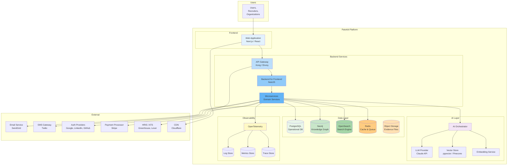

# System Overview

## Purpose

This document presents the high-level system architecture of the Patorbit platform. It describes the major building blocks, how they interact, and the overall system context.

## Scope

This document covers all primary system components, external integrations, and the C4 system context diagram.

---

## System Context (C4 Level 1)

## User Types

| User                   | Description                                     | Primary Interface     |
| ---------------------- | ----------------------------------------------- | --------------------- |
| **Individual**         | Job seeker managing their career data           | Web Application       |
| **Recruiter**          | Talent professional searching for candidates    | Web Application       |
| **Organization Admin** | Company representative managing their workspace | Web Application       |
| **Verifier**           | Human or automated entity verifying claims      | API / Web Application |
| **Platform Admin**     | Internal platform operator                      | Admin Portal          |

## Major Components

### Frontend

- **Next.js Application**: Server-side rendered React application.
- **Admin Portal**: Separate Next.js application for administrative functions.
- **Design System**: Shared component library (Radix UI + Tailwind CSS).

### Backend

- **API Gateway**: Entry point for all client requests. Handles authentication, rate limiting, routing.
- **Backend for Frontend (BFF)**: NestJS server that serves the frontend with aggregated API responses.
- **Domain Services**: NestJS modules implementing business logic per bounded context.

### AI Layer

- **AI Orchestrator**: Coordinates requests to LLM providers, manages prompts, caches outputs.
- **LLM Provider**: Claude API for resume analysis, skill extraction, recommendations.
- **Vector Store**: Stores embeddings for semantic search and RAG.
- **Embedding Service**: Generates embeddings for claims, resumes, and skills.

### Data Layer

- **PostgreSQL**: Primary operational database for all transactional data.
- **Neo4j**: Graph database for the Knowledge Graph.
- **OpenSearch**: Full-text search for resumes, claims, and candidates.
- **Redis**: Caching, session storage, and message queue.
- **Object Storage**: File storage for evidence documents and images.

## Key Flows

### Resume Creation Flow

1. User authenticates via the web application.
2. User opens the resume builder, which fetches their passport data via the BFF.
3. BFF aggregates data from Passport Service and Claim Service.
4. User selects claims to include and configures targeting.
5. BFF sends generation request to Resume Service.
6. Resume Service requests AI optimization from AI Orchestrator.
7. AI Orchestrator sends prompt to Claude API, receives suggestions.
8. Resume is rendered and stored. User downloads or shares.

### Verification Flow

1. User adds a claim and attaches evidence (document, link).
2. Evidence is uploaded to Object Storage, metadata stored in PostgreSQL.
3. Verification Service picks up the verification request.
4. AI verification runs first: document analysis via AI Orchestrator.
5. If AI confidence is high, auto-verify. If low, route to human verifier.
6. Verification result updates Claim status and Trust Score.
7. Knowledge Graph is updated with verification edge.
8. Event published for downstream consumers.

## System Qualities

| Quality             | Approach                                                 |
| ------------------- | -------------------------------------------------------- |
| **Scalability**     | Stateless services with horizontal pod autoscaling       |
| **Availability**    | Multi-AZ deployment, 99.95% SLA target                   |
| **Security**        | Zero-trust network, encryption at rest and in transit    |
| **Performance**     | CDN caching, API response < 200ms p95                    |
| **Maintainability** | Clean Architecture, typed languages, comprehensive tests |
| **Cost Efficiency** | Right-sized resources, auto-scaling, reserved instances  |

## References

- [Component Architecture](component-architecture.md): Detailed component descriptions.
- [Backend Architecture](backend-architecture.md): Service layer design.
- [Data Architecture](data-architecture.md): Database design.
- [AI Architecture](ai-architecture.md): AI integration design.
